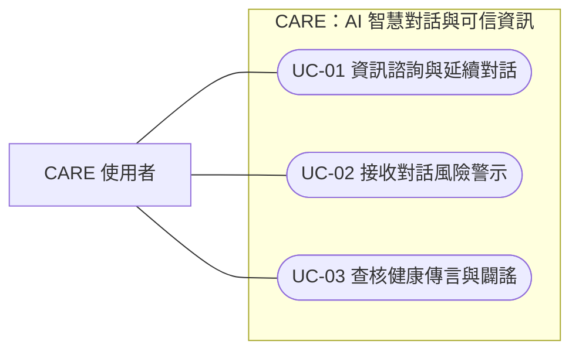
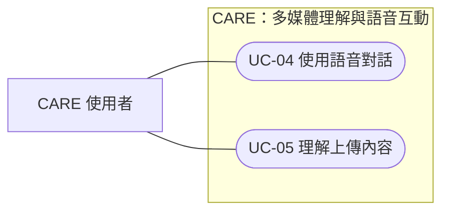
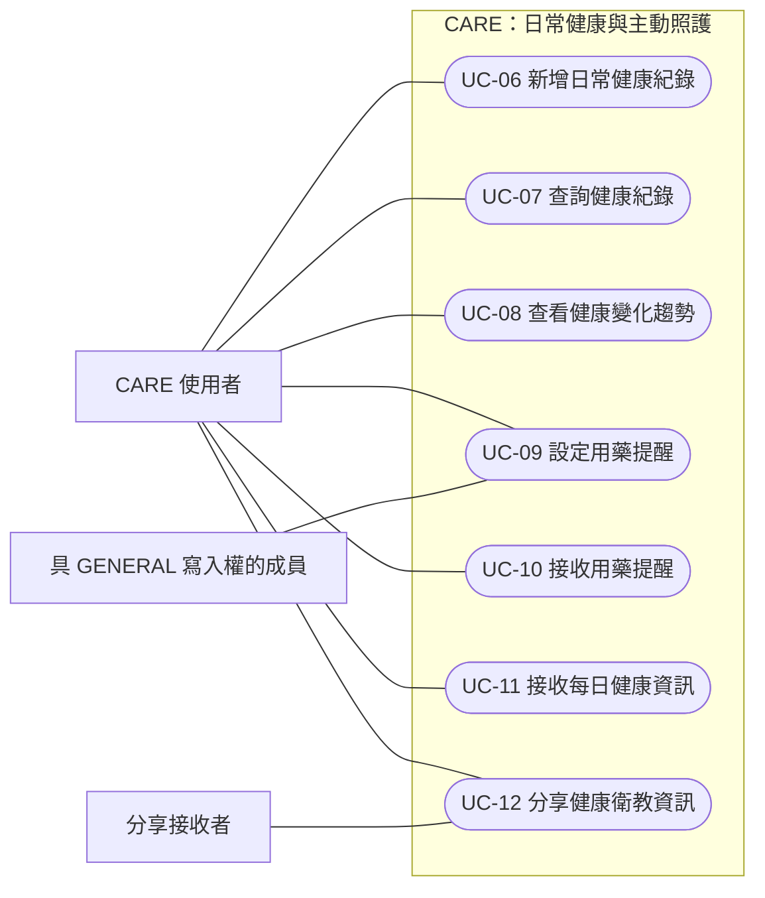
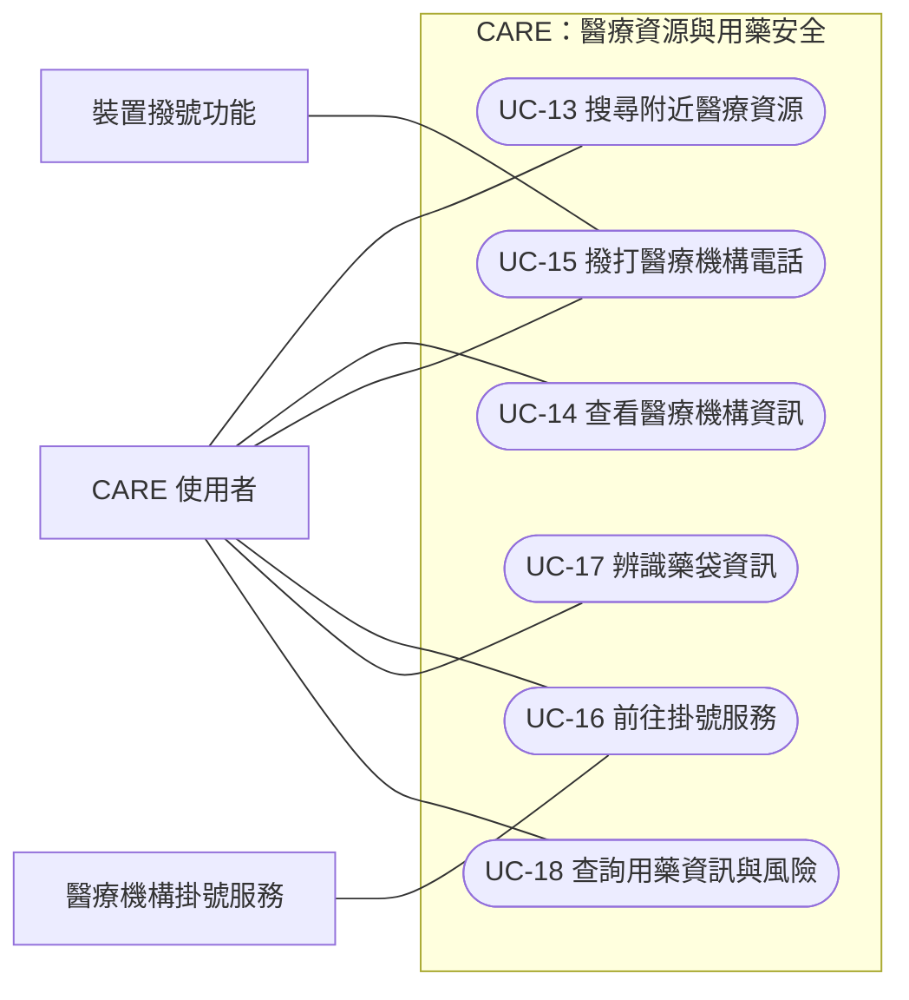
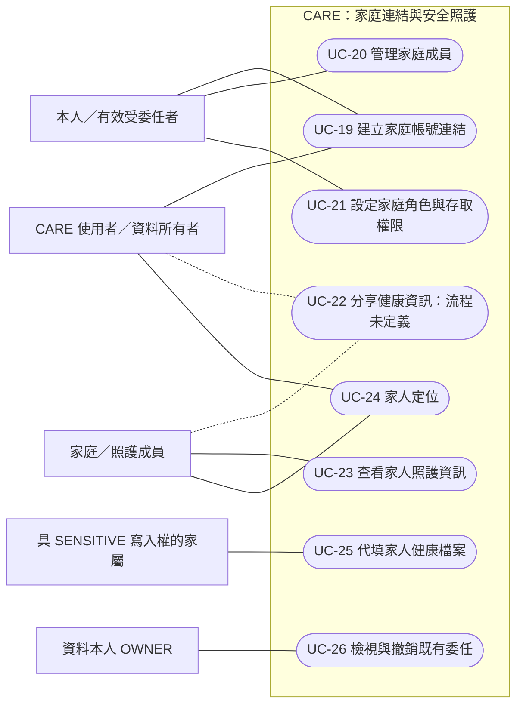
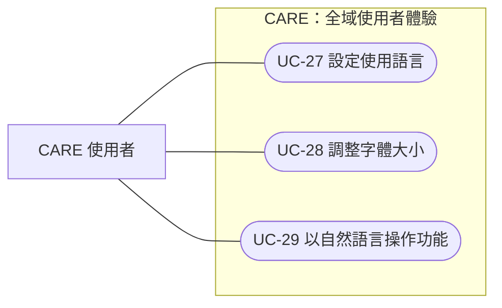

# CARE 使用案例規格（Iteration 7）

| 項目 | 內容 |
| --- | --- |
| 文件版本 | 0.3 |
| 建立日期 | 2026/09/17 |
| 更新日期 | 2026/09/18 |
| 需求依據 | CARE 系統功能說明（Iteration 7） |
| 闢謠需求依據 | 軟體需求文件（SRD） FR-6、FR-6.1、FR-6.2、FR-7.2 與 NFR-1 |
| 權限設計依據 | 家庭成員權限分級（family-rbac）技術文件，以下簡稱「RBAC 文件」 |
| 文件性質 | 使用案例設計草案，供需求確認與驗收情境設計使用 |
| 系統邊界 | CARE 對使用者提供的對話、健康管理、醫療資源、用藥資訊及家庭照護服務 |

## 1. 目的與範圍

本文件依 CARE 的五大功能模組與全域使用者體驗需求，描述使用者如何透過 CARE 完成具體目標。各案例包含參與者、觸發事件、前置條件、流程重點與成功後置條件。

RAG、OCR、語音辨識、語音生成及意圖分流屬於達成使用者目標的處理能力，納入對應案例的流程。健康紀錄的新增、歷史查詢與趨勢查看則分別定義為獨立案例。

健康傳言查核與闢謠以 UC-03 獨立描述，補入 SRD 已定義的文字內容驗證及影音轉錄後查核需求。此案例的使用者目標為判斷特定主張是否有證據支持，RAG 檢索則為取得查核依據的處理能力。使用案例編號依本文的模組與出現順序排列。

本文依需求文件、RBAC 文件與現有程式整理可執行行為；不宣稱正式環境的部署或資料遷移狀態。

### 1.1 程式現況與剩餘缺口

「已定義」表示現有程式已有資料模型、權限與操作流程；「部分定義」表示仍有功能缺口。以下不代表本次已重新執行測試。

來源差異：SRD FR-10.3 曾概括描述 CAREGIVER 可代填資料；RBAC 明定其對 SENSITIVE 僅有讀取權。本版以 RBAC 的資源分類及動作規則修正健康檔案代填案例。

| 編號 | 依據與缺口 | 影響案例 |
| --- | --- | --- |
| A-01 | 已定義：跨使用者權限依操作者、資料擁有者、分類與動作判斷。 | 跨使用者存取案例 |
| A-02 | 部分定義：藥袋已有草稿核對與提交介面；自然語言新增健康量測及個人健康資訊分享尚未實作。 | UC-06、UC-17、UC-22、UC-29 |
| A-03 | 已定義：可設定親屬稱謂與照顧標籤、撤銷邀請及雙向移除成員；移除時同步撤銷委任並留下稽核。 | UC-19～UC-21、UC-26 |
| A-04 | 已定義：走失求救由對話觸發，本人授權 LIFF 定位；合格家屬可看即時位置與軌跡，分享逾時後自動結束及清除。 | UC-24 |
| A-05 | 已定義：設定頁支援語言、字級、語音回覆、語速與音色，並同步資料庫與本機。 | UC-04、UC-25、UC-27、UC-28 |
| A-06 | 已定義：用藥提醒與家屬逾時通知可個別關閉；每日醫療消息預設於台北時間 09:00 發送，每人每日最多一則。 | UC-09～UC-11 |
| A-07 | 部分定義：已登記健康、用藥、掛號、對話、量測、經期與步數等資源；新增照護資料仍須另行分類。 | UC-23 |
| A-08 | 部分定義：血壓與血糖量測為 SENSITIVE，已定義本人及家屬讀寫權；體重時間序列與獨立趨勢圖尚未實作。 | UC-06～UC-08、UC-25 |
| A-09 | 未定義：逐筆健康資訊分享、撤回、期限及轉傳控制尚未實作。 | UC-22 |
| A-10 | 部分定義：原圖不保存，結構化 OCR 結果存於建立者的短期草稿；完整風險報告未建立獨立資源。 | UC-17、UC-18 |
| A-11 | 已定義：高風險用藥與對話緊急事件均有家屬通知政策，低風險用藥只通知本人。 | UC-02、UC-18 |
| A-12 | 部分定義：委任資料、期限、撤銷與稽核已存在；新委任核可仍關閉，查詢尚未公開為 API。 | UC-21、UC-26 |
| A-13 | 待環境確認：程式與 Helm 預設啟用 RBAC，但正式環境開關及各擁有者的 shadow／enforced 狀態須查部署與資料庫。 | 所有 RBAC 相關案例 |

## 2. 參與者

| 參與者 | 角色說明 |
| --- | --- |
| CARE 使用者 | 使用系統進行諮詢、健康管理與資訊查詢的人員，包含高齡使用者。 |
| 資料本人（OWNER） | 操作者與資料擁有者相同時推導的角色，不能指派或轉讓。 |
| 主要照顧者（GUARDIAN） | 對指定資料擁有者具有矩陣中的讀寫權；單憑此角色不具角色管理權。 |
| 協助照顧者（CAREGIVER） | 對指定資料擁有者可讀寫 GENERAL、讀取 SENSITIVE，不能讀取 PRIVATE；適用狀態見 §2.2。 |
| 一般家人（MEMBER） | 矩陣中僅可讀取 GENERAL；角色未設定時預設為 MEMBER，與已明確指派 MEMBER 的設定狀態仍有區別。 |
| 持有有效委任的成員 | 必須是該擁有者族譜內的成員，委任未到期且未撤銷；資料存取解析為 GUARDIAN，並具有限制的代管資格，不能視為 OWNER。 |
| 受照護者／資料所有者 | 健康或位置資訊所屬使用者；被其他成員存取時是判定權限的目標，不代表操作者具有定位權。 |
| 分享接收者 | 接收使用者主動分享資訊的家人或其他聯絡人；一般衛教內容接收者不必然具有 CARE 帳號。 |
| 外部協作系統 | 訊息傳遞平台、裝置定位與撥號功能、醫療機構掛號服務；其內部作業位於 CARE 系統邊界之外。 |

定時提醒與推播的觸發條件為時間事件。CARE 內部排程及 AI 處理元件不列為使用者角色。

### 2.1 資料分類與角色矩陣

依據：RBAC §1.1～§1.3。角色是「操作者對指定資料擁有者」的關係，不能當成使用者在所有家庭中的固定身分。

| 分類 | 文件已登記的範圍 |
| --- | --- |
| GENERAL | 用藥提醒、藥品基本資料、姓名與照片；例如服藥時間、藥名、外觀、劑量。 |
| SENSITIVE | 健康檔案、藥品適應症；例如年齡、性別、身高體重、慢性病、重大疾病史及手術史。 |
| PRIVATE | 原始對話及對話摘要。 |

| 角色 | GENERAL | SENSITIVE | PRIVATE |
| --- | --- | --- | --- |
| OWNER | 讀、寫 | 讀、寫 | 讀、寫 |
| GUARDIAN | 讀、寫 | 讀、寫 | 讀 |
| CAREGIVER | 讀、寫 | 讀 | 無 |
| MEMBER | 讀 | 無 | 無 |
| 不在資料擁有者族譜內 | 無 | 無 | 無 |

讀與寫分別判斷；矩陣不代表任何欄位都可以透過任一操作修改。例如代填健康檔案明確排除姓名、照片及 settings。未登記的欄位在跨使用者遮蔽時剔除；本人讀取不套用此遮蔽（RBAC §2.4、§2.8）。

### 2.2 生效模式與判定方向

依據：RBAC §2.1～§2.4、§4.5～§4.6、§5.8、§5.10。

| 情境 | 文件定義的行為 |
| --- | --- |
| 既有能力、enforced | 全域 FAMILY_RBAC_ENFORCED 啟用且目標擁有者狀態為 enforced 時，按角色矩陣執行跨使用者授權與欄位遮蔽。 |
| 既有能力、shadow | 保留該能力的 legacy 行為並記錄判定差異。例如既有健康檔案與對話讀取可較矩陣寬，不能一律寫成 MEMBER 必定被拒絕。 |
| 無 legacy 對應的新能力 | 直接套用 RBAC，shadow 不放寬；包含健康檔案代填、血壓血糖量測與掃描草稿提交。 |
| 前端顯示 | 依後端 my_permissions 判斷實際可用操作；欄位缺席時視為無權，不以角色名稱自行推算。後端仍需檢核每次請求。 |
| 角色方向 | family_role 表示「對方對我的資料」，my_role／my_permissions 表示「我對對方的資料」；兩方向各自判斷。 |
| 模式變更 | 角色指派完成不代表已切換 enforced；新增未指派成員也不會使已 enforced 的家庭退回 shadow。 |

下文的矩陣拒絕結果以 enforced 為前提；若文件明定該能力不受 shadow 放寬，會於案例另外指出。正式驗收須先確認 A-13。

### 2.3 角色管理、委任與通知

依據：RBAC §2.5～§2.7、§4.6、§5.6～§5.7。

- 本人可在自己的族譜指派 GUARDIAN、CAREGIVER 或 MEMBER；不得對本人指派角色，也不得將 OWNER 指派給其他人。
- 有效受委任者可在該擁有者的族譜管理角色及建立邀請，但只能授予 CAREGIVER 或 MEMBER；一般指派的 GUARDIAN 不具此代管資格。
- 有效委任限定資料擁有者，不得跨家庭使用。只有本人可撤銷自己的既有委任；新委任核可仍屬 A-12 缺口。
- 通知與資料讀取權分開判斷；enforced 時，高風險用藥、緊急事件、用藥逾時與走失通報的家屬收件人為 GUARDIAN、CAREGIVER。
- 通報節流未取得發送資格時不發送；符合發送條件時通知當事人。無合格家屬仍回覆當事人，且不能宣稱已通知家屬。通報只含姓名、藥名及風險類型，不夾帶病史或原始對話；收到通報不增加 PRIVATE 讀取權。

## 3. 使用案例總覽

| 編號 | 使用案例 | 主要參與者 | 所屬範圍 |
| --- | --- | --- | --- |
| UC-01 | 資訊諮詢與延續對話 | CARE 使用者 | AI 智慧對話與可信資訊 |
| UC-02 | 接收對話風險警示 | CARE 使用者 | AI 智慧對話與可信資訊 |
| UC-03 | 查核健康傳言與闢謠 | CARE 使用者 | AI 智慧對話與可信資訊 |
| UC-04 | 使用語音對話 | CARE 使用者 | 多媒體理解與語音互動 |
| UC-05 | 理解上傳的圖片、音訊、影片或文件 | CARE 使用者 | 多媒體理解與語音互動 |
| UC-06 | 新增日常健康紀錄 | CARE 使用者 | 日常健康與主動照護 |
| UC-07 | 查詢健康紀錄 | CARE 使用者 | 日常健康與主動照護 |
| UC-08 | 查看健康變化趨勢 | CARE 使用者 | 日常健康與主動照護 |
| UC-09 | 設定用藥提醒 | 本人或具 GENERAL 寫入權的成員 | 日常健康與主動照護 |
| UC-10 | 接收用藥提醒 | CARE 使用者 | 日常健康與主動照護 |
| UC-11 | 接收每日健康資訊 | CARE 使用者 | 日常健康與主動照護 |
| UC-12 | 分享健康衛教資訊 | CARE 使用者、分享接收者 | 日常健康與主動照護 |
| UC-13 | 搜尋附近醫療資源 | CARE 使用者 | 醫療資源與用藥安全 |
| UC-14 | 查看醫療機構資訊 | CARE 使用者 | 醫療資源與用藥安全 |
| UC-15 | 撥打醫療機構電話 | CARE 使用者 | 醫療資源與用藥安全 |
| UC-16 | 前往醫療機構掛號服務 | CARE 使用者 | 醫療資源與用藥安全 |
| UC-17 | 辨識藥袋資訊 | CARE 使用者 | 用藥安全；亦供日常健康模組使用 |
| UC-18 | 查詢用藥資訊與風險 | CARE 使用者 | 醫療資源與用藥安全 |
| UC-19 | 建立家庭帳號連結 | 本人或有效受委任者、受邀者 | 家庭連結與安全照護 |
| UC-20 | 管理家庭成員 | 本人；代管角色須有效委任 | 家庭連結與安全照護 |
| UC-21 | 設定家庭角色與存取權限 | 本人或有效受委任者 | 家庭連結與安全照護 |
| UC-22 | 分享個人健康資訊給家人 | 資料所有者；主動分享流程未定義 | 家庭連結與安全照護 |
| UC-23 | 查看家人照護資訊 | 授權家庭／照護成員 | 家庭連結與安全照護 |
| UC-24 | 查詢受照護家人的位置 | 位置分享者、合格家庭／照護成員 | 家庭連結與安全照護 |
| UC-25 | 代填家人健康檔案 | 對目標具有 SENSITIVE 寫入權的 GUARDIAN／有效受委任者 | 家庭連結與安全照護 |
| UC-26 | 檢視與撤銷既有委任 | 資料本人（OWNER） | 家庭連結與安全照護 |
| UC-27 | 設定使用語言 | CARE 使用者 | 全域使用者體驗 |
| UC-28 | 調整字體大小 | CARE 使用者 | 全域使用者體驗 |
| UC-29 | 以自然語言操作功能 | CARE 使用者 | 全域使用者體驗 |

### 3.1 使用案例關係圖

以下以 Mermaid 表示各範圍的使用案例與參與關係。圓角節點為使用案例，連線表示參與關係，不表示執行順序；條件式銜接另於第 3.2 節說明。

#### 模組一：AI 智慧對話與可信資訊

#### 模組二：多媒體理解與語音互動

#### 模組三：日常健康與主動照護

#### 模組四：醫療資源與用藥安全

#### 模組五：家庭連結與安全照護

圖中角色僅表示參與資格，實際資料權依 §2.2 判定；虛線表示功能需求存在，但操作或權限尚未完整定義。

#### 全域：使用者體驗與無障礙設計

### 3.2 案例銜接與共用行為

| 關係 | 條件與說明 |
| --- | --- |
| UC-02 條件式延伸 UC-01 | 對話出現高風險情境時提供警示；一般諮詢不必執行此案例。 |
| UC-04、UC-05 銜接 UC-01、UC-03 或 UC-29 | 語音或檔案內容轉為可理解資訊後，依使用者目標進行諮詢、健康傳言查核或功能操作。 |
| UC-01、UC-29 銜接 UC-03 | 使用者要求判斷特定健康主張真偽時，進入查核流程；查核後的追問可沿用 UC-01 的上下文。 |
| UC-17 銜接 UC-18 | 藥袋內容辨識並確認後，使用者可進一步查詢用藥資訊；辨識與風險查詢不視為同一目標。 |
| UC-09 與 UC-10 | 已生效的提醒設定為定時通知的前提；每次接收提醒不必重新執行設定。 |
| UC-13～UC-16 | 搜尋、查看資訊、撥號及掛號導引可依需求銜接；查看院所後不必撥號或掛號。 |
| UC-19、UC-21 與 UC-23、UC-25 | 家庭關係、角色及生效模式決定已定義資料的操作範圍；建立關係與角色指派不必每次重做。 |
| UC-22、UC-24 | 主動分享仍見 A-09；位置只在走失分享期間提供給合格收件人，不能僅由一般資料權限推定。 |
| UC-26 與 UC-19、UC-21、UC-25 | 有效委任影響代管及資料存取；撤銷後重新解析原本角色，不保證所有存取權一併消失。 |
| UC-27、UC-28 | 語言及顯示偏好適用於相關案例；使用者無須每次重新設定。 |
| UC-29 | 為功能操作的共用入口，依意圖銜接目標案例並套用該案例的前置條件與權限。 |

## 4. AI 智慧對話與可信資訊

### UC-01 資訊諮詢與延續對話

權限邊界：本案例限本人對話；家人讀取原始對話或摘要屬 PRIVATE，依 UC-23。

| 項目 | 說明 |
| --- | --- |
| 主要參與者 | CARE 使用者 |
| 目標與觸發 | 使用者提問或追問一般、健康或醫療資訊。 |
| 前置條件 | 使用者可進入 CARE 對話介面。 |
| 成功後置條件 | 回答符合問題、來源可追溯，且可延續追問。 |

流程重點：

1. 系統理解問題、承接可用上下文，必要時檢索可信知識庫。
2. 系統依問題與來源生成回答並附引用。
3. 問題含糊時請使用者補充；屬功能操作銜接 UC-29，傳言查核銜接 UC-03。
4. 資料不足、來源不支持或查詢失敗時，明確說明限制；高風險情境銜接 UC-02。

### UC-02 接收對話風險警示

高風險用藥與對話緊急事件皆有獨立通知政策；收到通知不會增加資料讀取權。

| 項目 | 說明 |
| --- | --- |
| 主要參與者 | CARE 使用者 |
| 目標與觸發 | 對話出現高風險情境，使用者取得警示與求助管道。 |
| 前置條件 | 系統已接收到可分析的對話內容。 |
| 成功後置條件 | 使用者看見風險提示及適當求助資訊。 |

流程重點：

1. 系統分析風險並向使用者呈現提示；資訊不足或分析失敗時說明無法判斷。
2. 系統依情境提供報警、生命專線或其他求助管道；是否聯繫由使用者決定。
3. 高風險用藥或緊急事件在 enforced 時通知 GUARDIAN、CAREGIVER；shadow 依相應相容規則處理。
4. 通報會去重並尊重收件人的家庭通知設定；未送達時不宣稱已通知。

### UC-03 查核健康傳言與闢謠

| 項目 | 說明 |
| --- | --- |
| 主要參與者 | CARE 使用者 |
| 目標與觸發 | 使用者輸入或轉傳健康資訊，要求判斷主張是否正確。 |
| 前置條件 | 使用者已提供待查核內容；多媒體須先由 UC-04 或 UC-05 擷取文字。 |
| 成功後置條件 | 使用者取得查核結果、理由與來源；無法判定時知道限制。 |

流程重點：

1. 系統辨識可驗證主張；內容不完整或主張含糊時先請使用者確認。
2. 系統以 RAG 檢索可信資料，並比對主張、對象、條件與時間。
3. 系統逐項回覆查核結果、理由、來源與更正說明。
4. 無法驗證、資料不足、來源矛盾或僅能驗證部分內容時，標示限制；高風險情境銜接 UC-02。

## 5. 多媒體理解與語音互動

### UC-04 使用語音對話

| 項目 | 說明 |
| --- | --- |
| 主要參與者 | CARE 使用者 |
| 目標與觸發 | 使用者傳送語音，或要求以語音聆聽回答。 |
| 前置條件 | 使用者可提供系統支援的語音輸入，或已有可轉為語音的文字回答。 |
| 成功後置條件 | 語音內容獲得回應，或使用者取得可播放的回答。 |

流程重點：

1. 系統辨識語音內容；台語輸入適用台語辨識能力。
2. 系統依意圖銜接 UC-01、UC-29 或 UC-03，並依使用者偏好產生文字或語音回答。
3. 辨識不清、語言不支援或語音生成失敗時，請使用者重錄、改文字，或保留文字回答。

### UC-05 理解上傳的圖片、音訊、影片或文件

| 項目 | 說明 |
| --- | --- |
| 主要參與者 | CARE 使用者 |
| 目標與觸發 | 使用者上傳檔案，要求系統理解內容或回答問題。 |
| 前置條件 | 使用者可將檔案傳送至 CARE。 |
| 成功後置條件 | 使用者取得基於可擷取內容的說明，並知悉擷取限制。 |

流程重點：

1. 系統確認檔案可處理後，依類型擷取文字、音訊轉錄或文件內容。
2. 系統結合擷取結果與使用者問題，銜接 UC-01、UC-29 或 UC-03。
3. 格式不支援、檔案損毀、內容不清或擷取不完整時，提示補充，不產生虛構解析。
4. 影片處理以可擷取的語音或文字為限；未讀取畫面不作為回答依據。

## 6. 日常健康與主動照護

### UC-06 新增日常健康紀錄

血壓與血糖量測已分類為 SENSITIVE；本人可新增，GUARDIAN／有效受委任者可代填。體重時間序列尚未實作。

| 項目 | 說明 |
| --- | --- |
| 主要參與者 | 本人，或對目標具 SENSITIVE WRITE 的 GUARDIAN／有效受委任者 |
| 目標與觸發 | 使用者記錄一次血壓或血糖量測結果。 |
| 前置條件 | 系統可識別資料擁有者；跨使用者新增須通過 SENSITIVE WRITE。 |
| 成功後置條件 | 已確認的量測結果完成儲存，可供 UC-07 查詢。 |

流程重點：

1. 使用者在量測表單輸入血壓或血糖與量測時間。
2. 系統驗證欄位及跨使用者寫入權後儲存，並依提醒範圍標示等級。
3. 驗證、授權或儲存失敗時不新增紀錄；自然語言新增尚未支援。

### UC-07 查詢健康紀錄

血壓與血糖紀錄可依種類與期間查詢；GUARDIAN、CAREGIVER 可讀，MEMBER 不可讀。

| 項目 | 說明 |
| --- | --- |
| 主要參與者 | CARE 使用者 |
| 目標與觸發 | 使用者查看過去的健康量測紀錄。 |
| 前置條件 | 系統可識別使用者及其可存取的資料。 |
| 成功後置條件 | 顯示符合條件的紀錄，或明確告知查無資料。 |

流程重點：

1. 使用者指定指標與期間；未指定期間時預設查最近 30 天。
2. 系統顯示量測時間、數值與單位。
3. 跨使用者查詢須通過 SENSITIVE READ；查無紀錄與讀取失敗分開呈現。

### UC-08 查看健康變化趨勢

現有程式可依時間列出血壓與血糖紀錄，並沿用量測資料的 SENSITIVE 讀取規則；獨立趨勢圖與分析尚未實作。

| 項目 | 說明 |
| --- | --- |
| 主要參與者 | CARE 使用者 |
| 目標與觸發 | 使用者了解一段期間內健康指標的變化。 |
| 前置條件 | 系統可識別使用者；指定範圍內有可供比較的健康紀錄。 |
| 成功後置條件 | 使用者可查看所選期間的變化及對應數值。 |

流程重點：

1. 使用者選擇指標與期間，系統取得有權查看的量測紀錄。
2. 系統依時間呈現數值，供使用者比較變化。
3. 紀錄不足、單位不可比或資料缺漏時標明限制，不補造趨勢或數值。

### UC-09 設定用藥提醒

權限依據：RBAC §1.2、§5.8 FR-API-25～FR-API-33；實際授權依 §2.2 的能力與生效模式判斷。

| 項目 | 說明 |
| --- | --- |
| 主要參與者 | 本人，或對用藥者具 GENERAL WRITE 的成員；矩陣中為 GUARDIAN、CAREGIVER，包含符合解析條件的有效受委任者 |
| 目標與觸發 | 使用者依指定服藥時間建立提醒。 |
| 前置條件 | 已識別操作者與實際用藥者，寫入通過 GENERAL 授權，且具有提醒所需資訊。 |
| 成功後置條件 | 已確認的提醒設定生效，供 UC-10 使用。 |

流程重點：

1. 使用者指定用藥者、藥品與時間；資訊不足時請補充。
2. 系統整理內容並檢核實際用藥者的 GENERAL WRITE，確認後儲存。
3. 修改、停用或刪除須重新檢核；MEMBER 不能寫入。
4. 用藥者可關閉本人提醒；家屬逾時通報另依 `medication_missed` 政策選擇收件人。

### UC-10 接收用藥提醒

提醒到時先通知用藥者；逾時未確認時，再依 `medication_missed` 政策通知合格家屬。

| 項目 | 說明 |
| --- | --- |
| 主要參與者 | CARE 使用者 |
| 目標與觸發 | 到達服藥提醒時間，使用者收到提醒。 |
| 前置條件 | 存在生效中的提醒設定，且使用者具有可接收通知的管道。 |
| 成功後置條件 | 使用者可查看當次用藥提醒內容。 |

流程重點：

1. 到達提醒時間，系統依最新設定通知用藥者，並提供服藥確認。
2. 未確認時可再次提醒；到達逾時門檻後，enforced 僅通知 GUARDIAN、CAREGIVER，shadow 保留相容收件人。
3. 本人提醒與家屬通知分別尊重 `notify_reminder`、`notify_family`；送達不等於已服藥。

### UC-11 接收每日健康資訊

| 項目 | 說明 |
| --- | --- |
| 主要參與者 | CARE 使用者 |
| 目標與觸發 | 到達推播時機，使用者取得健康或衛教內容。 |
| 前置條件 | 使用者未關閉每日醫療消息，且系統有可提供的內容。 |
| 成功後置條件 | 使用者可閱讀推播內容並查看來源。 |

流程重點：

1. 系統預設於台北時間 09:00，為每位使用者選取每日最多一則可信內容。
2. 系統依使用者用藥優先選擇相關消息，無相關內容時提供一般衛教，並保留來源與連結。
3. 無適當內容時不編造；傳送失敗不標示為已收到；分享銜接 UC-12。

### UC-12 分享健康衛教資訊

| 項目 | 說明 |
| --- | --- |
| 主要參與者 | CARE 使用者；分享接收者參與接收 |
| 目標與觸發 | 使用者分享健康或衛教資訊。 |
| 前置條件 | 使用者已取得可分享的健康資訊，且有可用的分享管道。 |
| 成功後置條件 | 分享內容依使用者選擇交付，並呈現可確認的傳送結果。 |

流程重點：

1. 使用者選擇分享，系統準備內容與來源連結並讓使用者確認對象。
2. 使用者確認後送出；取消則不傳送。
3. 分享管道不可用時顯示可確認狀態；分享個人健康紀錄改依 UC-22。

## 7. 醫療資源與用藥安全

### UC-13 搜尋附近醫療資源

| 項目 | 說明 |
| --- | --- |
| 主要參與者 | CARE 使用者；裝置定位功能協助提供位置 |
| 目標與觸發 | 使用者搜尋目前位置附近的醫療資源。 |
| 前置條件 | 使用者可進入搜尋功能，並允許裝置提供目前位置。 |
| 成功後置條件 | 使用者取得符合位置與條件的資源，或得知查無結果。 |

流程重點：

1. 系統說明定位用途，取得有效授權後依位置與條件搜尋。
2. 系統顯示結果，使用者可選擇院所銜接 UC-14。
3. 拒絕定位或裝置無法定位時說明限制；查無結果與搜尋失敗須區別呈現。

### UC-14 查看醫療機構資訊

| 項目 | 說明 |
| --- | --- |
| 主要參與者 | CARE 使用者 |
| 目標與觸發 | 使用者選取醫療機構並查看就醫資訊。 |
| 前置條件 | 系統已識別使用者欲查看的醫療機構。 |
| 成功後置條件 | 使用者可查看可取得的機構資訊及操作入口。 |

流程重點：

1. 系統顯示院所名稱、地址、電話與可取得的門診資訊。
2. 資料可用時提供撥號及掛號入口，分別銜接 UC-15、UC-16。
3. 資訊缺漏時標示未提供；查詢失敗時明確說明。

### UC-15 撥打醫療機構電話

| 項目 | 說明 |
| --- | --- |
| 主要參與者 | CARE 使用者；裝置撥號功能參與後續操作 |
| 目標與觸發 | 使用者撥打所查看院所的聯絡電話。 |
| 前置條件 | 機構有可用電話資訊，裝置可處理撥號操作。 |
| 成功後置條件 | CARE 將電話交由裝置撥號功能處理。 |

流程重點：

1. 系統將院所電話帶入裝置撥號流程，使用者依裝置提示操作。
2. 無電話資料時不提供撥號；裝置無法撥號時保留電話資訊。
3. 取消或未接通不代表 CARE 完成通話；通話結果在系統邊界之外。

### UC-16 前往醫療機構掛號服務

| 項目 | 說明 |
| --- | --- |
| 主要參與者 | CARE 使用者；醫療機構掛號服務參與後續操作 |
| 目標與觸發 | 使用者前往院所提供的掛號服務。 |
| 前置條件 | 系統具有所選院所的可用掛號連結或導引資訊。 |
| 成功後置條件 | 使用者取得該院所的掛號服務入口。 |

流程重點：

1. 系統顯示院所掛號入口，使用者可開啟外部服務。
2. 無連結時說明未提供；外部網頁無法開啟或取消時保留院所資訊。
3. CARE 僅負責導引；掛號成立與否由外部服務決定。

### UC-17 辨識藥袋資訊

原始圖片僅供辨識、不保存；結構化結果存為建立者專屬的短期草稿，確認提交時再檢核目標用藥者的 GENERAL WRITE。

| 項目 | 說明 |
| --- | --- |
| 主要參與者 | CARE 使用者 |
| 目標與觸發 | 使用者掃描或上傳藥袋，取得藥名與使用資訊。 |
| 前置條件 | 使用者可提供藥袋圖片，且掃描功能已啟用。 |
| 成功後置條件 | 使用者取得並確認藥袋資訊，供 UC-18 使用。 |

流程重點：

1. 系統辨識藥名、用法、頻次與適應症，建立有期限的草稿。
2. 使用者核對、修改、挑選藥證與提醒時段；模糊或非藥袋圖片須提示重拍。
3. 系統檢核 GENERAL WRITE 後提交藥品與提醒；重複提交不重複建立資料。

### UC-18 查詢用藥資訊與風險

藥名、劑量屬 GENERAL，適應症屬 SENSITIVE；跨使用者讀取依 UC-23 逐欄處理。通知收件人不因此取得完整資料讀取權。

| 項目 | 說明 |
| --- | --- |
| 主要參與者 | CARE 使用者 |
| 目標與觸發 | 使用者查詢藥品用途、使用資訊與風險。 |
| 前置條件 | 已有足以查詢且經使用者確認的藥品資訊，例如 UC-17 的結果。 |
| 成功後置條件 | 使用者取得有來源支持的說明、風險提示或資料限制。 |

流程重點：

1. 系統依已確認藥品查找可信用藥資訊，呈現說明、來源與注意事項。
2. 新增藥品後，系統可與既有藥品檢查成分重複、抗膽鹼疊加、西藥類別配對及中西藥交互作用。
3. 查無資料、藥品不明或資料不足時說明無法判斷，不把缺乏警示解讀為安全。
4. 發現風險時通知本人及合格家屬並建議諮詢專業人員；系統不自動調整處方。

## 8. 家庭連結與安全照護

### UC-19 建立家庭帳號連結

| 項目 | 說明 |
| --- | --- |
| 主要參與者 | 資料本人或該擁有者的有效受委任者；受邀者 |
| 目標與觸發 | 將受邀者加入指定資料擁有者的照護圈。 |
| 前置條件 | 本人可邀請加入自己的照護圈；代他人邀請須持有該人的有效委任，不能只憑 GUARDIAN 角色。 |
| 成功後置條件 | 接受邀請後建立關係，並依保存的邀請角色設定權限。 |
| 依據 | RBAC §5.6，FR-SVC-R-32～FR-SVC-R-46。 |

流程重點：

1. 發起者指定照護圈與邀請角色；本人可指定 GUARDIAN、CAREGIVER、MEMBER，有效受委任者僅可指定 CAREGIVER、MEMBER。
2. 系統保存目標擁有者與角色，受邀者接受後加入照護圈；未指定角色者維持未設定，解析為 MEMBER。
3. 無資格代邀、授予不合法角色、邀請自己或接受時改寫角色皆不允許；已是成員者保留原角色。
4. 反向關係不自動賦權；新加入未設定角色者不使 enforced 家庭退回 shadow。

### UC-20 管理家庭成員

| 項目 | 說明 |
| --- | --- |
| 主要參與者 | 查看本人族譜的使用者；管理角色清單時限本人或有效受委任者 |
| 目標與觸發 | 查看成員，或更新關係、照顧標籤及家庭連結。 |
| 前置條件 | 系統可識別族譜擁有者及操作者；代管資格須另行檢核。 |
| 成功後置條件 | 顯示可查看成員；角色管理銜接 UC-21，新增成員銜接 UC-19。 |
| 依據 | RBAC §2.7、§4.5、§5.6、§5.10。 |

流程重點：

1. 系統顯示本人族譜、雙向角色、實際可用權限及後端角色設定狀態。
2. 使用者可設定或清除自己視角的親屬稱謂，並設定照顧對象標籤。
3. 任一方可雙向移除成員；移除後停止雙方資料存取與通知，並撤銷相關委任。
4. 新增成員依 UC-19、角色設定依 UC-21；未回傳 my_permissions 時視為無資料存取權。

### UC-21 設定家庭角色與存取權限

| 項目 | 說明 |
| --- | --- |
| 主要參與者 | 資料本人或該擁有者的有效受委任者 |
| 目標與觸發 | 指派既定角色，控制成員對指定擁有者資料的權限。 |
| 前置條件 | 設定者具角色管理資格，目標為擁有者族譜內的其他成員。 |
| 成功後置條件 | 角色更新、留下稽核資料，並重新取得權限狀態。 |
| 依據 | RBAC §2.5、§2.7、§5.6 FR-SVC-R-01～FR-SVC-R-21。 |

流程重點：

1. 系統確認設定者為本人或有效受委任者，再顯示目標照護圈角色資料。
2. 本人可指定 GUARDIAN、CAREGIVER、MEMBER；有效受委任者僅可指定 CAREGIVER、MEMBER。
3. 系統檢查成員與角色合法性，更新角色並記錄操作者、變更前後及委任狀態。
4. 不可指派 OWNER、修改本人 OWNER 身分，或跨家庭使用委任；角色設定完成不等於 enforced。
5. 逐欄讀寫權與自訂角色未定義，不能描述成任意編輯權限表。

### UC-22 分享個人健康資訊給家人

| 項目 | 說明 |
| --- | --- |
| 主要參與者 | 資料所有者；接收者資格須依分享規則確認 |
| 目標與觸發 | 使用者將指定個人健康資訊提供給家人。 |
| 前置條件 | 功能需求存在；逐筆分享的操作資格、資料範圍及傳遞方式尚未定義（A-09）。 |
| 成功後置條件 | 需求目標為在許可範圍內分享；完整條件待分享規格確認。 |
| 依據 | Iteration 7 §5 的健康資訊分享；RBAC §1、§2.4 僅提供已登記資料的存取與遮蔽規則。 |
| 定義狀態 | 部分定義：既有資料讀取可引用 UC-23；主動分享流程未定義。 |

流程重點：

1. Iteration 7 要求在權限允許下提供家人健康資訊。
2. CARE 內讀取已登記資料時，依 UC-23 檢核角色、動作、生效模式與欄位分類。
3. 讀取、通知與授權他人存取是不同能力，不能因可讀資料就宣稱可轉傳或建立分享連結。
4. 分享形式、接收對象、逐筆選擇、所需權限、撤回、有效期限及已送出內容控制方式仍待定義。

### UC-23 查看家人照護資訊

| 項目 | 說明 |
| --- | --- |
| 主要參與者 | 對指定擁有者有相應有效讀取權的家庭成員 |
| 目標與觸發 | 查看家人的用藥資料、健康檔案或對話摘要等已定義資訊。 |
| 前置條件 | 已識別操作者與資料擁有者，依 §2.2 判定模式及讀取權；位置與未登記資料不包含在內。 |
| 成功後置條件 | 顯示可讀欄位；無權或未登記欄位依模式遮蔽。 |
| 依據 | RBAC §1.2、§2.4、§4.5、§5.8 FR-API-01～FR-API-24、§5.10。 |

流程重點：

1. 使用者選擇家庭成員；前端依後端 my_permissions 顯示可用操作。
2. 系統依操作者對該擁有者的角色、資料分類、READ 與生效模式判斷。
3. enforced 時，GENERAL 可供 MEMBER、CAREGIVER、GUARDIAN 讀取；SENSITIVE 只供 CAREGIVER、GUARDIAN；PRIVATE 原始對話與摘要僅家屬 GUARDIAN 可讀。
4. 同一回應含不同分類時逐欄遮蔽；權限欄位缺席時不請求受保護資料。
5. 血壓血糖紀錄依 SENSITIVE 規則讀取；定位另依 UC-24。未登記的新資源一律不跨使用者輸出。

### UC-24 查詢受照護家人的位置

| 項目 | 說明 |
| --- | --- |
| 主要參與者 | 位置分享者；符合 `elder_lost` 通知政策的家庭／照護成員 |
| 目標與觸發 | 使用者回報走失並分享即時位置，家屬查看位置與協助尋找。 |
| 前置條件 | 走失求救已由 LINE 對話啟動；分享者在 LIFF 授權定位。 |
| 成功後置條件 | 合格家屬可查看最新位置與軌跡，並回報正在前往或已找到。 |
| 依據 | 現有走失定位 API、`elder_lost` 通知政策與 LIFF 定位流程。 |

流程重點：

1. 使用者在對話確認走失求救後，開啟 LIFF 並授權定位；系統約每 20 秒上傳位置。
2. 只有 `elder_lost` 合格收件人可查看地圖；enforced 為 GUARDIAN、CAREGIVER，shadow 保留族譜相容行為。
3. 家屬可回報正在前往或已找到；本人也可結束分享。
4. 位置 3 分鐘未更新時標示過期，2 小時後自動結束，資料於 24 小時後清除。

### UC-25 代填家人健康檔案

| 項目 | 說明 |
| --- | --- |
| 主要參與者 | 對目標資料擁有者具 SENSITIVE 寫入權的 GUARDIAN／有效受委任者 |
| 目標與觸發 | 具資格的照護成員代為更新家人健康檔案。 |
| 前置條件 | 操作者與資料擁有者不同，且通過 SENSITIVE WRITE；此能力不受 shadow 放寬。 |
| 成功後置條件 | 僅更新本次提交且允許代填的欄位。 |
| 依據 | RBAC §2.8、§4.5、§5.8 FR-API-07～FR-API-15、§5.10。 |

流程重點：

1. 使用者開啟家人健康檔案並修改可代填欄位，例如年齡、性別、身高體重、慢性病或病史。
2. 送出時，系統對實際資料擁有者檢核 SENSITIVE WRITE，並排除姓名、照片、role、settings、line_id 等禁止欄位。
3. 系統以部分更新保存資料；未提交欄位不清空，並回報被略過欄位。
4. CAREGIVER、MEMBER、族譜外成員不能代填，shadow 亦不放寬；本人更新流程不在本案例。
5. 血壓與血糖量測改依 UC-06 的 SENSITIVE WRITE；體重時間序列尚未實作。

### UC-26 檢視與撤銷既有委任

| 項目 | 說明 |
| --- | --- |
| 主要參與者 | 資料本人（OWNER） |
| 目標與觸發 | 本人查看有效委任，或撤回成員代本人行事的資格。 |
| 前置條件 | 操作者為該份委任的資料擁有者；受委任者不能代查或撤銷他人的委任。 |
| 成功後置條件 | 撤銷後委任失效並留下稽核紀錄。 |
| 依據 | RBAC §4.6、§5.6 FR-SVC-R-22～FR-SVC-R-31。 |

流程重點：

1. 本人可透過後端端點撤銷指定成員的既有委任；非本人不得撤銷。
2. 系統撤銷有效委任並留下稽核紀錄，後續存取重新解析原角色。
3. 有效委任查詢目前只有內部服務，尚未公開為 API 或 LIFF 畫面。
4. 新委任核可仍由功能開關停用（A-12）。

## 9. 全域使用者體驗

### UC-27 設定使用語言

語言由本人設定；健康檔案代填不包含 settings。

| 項目 | 說明 |
| --- | --- |
| 主要參與者 | CARE 使用者 |
| 目標與觸發 | 使用者以熟悉語言使用介面與對話功能。 |
| 前置條件 | 使用者可進入設定頁。 |
| 成功後置條件 | 設定保存至資料庫與本機，並套用至支援流程。 |

流程重點：

1. 使用者可選繁中、英文、印尼文、越南文、泰文、日文或台語。
2. 文字與介面套用所選語言；台語維持繁中介面，語音改用台語 STT／TTS。
3. 登入時以資料庫設定同步其他裝置；讀取失敗時使用本機設定。

### UC-28 調整字體大小

字級由本人設定；健康檔案代填不能修改 settings。

| 項目 | 說明 |
| --- | --- |
| 主要參與者 | CARE 使用者 |
| 目標與觸發 | 使用者以更容易閱讀的字體大小查看內容。 |
| 前置條件 | 使用者可進入設定頁。 |
| 成功後置條件 | 調整後內容與必要操作仍可閱讀、可操作。 |

流程重點：

1. 使用者選擇一般、大或特大字級，系統即時套用並保存設定。
2. 內容需較多空間時應換行或調整排列，不裁切必要資訊與按鈕。
3. 外部平台控制且 CARE 無法修改的畫面，須說明適用範圍。

### UC-29 以自然語言操作功能

| 項目 | 說明 |
| --- | --- |
| 主要參與者 | CARE 使用者 |
| 目標與觸發 | 使用者以文字或語音表達功能操作需求。 |
| 前置條件 | 可進入對話功能；目標案例另有身分、資料或授權要求時須一併滿足。 |
| 成功後置條件 | 系統銜接正確案例，並回報實際執行結果。 |

流程重點：

1. 系統辨識意圖、對象與必要內容；語音輸入先經 UC-04。
2. 系統補齊必要資訊並檢查目標案例前置條件；跨使用者操作須解析角色與實際權限。
3. 涉及寫入、分享或權限變更時，依目標案例取得確認後執行。
4. 意圖或對象不明、缺少身分／權限／定位授權，或資源分類尚未定義時，不直接執行。
5. 現有自然語言工具支援問答、查核、院所搜尋、用藥查詢／回報、家庭成員查詢及 CARE 分享；健康量測新增、角色修改與健康資料分享尚未支援。

## 10. 跨案例需求

| 編號 | 要求 | 適用範圍 |
| --- | --- | --- |
| UX-01 | 高齡友善流程應減少複雜選單及不必要的步驟；依案例提供文字或語音互動方式。 | 全部互動案例 |
| UX-02 | 多語言能力涵蓋介面、輸入理解、檢索、回答及語音；來源引用須維持可追溯性。 | UC-01～UC-05、UC-11、UC-18、UC-27、UC-29 |
| UX-03 | 語音輸入、語音回覆與台語互動為共用能力，不因入口不同改變資料權限。 | UC-04、UC-29 及其銜接案例 |
| UX-04 | 高風險提示、資料不足、查無資料、權限不足及服務失敗須明確區分，避免誤導使用者。 | 對話、查詢、定位及用藥資訊案例 |
| UX-05 | 字體調整後，內容、欄位與必要操作不得互相遮蔽；簡化流程後仍應保留必要確認。 | UC-28 及各功能畫面 |
| RBAC-01 | 角色依操作者與目標擁有者配對判斷，前端採用 my_permissions，後端逐次檢核；不得反用 family_role。 | 所有跨使用者案例 |
| RBAC-02 | 區分 shadow、enforced 與無 legacy 對應的新能力；未登記資源不跨使用者輸出。 | 所有跨使用者案例 |
| RBAC-03 | 資料讀寫、角色管理、通知收件人分別判斷；GUARDIAN 角色不等於有效委任。 | UC-02、UC-09、UC-19～UC-23、UC-25、UC-26 |

## 11. 功能與使用案例對照

下表逐項對應來源文件中的功能；相同能力跨模組使用時，共用案例，不重複建立另一套行為。

| 來源章節 | 功能 | 對應使用案例 |
| --- | --- | --- |
| 1 | AI 上下文對話窗口 | UC-01 |
| 1 | 自然語言問題理解 | UC-01、UC-29 |
| 1 | 健康／醫療資訊問答 | UC-01 |
| 1 | 健康傳言查核與闢謠 | UC-03；文字驗證依 SRD FR-6～FR-6.2，多媒體轉錄後查核依 FR-7.2，不可驗證回應標示依 NFR-1 |
| 1 | RAG 可信資訊檢索 | UC-01、UC-03；UC-11、UC-18 共用可信資訊原則 |
| 1 | 資訊來源引用 | UC-01、UC-03、UC-11、UC-18 |
| 1 | 幻覺抑制 | UC-01、UC-03、UC-05、UC-11、UC-18 的資料不足流程 |
| 1 | 對話風險警示 | UC-02 |
| 1 | 一般／醫療意圖分流 | UC-01、UC-29 |
| 2 | 語音訊息辨識（ASR/STT） | UC-04 |
| 2 | 語音回覆（TTS） | UC-04 |
| 2 | 台語語音互動 | UC-04、UC-27 |
| 2 | 圖片 OCR | UC-05、UC-17 |
| 2 | 音訊處理 | UC-05；語音對話適用 UC-04 |
| 2 | 影片處理 | UC-05 |
| 2 | 文件解析 | UC-05 |
| 3 | 日常健康紀錄 | UC-06 |
| 3 | 健康紀錄查詢 | UC-07 |
| 3 | 健康變化追蹤 | UC-08 |
| 3 | 藥袋影像辨識 | UC-17 |
| 3 | 用藥提醒 | UC-09、UC-10 |
| 3 | 每日健康資訊推播 | UC-11 |
| 3 | 健康資訊一鍵分享 | UC-12 |
| 4 | 附近醫療資源搜尋 | UC-13 |
| 4 | GPS 定位 | UC-13 |
| 4 | 醫療機構資訊查看 | UC-14 |
| 4 | 快速撥打 | UC-15 |
| 4 | 掛號導引／連結 | UC-16 |
| 4 | 掃描藥袋 | UC-17 |
| 4 | 藥品資訊辨識 | UC-17 |
| 4 | 藥物風險警示 | UC-18 |
| 4 | 用藥資訊說明 | UC-18 |
| 5 | 家庭帳號連結 | UC-19 |
| 5 | 家庭成員管理 | UC-20 |
| 5 | 家庭權限管理 | UC-21 |
| 5 | 健康資訊分享 | UC-22（主動分享流程未定義）、UC-23（已定義資料讀取） |
| 5 | 防走失定位 | UC-24；限走失分享期間與合格通知收件人 |
| 5 | 家庭安全照護 | UC-23、UC-24；主動健康資料分享仍見 UC-22 |
| 6.1 | 多國語言支援 | UC-27、UX-02；涵蓋 LINE／LIFF 介面、自然語言理解、文字回覆、語音辨識與生成 |
| 6.2 | 字體大小調整 | UC-28、UX-05 |
| 6.2 | 簡化操作流程、降低複雜選單需求 | UC-29、UX-01 |
| 6.2 | 語音輸入、語音回覆、台語互動 | UC-04、UX-03 |
| 6.3 | 自然語言操作各模組 | UC-29 及其銜接案例 |
| RBAC §2.8、§4.5 | 代填健康檔案 | UC-25；與 UC-06 的時間序列紀錄區分 |
| RBAC §5.6 | 檢視與撤銷既有委任 | UC-26；撤銷已實作，查詢介面與新委任核可仍未完成 |

## 12. 驗收情境建議

本節為後續驗收情境，尚非測試執行結果。

涉及角色矩陣的情境，除明列 shadow 外，均以目標擁有者處於有效 enforced 模式為前提。部分定義或未定義的能力，只驗收本文明列的現有範圍。

| 情境 | 對應案例 | 預期結果 |
| --- | --- | --- |
| 使用者以同一話題追問 | UC-01 | 回答承接可用上下文，所引用資料可供查證。 |
| 轉傳健康傳言並詢問真偽 | UC-03 | 針對具體主張比對證據，呈現查核結果、理由與來源；有反證時提供更正說明。 |
| 要求查核影片中的健康說法 | UC-03、UC-05 | 先擷取語音內容再驗證主張，不將未處理的影像畫面納入結論。 |
| 待查核內容無法驗證、證據不足或來源矛盾 | UC-03 | 分別說明限制，不強判真偽；對不可驗證內容提供的一般說明標示為 AI 回應。 |
| 一則訊息混合可驗證與不可驗證主張 | UC-03 | 逐項呈現查核結果，已確認部分不擴大為整則訊息的真偽結論。 |
| 可信資料不足以回答問題 | UC-01、UC-18 | 明確說明資料不足，不編造來源或保證用藥安全。 |
| 傳送台語語音、模糊圖片與影片 | UC-04、UC-05 | 依各自能力處理；台語回覆可使用台語語音，無法辨識內容要求補充，影片不虛構未處理畫面。 |
| 以自然語言要求新增健康數值 | UC-06、UC-29 | 說明尚未支援並引導至量測表單，不宣稱已寫入。 |
| 查看空白期間或單次量測的趨勢 | UC-07、UC-08 | 顯示既有紀錄或空狀態，不產生未實作的趨勢分析。 |
| 生效提醒到時、通知傳送失敗 | UC-09、UC-10 | 依設定發送；失敗不誤報成功，送達不視為已服藥。 |
| 分享每日衛教內容 | UC-11、UC-12 | 一般分享保留來源且不夾帶個人資料；個別健康資訊分享另見 A-09，不能視為已有可執行的授權流程。 |
| GUARDIAN 查詢家人血壓歷史與位置 | UC-06～UC-08、UC-24 | 血壓依 SENSITIVE READ 提供；位置僅在有效走失分享期間且操作者為合格收件人時提供。 |
| 藥袋辨識藥名錯誤或不完整 | UC-17、UC-18 | 先重新確認藥品資訊，資料不足時不給出確定風險結論。 |
| 開啟院所撥號與掛號入口 | UC-14～UC-16 | 帶入正確院所資訊，缺少連結時明確說明，不回報外部掛號已成立。 |
| 建立家庭關係後查看未授權資訊 | UC-19～UC-23 | 家庭連結與資料存取授權分別判斷，無權限資訊不揭露。 |
| 放大字體或切換支援語言 | UC-27、UC-28 | 設定立即套用並保存，重新登入後可從資料庫同步。 |
| 對未支援自然語言操作的模組下指令 | UC-29 | 說明支援範圍並提供既有入口；不宣稱操作已完成。 |
| CAREGIVER 查看健康檔案、對話並嘗試代填 | UC-23、UC-25 | 可讀 SENSITIVE 健康檔案，不可讀 PRIVATE 對話或代填；代填拒絕在 shadow 也成立（RBAC §5.8、§5.10）。 |
| MEMBER 查看混合分類的健康檔案或用藥資料 | UC-09、UC-23 | 只保留已登記的 GENERAL 欄位，不提供健康欄位或藥品適應症；不把部分遮蔽誤寫成全部拒絕（FR-API-02、FR-API-20）。 |
| 同一成員在甲家庭為 GUARDIAN、乙家庭為 MEMBER | UC-23、UC-25 | 依各目標擁有者判斷，不能把甲的角色用於乙（RBAC §1.1、§2.2）。 |
| 一般指派的 GUARDIAN 嘗試替本人管理其他成員角色 | UC-19、UC-21 | 沒有有效委任時拒絕代管，資料讀寫資格不構成角色管理資格（FR-SVC-R-04）。 |
| 有效受委任者指派 CAREGIVER、GUARDIAN 或 OWNER | UC-21 | 可授予 CAREGIVER 或 MEMBER，不能授予 GUARDIAN、OWNER，也不能修改資料本人身分（RBAC §2.5）。 |
| 邀請接受者修改角色、反向授權或再次加入 | UC-19 | 採用保存的邀請角色，反向角色不自動複製；既有成員角色不被新邀請覆蓋（FR-SVC-R-40～FR-SVC-R-43）。 |
| GUARDIAN 代填年齡，同時夾帶姓名、照片與 settings | UC-25 | 只更新允許且有提交的欄位，排除禁止欄位且不清空其他資料（RBAC §2.8、§4.5）。 |
| 建立提醒者後來失去對用藥者的寫入資格 | UC-09 | 依用藥者重新判斷，不能因曾建立提醒而修改或刪除（FR-API-28、FR-API-30）。 |
| MEMBER 在 shadow 提交藥袋掃描草稿 | UC-17 | 提交屬不受 shadow 放寬的寫入能力，拒絕提交；不由此推定草稿讀取權（FR-API-36）。 |
| 符合通報條件的高風險用藥事件通知 CAREGIVER | UC-02、UC-18 | 依事件政策通知，但不提供 PRIVATE 對話；只含姓名、藥名與風險類型（FR-SVC-N-01～FR-SVC-N-03、FR-SVC-N-09）。 |
| 高風險用藥事件處於 shadow 或遭節流 | UC-02 | shadow 依既有族譜全員通知；節流未取得發送資格時不發送，不假稱已通知家屬（FR-SVC-N-08、FR-SVC-N-10）。 |
| MEMBER 讀取既有對話，目標擁有者處於 shadow | UC-23 | 保留 legacy 讀取能力；不能套用 enforced 的 PRIVATE 拒絕結論（FR-API-19）。 |
| 前端未收到 my_permissions | UC-20、UC-23 | 視為無權，不請求受保護資料（RBAC §5.10 FR-FE-04）。 |
| 本人在建立閘門關閉時撤銷既有委任 | UC-26 | 仍可撤銷並重新解析原角色；非本人不能代查或撤銷（FR-SVC-R-27～FR-SVC-R-31）。 |
