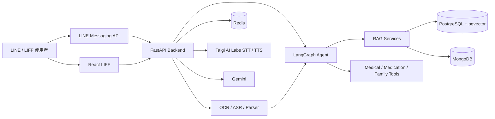
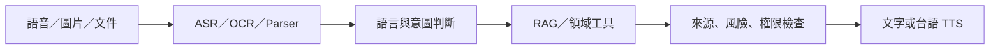

# CARE 作品說明書草稿

> 正式送件須依主辦單位「附件三：作品說明書」欄位轉填。

## 一、問題與設計目標

健康資訊服務若只提供文字搜尋或一般聊天，仍無法完整處理高齡使用者的語言、操作、可信度與家庭協作需求。本作品設計目標為：

1. 使用 LINE 降低新系統學習成本。
2. 支援台語及多媒體輸入。
3. 以 RAG 與來源引用提高可追溯性。
4. 把資訊回答連接到藥袋、提醒、健康紀錄與醫療資源等任務。
5. 以細緻權限支援家庭協作並保護敏感資料。

## 二、系統需求

- 接收 LINE 文字、語音、圖片、影音及文件。
- 辨識健康問答、查核、院所、用藥及照護意圖。
- 提供附來源的健康資訊，無足夠資料時說明限制。
- 台語語音能完成 STT、內容處理及 TTS 回覆。
- 藥袋辨識結果須人工核對。
- 家庭資料須依擁有者、角色、分類及動作授權。
- 系統不得輸出診斷或把風險提示解讀為藥品安全保證。

## 三、系統架構

## 四、AI 與 RAG 設計

使用者問題先進行意圖與查詢處理，再由 pgvector 向量檢索及文字檢索取得候選文件，經重排後建立回答上下文。回答需保留來源；檢索結果不足、來源失效或模型無法支持結論時，系統採限制說明或拒答，而非補造內容。

健康傳言查核另有主張正規化與證據匹配流程。醫療資源、用藥狀態等結構化任務由領域工具處理，不把所有操作交給語言模型自由生成。

## 五、多模態與台語流程

台語語音輸入會與華語辨識候選共同處理，再依台語字詞與候選相似度選擇。回答先濃縮為適合朗讀的台語文字，再呼叫 Taigi AI Labs TTS。長錄音會依停頓切段並控制併發與總時間預算。

## 六、後端、前端與資料

- FastAPI 提供 LINE webhook、LIFF API 與領域服務。
- React/TypeScript LIFF 提供健康紀錄、藥袋核對、家庭、定位與設定頁。
- MongoDB 保存業務文件；PostgreSQL + pgvector 負責主要向量檢索；Redis 保存短期狀態。
- Docker、Kubernetes、Helm 與 Ingress 支援部署。
- 家庭 RBAC 依 GENERAL、SENSITIVE、PRIVATE、PERSONAL 控制 READ／WRITE 與通知資格。

## 七、實作成果

### Implemented

- LINE 多輪對話與 LIFF 介面。
- 可信健康資訊 RAG、來源引用與健康傳言查核。
- 圖片 OCR、文件處理、華語／台語 STT 及 TTS。
- 藥袋掃描、使用者核對、藥物資訊與風險提示。
- 用藥提醒、血壓／血糖紀錄、自訂提醒範圍。
- 醫療資源搜尋、撥號與掛號入口。
- 家庭邀請、角色權限、健康摘要及防走失定位。

### Developing

- 多語言端到端自然語言驗證。
- 健康超限通知的正式部署啟用與場域驗證。
- 看診錄音在真實 LINE 與診間環境的驗證。
- 自然語言操作所有功能模組。

### Planned

- 體重時間序列。
- 獨立趨勢圖與醫療趨勢分析。
- 個人健康資料逐筆分享、期限、撤回及轉傳控制。

## 八、測試與評估

Repository 包含後端單元／整合測試、前端 Vitest 測試及 Playwright E2E，並有 RAG、查核、路由、藥袋、用藥交互作用、院所搜尋、STT 與 TTS 評估資料。

台語 GCP Pod 固定測句基準：

- STT：10、25、50、100、150 字各 5 次正式測試，皆無失敗或逾時；平均 CER 約 0%、13.0%、11.6%、5.8%、13.7%。
- TTS：相同長度各 5 次，皆無失敗或逾時；完整 WAV 回應中位數約 1.55、2.03、3.49、5.70、7.86 秒。

限制：STT 音檔由同一台語 TTS 合成，音質穩定，因此結果是工程下限測試，不代表真人、噪音與不同口音的表現。

## 九、創新性與可行性

本作品的創新性在於把在地台語語音、可信健康 RAG、多模態輸入、領域工具與家庭資料權限整合為同一個可操作系統。可行性來自現有程式、部署設定、測試資料及實際 API 串接，而非只有概念圖。

## 十、展示規劃

1. 台語語音詢問，展示 STT、RAG 來源及 TTS 回覆。
2. 拍攝藥袋，展示 OCR、人工核對與用藥提醒。
3. 新增血壓，展示健康紀錄及家庭權限差異。
4. 模擬定位拒絕、資料不足或無權限等失敗情境。

[待補：現場網路、帳號、測試資料與備援錄影]

## 十一、限制與未來工作

- 仍需真實高齡者及照顧者可用性測試。
- 台語口音、背景噪音與混語情境需擴充資料集。
- 不進行疾病診斷，也不宣稱醫療效能。
- 正式場域需完成個資、資安、倫理與服務責任檢視。
- 商業成本與合作模式尚待驗證。

## 十二、團隊

- 開發文件列名：游承諺、王洪賢、張宸翊、蘇奕勳、蕭丞佑。
- [待補：正式參賽名單、學校、系所、年級及分工]
- [待補：指導教授]

