# 家庭成員權限分級（family-rbac）技術文件

CARE 專案 — 以「角色 × 資料分類 × 動作」取代原本「在族譜裡＝有權」的授權判斷。

| 項目 | 內容 |
|---|---|
| 後端 repo | `C:\CARE`，commit `df576e2`、`43dccdc`、`c7191ec`、`7fe7297` |
| 前端 repo | `C:\CARE-LIFF`，commit `f46ca1a` |
| 後端技術 | Python 3.12 / FastAPI / Pydantic 2 / MongoDB (motor) |
| 前端技術 | React 19 / TypeScript 5.9 / TanStack Query 5 / Vite |
| 基礎 RBAC 測試結果 | 後端 3221 passed、前端 303 passed |
| Iteration 7 健康擴充 | 新增 PERSONAL、血壓血糖量測、提醒範圍、經期與步數的嚴格權限；模組相關後端 324 筆、前端 121 筆通過 |

---

## 1. 系統概觀

### 1.1 四種角色

角色記在**資料擁有者**的族譜文件裡，語意是「這個人對**我的**資料能做什麼」。同一個人對甲是 `GUARDIAN`、對乙可以是 `MEMBER` — 角色是「(操作者, 擁有者)」這組配對的性質，不是操作者自身的屬性。

| 角色 | 說明 | 儲存方式 |
|---|---|---|
| `OWNER` | 資料本人 | **不落地**，由 `operator_id == target_owner_id` 推導 |
| `GUARDIAN` | 主要照顧者 | 族譜成員的 `family_role` |
| `CAREGIVER` | 協助照顧者 | 族譜成員的 `family_role` |
| `MEMBER` | 一般家人 | 族譜成員的 `family_role`，或欄位缺席時的預設 |

`OWNER` 之所以不落地：一個寫得進資料庫的 `OWNER` 等於可以讓渡資料所有權。模型層的驗證器與 repository 都各擋一次。

### 1.2 四種資料分類

| 分類 | 資源 | 實際欄位 |
|---|---|---|
| `GENERAL` | 用藥提醒、藥品、身分欄位 | 吃藥時間、藥名、外觀、劑量、`name`、`picture_url` |
| `SENSITIVE` | 健康檔案、藥品適應症、健康量測、提醒範圍、步數 | 年齡、性別、身高體重、病史、`indication`、血壓血糖、上下限及每日步數 |
| `PRIVATE` | 對話摘要、原始對話 | 與 LINE 機器人的健康諮詢內容 |
| `PERSONAL` | 經期紀錄 | 開始／結束日、流量、備註及計算後週期資訊；只限本人 |

### 1.3 權限矩陣

| 角色 | GENERAL | SENSITIVE | PRIVATE | PERSONAL |
|---|---|---|---|---|
| `OWNER` | 讀 + 寫 | 讀 + 寫 | 讀 + 寫 | 讀 + 寫 |
| `GUARDIAN` | 讀 + 寫 | 讀 + 寫 | 讀 | — |
| `CAREGIVER` | 讀 + 寫 | 讀 | — | — |
| `MEMBER` | 讀 | — | — | — |
| 不在族譜內 | — | — | — | — |

### 1.4 Iteration 7 健康資源擴充

本節與 [Iteration 7 健康紀錄模組技術文件](<./Iteration%207健康紀錄模組技術文件.md>) 使用相同資源分類與嚴格授權基線。

| 資源 | 分類 | 讀取 | 寫入 |
|---|---|---|---|
| `health_measurement` | SENSITIVE | OWNER、GUARDIAN、CAREGIVER | OWNER、GUARDIAN |
| `health_alert_threshold` | SENSITIVE | OWNER、GUARDIAN、CAREGIVER | OWNER、GUARDIAN |
| `menstrual_record` | PERSONAL | 僅 OWNER | 僅 OWNER |
| `step_count` | SENSITIVE | OWNER、GUARDIAN、CAREGIVER | 僅 OWNER |

健康資源在導入前沒有 legacy 端點，因此一律以 `authorize(..., has_legacy_equivalent=False)` 判定，shadow 模式不得放寬。前端使用 `/api/family/me` 的 `my_strict_permissions` 顯示健康紀錄與代記入口；欄位缺席時 fail-closed，不退回 `my_permissions`。

`PERSONAL` 不加入 `my_permissions` 或 `my_strict_permissions` 的 general／sensitive／private 描述物件。經期 Router 先直接比對操作者與資料本人，任何跨使用者請求均回 403；PERSONAL 欄位分類提供第二道遮蔽保護。有效委任者亦不得取得 PERSONAL。

---

## 2. 流程圖

### 2.1 授權判定主流程 `authorize()`

單一判定處。每支跨使用者的端點都走這一條。

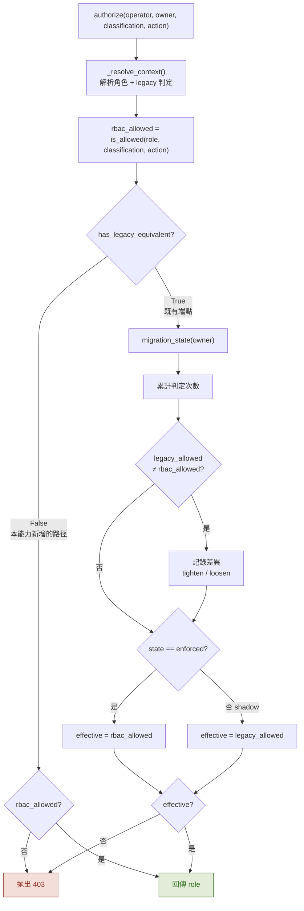

**`has_legacy_equivalent=False` 為什麼重要**：代理寫入這條路徑在本能力導入**前不存在**。若沿用 legacy 判定，一位 `MEMBER` 會在遷移期間取得他在強制之後反而**沒有**的寫入權 — 那不是保留既有行為，是憑空發明一個更寬的行為。

### 2.2 角色解析 `_resolve_context()`

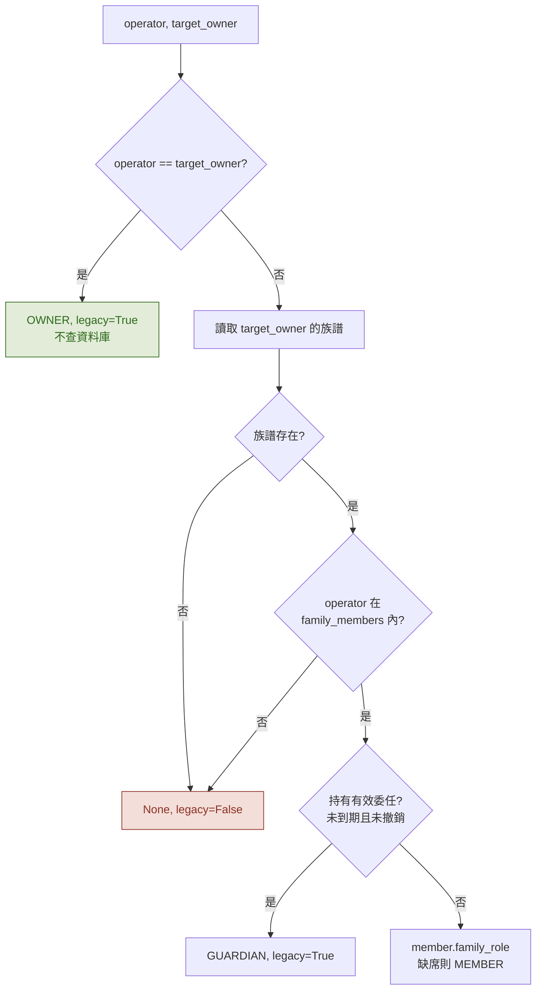

三個刻意的設計：

- **第一步不查資料庫** — 一個人對自己資料的權限不需要任何人授予，也不該因為族譜讀取失敗而消失。
- **委任解析為 `GUARDIAN`，不是 `OWNER`** — 擁有權不轉移。
- **只讀一次族譜** — 角色與 legacy 判定共用同一份文件。分成兩支各查一次，每個 `authorize` 就是兩趟往返，而這是授權的熱路徑。

### 2.3 遷移狀態決策

全域開關與逐擁有者狀態是 **AND** 關係。

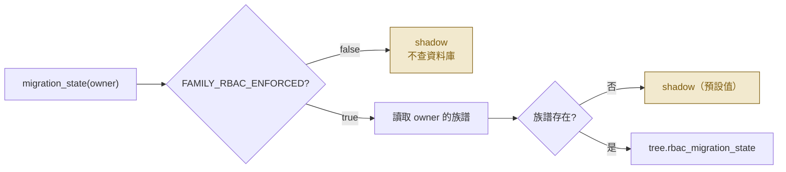

讀的是**目標擁有者**的狀態，不是操作者的。同一個人可能同時是甲家庭的照顧者與乙家庭的成員，甲已完成指派、乙還沒 — 那他對甲的資料就該受矩陣約束，對乙的不該。**要保護的是資料，不是使用者。**

### 2.4 欄位遮蔽 fail-closed

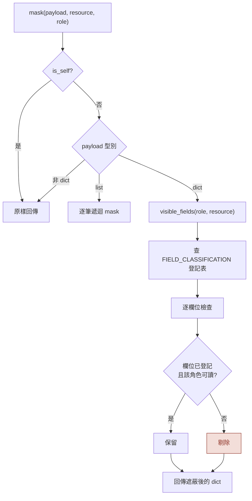

**未登記的欄位一律不跨使用者呈現。** 方向是刻意的：

- 預設剔除 → 新增一個欄位忘了登記，最壞是「家人在畫面上看不到某個欄位」。會被發現、會被回報、不會外洩。
- 預設保留 → 新增一個欄位忘了登記，會在沒有任何錯誤、沒有任何提示的情況下對權限最低的人公開。

另有一份 `DELIBERATELY_UNEXPOSED_FIELDS`（`role`、`settings`、`created_at`、`updated_at`），把「刻意不給」與「漏登記」分開，讓稽核時看得出差別。

### 2.5 角色指派的六道防護

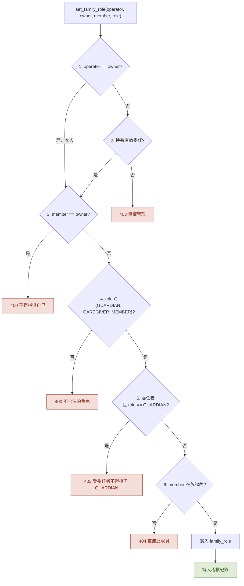

**檢查順序有意義**：第 1、2 道在讀取目標族譜**之前**執行。若先讀族譜再檢查權限，無權者可以從回應時間或錯誤碼的差異推測出某個族譜是否存在。

**第 5 道封住一條提權路徑**：受委任者若能授予 `GUARDIAN`，他就能自行擴充可代理的人數，而擁有者從未同意過。

### 2.6 安全通報的收件人

通知政策與讀取權**分開判定**。

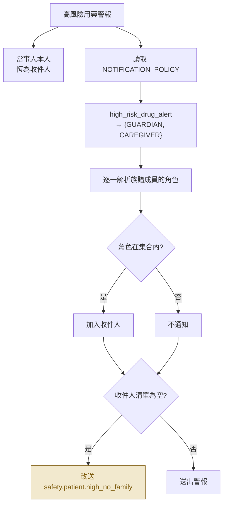

`CAREGIVER` 讀不到 `PRIVATE`，卻收得到高風險藥物警報 — 這正是「通知與讀取權分離」最好的例子。他在照顧現場，需要知道這件事；但那不代表他該看得到長輩跟機器人聊了什麼。`MEMBER` 不在任何一種推播的集合內，不會因為具備 `GENERAL` 讀取權就自動收到警報。

### 2.7 引導式角色指派（前端）

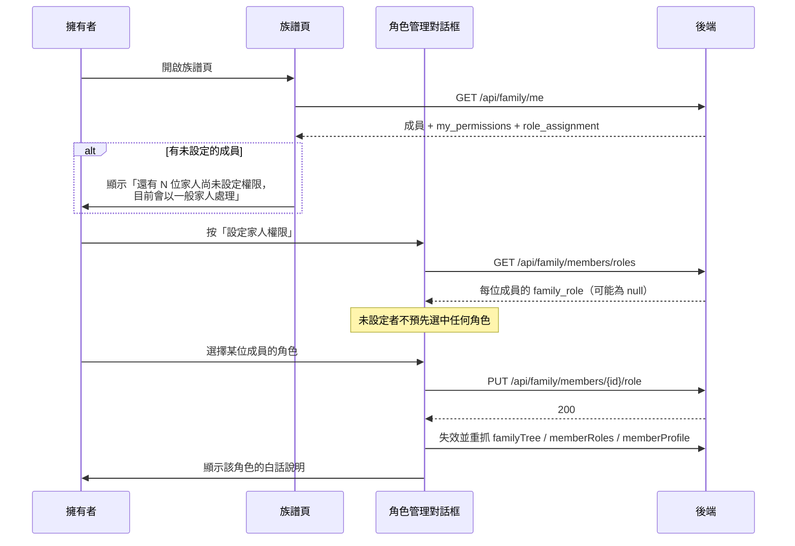

**完成狀態由後端判定，前端不採信本地旗標** — 本地旗標可以被清掉、可以在另一支裝置上不同步、也可以在使用者按了「完成」卻其實沒設定任何人時被設起來。要決定一個家庭能不能安全地進入強制，唯一可信的依據是那份族譜文件裡實際存了什麼。

### 2.8 代填健康資料

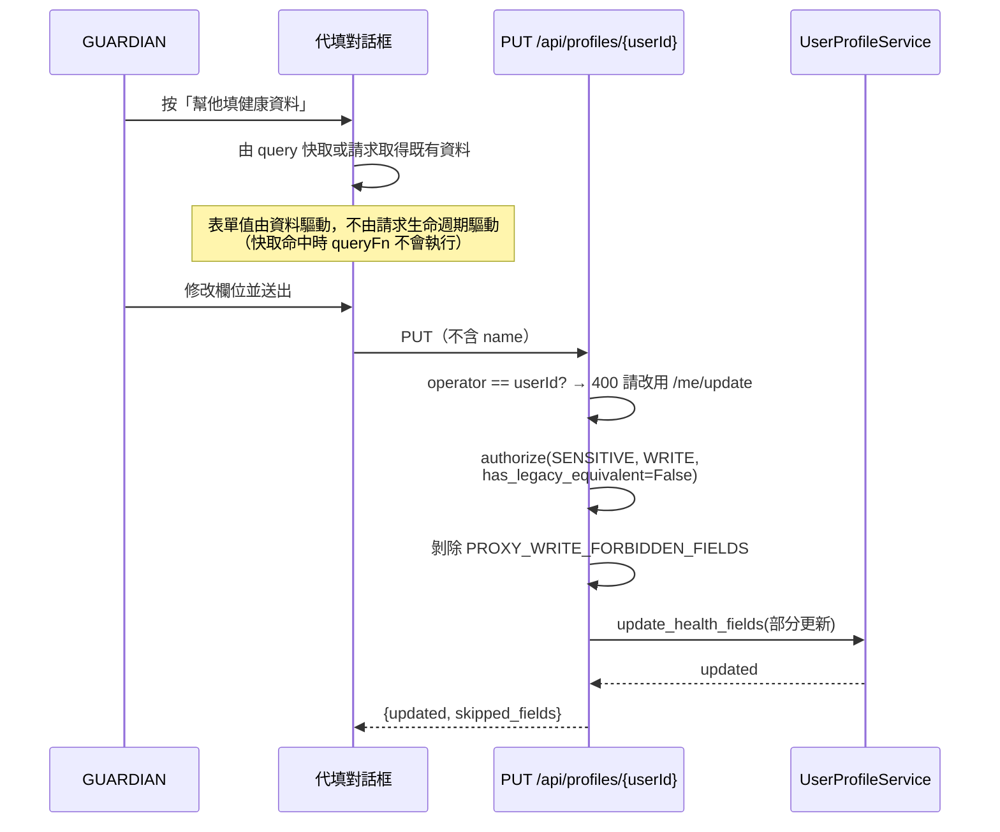

**不提供姓名與照片的編輯**：那兩個欄位由本人設定，後端也會剝除。放一個送出去會被無聲忽略的輸入框，比不放更糟。

**走部分更新而非 upsert**：`upsert_user_profile` 會以完整模型重建文件，把 `picture_url` 補成 `None`、`settings` 補成一整組預設值再寫回去 — 那會清掉被照顧者的頭像與介面偏好。

---

## 3. 類別圖

### 3.1 模型層

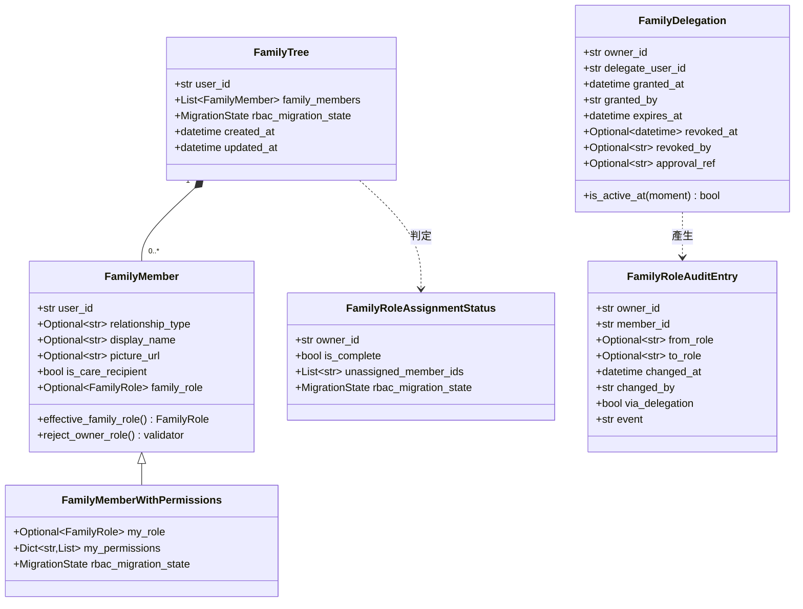

### 3.2 授權核心與服務層

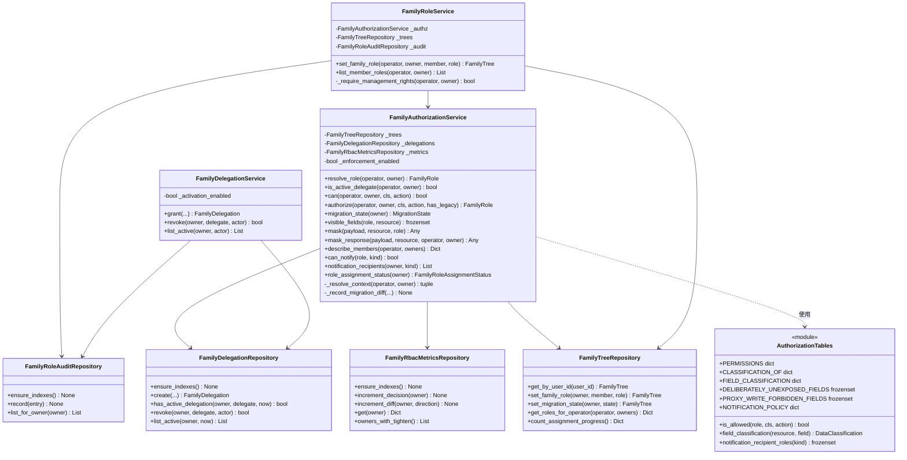

### 3.3 前端

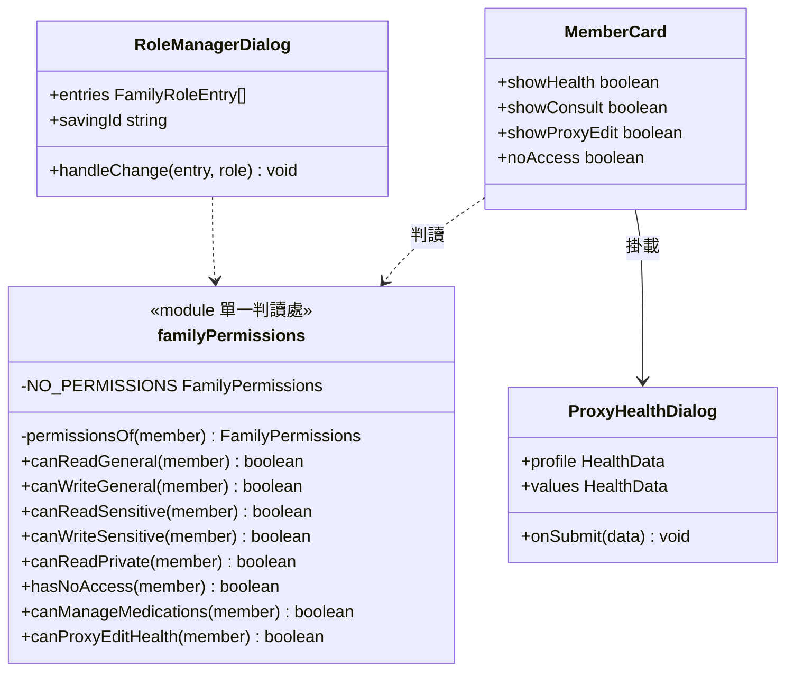

前端**不重算權限矩陣、不判斷遷移狀態**。那些只存在後端一處 — 在前端重建一次，就是第二個安全邊界，而它必然會與第一個漂移。前端唯一的職責是：不要給使用者一個按下去必定失敗的按鈕。

---

## 4. 資料格式 Schema

### 4.1 `family_trees`（既有 collection，新增兩個欄位）

```jsonc
{
  "user_id": "U1234...",                    // 既有：資料擁有者
  "family_members": [
    {
      "user_id": "U5678...",                // 既有
      "relationship_type": "child",         // 既有：parent|child|spouse|sibling|grandparent|grandchild|other
      "display_name": "小美",                // 既有
      "picture_url": "https://...",         // 既有
      "is_care_recipient": false,           // 既有
      "family_role": "GUARDIAN"             // ★ 新增：GUARDIAN|CAREGIVER|MEMBER，可缺席
    }
  ],
  "rbac_migration_state": "shadow",         // ★ 新增：shadow|enforced，預設 shadow
  "created_at": "2026-08-25T13:41:31Z",
  "updated_at": "2026-08-25T13:46:00Z"
}
```

| 欄位 | 型別 | 必填 | 預設 | 約束 |
|---|---|---|---|---|
| `family_members[].family_role` | `str \| null` | 否 | `null` | 只能是 `GUARDIAN` / `CAREGIVER` / `MEMBER`；**`OWNER` 會被拒絕** |
| `rbac_migration_state` | `str` | 否 | `"shadow"` | 只能是 `shadow` / `enforced` |

**不需要資料遷移腳本。** 既有文件沒有這兩個欄位，讀回來分別是 `null` 與 `"shadow"`，授權上視為 `MEMBER` 且行為與變更前完全相同。

**刻意不做 backfill**：補成 `MEMBER` 之後，「還沒設定」與「已決定設為一般家人」在資料上就分不出來了，而引導式指派流程正要靠這個差別知道還有誰沒設定。

### 4.2 `family_delegations`（新 collection）

受委任照顧者的授權紀錄。與族譜分開存放：族譜是擁有者自己維護的名單，委任則是「不經擁有者逐一同意就取得其資料權限」的例外路徑，兩者的寫入資格與稽核要求完全不同。

```jsonc
{
  "_id": ObjectId("..."),
  "owner_id": "U1234...",                   // 資料擁有者
  "delegate_user_id": "U9999...",           // 受委任者
  "granted_at": "2026-08-25T10:00:00Z",
  "granted_by": "U0000...",                 // 核可者／執行委任建立的一方
  "expires_at": "2026-11-23T10:00:00Z",     // 預設 90 天
  "revoked_at": null,                       // 撤銷時間，未撤銷為 null
  "revoked_by": null,
  "approval_ref": null                      // 核可流程的參照，格式待後續 change 定義
}
```

| 欄位 | 型別 | 必填 | 說明 |
|---|---|---|---|
| `owner_id` | `str` | 是 | 索引欄位之一 |
| `delegate_user_id` | `str` | 是 | 索引欄位之一 |
| `granted_at` | `datetime` | 是 | |
| `granted_by` | `str` | 是 | 稽核用 |
| `expires_at` | `datetime` | 是 | `DELEGATION_DEFAULT_VALID_DAYS = 90` |
| `revoked_at` | `datetime \| null` | 否 | 有效性查詢的條件 |
| `revoked_by` | `str \| null` | 否 | |
| `approval_ref` | `str \| null` | 否 | 待法務流程定義 |

**索引**：`{owner_id: 1, delegate_user_id: 1}` — 授權判定每次都要查「這位操作者對這位擁有者有沒有有效委任」，這是唯一的查詢形狀。

**有效性判定**：`revoked_at == null && expires_at > now`。查詢時就篩掉，不在應用層過濾。

### 4.3 `family_role_audit`（新 collection）

角色與委任變更的稽核紀錄，**append-only**。

```jsonc
{
  "_id": ObjectId("..."),
  "owner_id": "U1234...",
  "member_id": "U5678...",
  "from_role": "MEMBER",                    // 變更前，首次指派時為 null
  "to_role": "GUARDIAN",                    // 變更後
  "changed_at": "2026-08-25T14:00:00Z",
  "changed_by": "U1234...",                 // 執行變更的人
  "via_delegation": false,                  // 是否經由委任身分執行
  "event": "role_change"                    // role_change|delegation_granted|delegation_revoked
}
```

| 欄位 | 型別 | 必填 | 說明 |
|---|---|---|---|
| `owner_id` | `str` | 是 | 索引欄位之一 |
| `member_id` | `str` | 是 | |
| `from_role` | `str \| null` | 否 | |
| `to_role` | `str \| null` | 否 | 委任事件時為 null |
| `changed_at` | `datetime` | 是 | 索引欄位之一（降冪） |
| `changed_by` | `str` | 是 | |
| `via_delegation` | `bool` | 否 | 預設 `false` |
| `event` | `str` | 否 | 預設 `"role_change"` |

**索引**：`{owner_id: 1, changed_at: -1}` — 稽核的查詢形狀永遠是「某位擁有者的變更歷程，由新到舊」。

**三種事件共用同一份 collection**，是為了讓時序拼得回來。分成三個 collection 之後，「這位受委任者在被撤銷前改過誰的角色」就要跨集合合併排序。

### 4.4 `family_rbac_metrics`（新 collection）

影子模式的判定差異計數。**一位擁有者一份文件。**

```jsonc
{
  "_id": ObjectId("..."),
  "owner_id": "U1234...",                   // 唯一索引
  "decisions": 1523,                        // 總判定次數
  "tighten": 47,                            // legacy 允許但 RBAC 拒絕
  "loosen": 0,                              // legacy 拒絕但 RBAC 允許 ← 必須為 0
  "first_diff_at": "2026-08-25T09:00:00Z",
  "last_diff_at": "2026-08-25T16:30:00Z"
}
```

| 欄位 | 型別 | 說明 |
|---|---|---|
| `owner_id` | `str` | **唯一索引**。差異計數是以它為鍵的 upsert `$inc` |
| `decisions` | `int` | 分母：這位擁有者的資料被判定過幾次 |
| `tighten` | `int` | 遷移的成本。數量決定切換時機 |
| `loosen` | `int` | **不該存在**。非零即為 bug |
| `first_diff_at` | `datetime` | |
| `last_diff_at` | `datetime` | |

**索引**：`owner_id`（唯一）、`tighten`

`owner_id` 的唯一約束不只是查詢效率 — 少了它，併發的 `$inc` upsert 會生出同一位擁有者的多份文件，指標就是錯的。而那份指標正是決定何時對真實使用者開啟強制的依據，**錯的指標比沒有指標更危險**。

**只記判定要素，不記任何資料內容。**

### 4.5 API 請求／回應

#### `PUT /api/family/members/{memberId}/role`

```jsonc
// Request
{ "family_role": "GUARDIAN" }               // 型別刻意宣告為寬鬆的 str
```

`family_role` 宣告為 `str` 而非 `Literal`，是為了讓不合法的值由 service 回 **400**（帶得出「不合法的角色」這句話），而不是由 FastAPI 回 422（一串 Pydantic 的錯誤結構，前端沒辦法對使用者說人話）。

```jsonc
// Response 200：更新後的完整族譜
{
  "user_id": "U1234...",
  "family_members": [ /* ... */ ],
  "rbac_migration_state": "enforced",
  "created_at": "...", "updated_at": "..."
}
```

#### `GET /api/family/members/roles`

```jsonc
// Response 200
[
  {
    "user_id": "U5678...",
    "display_name": "小美",
    "family_role": "GUARDIAN",              // null 代表尚未設定
    "effective_family_role": "GUARDIAN"     // 授權實際採用的值，缺席時為 MEMBER
  }
]
```

兩個欄位並存是刻意的：`family_role` 回答「擁有者設定過嗎」，`effective_family_role` 回答「現在實際是什麼權限」。呈現面需要分得出來。

#### `GET /api/family/role-assignment-status`

```jsonc
// Response 200
{
  "owner_id": "U1234...",
  "is_complete": false,
  "unassigned_member_ids": ["U5678...", "U9999..."],
  "rbac_migration_state": "shadow"
}
```

#### `GET /api/family/me`（既有端點，回應擴充）

```jsonc
{
  "family_tree": {
    "user_id": "U1234...",
    "family_members": [
      {
        "user_id": "U5678...",
        "display_name": "小美",
        "relationship_type": "child",
        "family_role": "GUARDIAN",          // 他對我的資料是什麼角色
        "my_role": "MEMBER",                // ★ 我對他的資料是什麼角色
        "my_permissions": {                 // ★ 已套用對方遷移狀態的實際權限
          "general": ["READ"],
          "sensitive": [],
          "private": []
        },
        "rbac_migration_state": "enforced"  // ★ 對方家庭的狀態
      }
    ],
    "rbac_migration_state": "enforced"
  },
  "role_assignment": {                      // ★ 我自己的指派進度
    "owner_id": "U1234...",
    "is_complete": true,
    "unassigned_member_ids": [],
    "rbac_migration_state": "enforced"
  }
}
```

`family_role` 與 `my_role` **方向相反**，這是最容易讀錯的地方：前者存在我的族譜裡（他對我），後者要去對方的族譜查（我對他）。

#### `PUT /api/profiles/{userId}`（新端點，代填健康資料）

```jsonc
// Request：所有欄位皆可省略
{
  "gender": "female",                       // male|female|unknown
  "height": 158.0,                          // > 0
  "weight": 52.0,                           // > 0
  "age": 79,                                // 0 ~ 130
  "chronic_diseases": ["hypertension"],
  "chronic_custom": ["痛風"],
  "major_illness_history": "2019 年心導管手術",
  "surgery_history": ""
  // name / display_name / picture_url / role / settings / line_id
  // 收得下，但一律剝除並在 skipped_fields 回報
}
```

```jsonc
// Response 200
{
  "user_id": "U1234...",
  "updated": true,
  "skipped_fields": ["name"]                // 送了但不可寫的欄位
}
```

**全部可選 + `exclude_unset`** 是這條路徑的正確語意，也是安全上的必要條件：若連沒帶到的鍵也一起寫入，它們會以 `null` 進 `$set`，把被照顧者既有的身高、慢性病、病史一次清成 null — 而呼叫端只想補一個年齡。

### 4.6 設定開關

| 環境變數 | 預設 | 管什麼 |
|---|---|---|
| `FAMILY_RBAC_ENFORCED` | `false` | 授權判定要不要強制。與逐擁有者的 `rbac_migration_state` 是 **AND**。出事時讓全體立刻回到變更前的行為，不必逐一改資料 |
| `FAMILY_DELEGATION_ACTIVATION_ENABLED` | `false` | 能不能**建立**新的委任。核可流程（身分驗證、醫療證明、法定監護證明）定義之前不得開啟。**撤銷不受此開關限制** — 閘門管的是能不能給出去，不是能不能收回來 |

### 4.7 索引總表

| Collection | 索引 | 用途 |
|---|---|---|
| `family_delegations` | `{owner_id: 1, delegate_user_id: 1}` | 授權熱路徑的委任查詢 |
| `family_role_audit` | `{owner_id: 1, changed_at: -1}` | 稽核歷程查詢 |
| `family_rbac_metrics` | `{owner_id: 1}` **unique** | upsert `$inc` 的定位鍵，防併發重複文件 |
| `family_rbac_metrics` | `{tighten: 1}` | 列舉仍在產生收緊差異的擁有者 |

三份索引都在 `app/main.py` 的 lifespan 建立，與其他既有 collection 同一處。

---

## 5. 測試案例

### 5.1 說明

- **Identification** 依模組編號，`FR` 為 family-rbac 的前綴。
- **Test Proposal** 取自測試函式的 docstring 第一句；未撰寫 docstring 者，該專案的函式名稱本身即為完整敘述，直接引用。
- **Real Output** 欄位的依據：下表所有案例在 Python 3.12.14 與 3.14.7 兩個版本上皆為 `passed`。測試通過即代表實際輸出與 Expected Result 的斷言完全相符；若不符，pytest 會標記為 failed 並印出差異。
- 標示 `[參數化]` 者為 `pytest.mark.parametrize`，一個函式展開為多個實際案例。269 個測試函式共展開為 **346** 個後端測試案例。

### 5.2 測試環境

| 項目 | 內容 |
|---|---|
| 後端測試框架 | pytest + pytest-asyncio |
| 前端測試框架 | Vitest + React Testing Library |
| 相依注入 | 一律以參數注入（`collection=`、`repository=`），**專案規範禁止 monkey patch** |
| 執行指令（後端） | `.\.venv\Scripts\python.exe -m pytest tests\ -q` |
| 執行指令（前端） | `npm.cmd run test` |
| 後端結果 | **3221 passed**、7 skipped、2 failed（皆為環境限制，見 §5.12） |
| 前端結果 | **303 passed**、30 個測試檔 |

### 5.3 授權表與模型（`tests/unit/models/`）

四張授權表的窮舉驗證，以及族譜模型的角色欄位與遷移狀態。

共 33 個測試函式。

| Identification | Test Function Name | Test Proposal | Input | Expected Result | Real Output | Test Result |
|---|---|---|---|---|---|---|
| FR-MDL-01 | `test_matrix_cell_matches_spec` [參數化] | Matrix cell matches spec | 以測試資料建構模型／表格 | `PERMISSIONS[role][classification] == EXPECTED_MATRIX[role, classification]` | 與 Expected 相符 | passed |
| FR-MDL-02 | `test_is_allowed_matches_matrix` [參數化] | Is allowed matches matrix | `is_allowed(role, classification, action)` | `is_allowed(role, classification, action) is expected` | 與 Expected 相符 | passed |
| FR-MDL-03 | `test_non_member_has_no_permission_at_all` | 不在族譜內時角色解析為 None，任何組合都不得放行。 | `is_allowed(None, classification, action)` | `is_allowed(None, classification, action) is False` | 與 Expected 相符 | passed |
| FR-MDL-04 | `test_write_does_not_imply_read` | WRITE 不得蘊含 READ。 | `is_allowed('MEMBER', 'GENERAL', 'WRITE', permissions=write_only)` | `is_allowed('MEMBER', 'GENERAL', 'WRITE', permissions=write_only) is True`<br>`is_allowed('MEMBER', 'GENERAL', 'READ', permissions=write_only) is False` | 與 Expected 相符 | passed |
| FR-MDL-05 | `test_read_does_not_imply_write` | MEMBER 對 GENERAL 只有 READ，SHALL NOT 因此取得 WRITE。 | `is_allowed('MEMBER', 'GENERAL', 'READ')` | `is_allowed('MEMBER', 'GENERAL', 'READ') is True`<br>`is_allowed('MEMBER', 'GENERAL', 'WRITE') is False` | 與 Expected 相符 | passed |
| FR-MDL-06 | `test_owner_is_not_assignable` | OWNER 是「這份資料是誰的」的事實，不是可授予的角色。 | 以測試資料建構模型／表格 | `'OWNER' not in ASSIGNABLE_FAMILY_ROLES`<br>`ASSIGNABLE_FAMILY_ROLES == frozenset({'GUARDIAN', 'CAREGIVER', 'MEMBER'})` | 與 Expected 相符 | passed |
| FR-MDL-07 | `test_default_role_is_member` | Default role is member | 以測試資料建構模型／表格 | `DEFAULT_FAMILY_ROLE == 'MEMBER'` | 與 Expected 相符 | passed |
| FR-MDL-08 | `test_default_migration_state_is_shadow` | 預設不強制：新擁有者不會在沒指派任何角色的情況下就把家人擋在門外。 | 以測試資料建構模型／表格 | `DEFAULT_MIGRATION_STATE == 'shadow'` | 與 Expected 相符 | passed |
| FR-MDL-09 | `test_consultation_summary_and_raw_are_both_private` | 摘要是原始對話的濃縮，降一級等於讓同一份內容從側門走出去。 | 以測試資料建構模型／表格 | `CLASSIFICATION_OF['consultation_summary'] == 'PRIVATE'`<br>`CLASSIFICATION_OF['consultation_raw'] == 'PRIVATE'` | 與 Expected 相符 | passed |
| FR-MDL-10 | `test_indication_fields_are_sensitive` | 三個適應症欄位回答的都是「這個人為什麼吃這個藥」，同屬 SENSITIVE。 | `field_classification('medication', field)` | `field_classification('medication', field) == 'SENSITIVE'` | 與 Expected 相符 | passed |
| FR-MDL-11 | `test_display_identity_fields_are_general` | 族譜清單靠這兩個欄位回答「這是誰」，權限最低的成員也看得到。 | `field_classification('health_profile', 'name')` | `field_classification('health_profile', 'name') == 'GENERAL'`<br>`field_classification('health_profile', 'picture_url') == 'GENERAL'` | 與 Expected 相符 | passed |
| FR-MDL-12 | `test_health_fields_are_sensitive` | Health fields are sensitive | `field_classification('health_profile', field)` | `field_classification('health_profile', field) == 'SENSITIVE'` | 與 Expected 相符 | passed |
| FR-MDL-13 | `test_unregistered_field_returns_none_not_general` | fail-closed 的方向：查不到就是查不到，不得代換成資源的預設分類。 | `field_classification('medication', 'some_future_field')` | `field_classification('medication', 'some_future_field') is None`<br>`field_classification('health_profile', 'role') is None` | 與 Expected 相符 | passed |
| FR-MDL-14 | `test_proxy_write_forbidden_fields_cover_display_identity` | 分類回答「誰看得到」，不回答「誰改得動」。 | 以測試資料建構模型／表格 | `field in PROXY_WRITE_FORBIDDEN_FIELDS` | 與 Expected 相符 | passed |
| FR-MDL-15 | `test_member_is_not_a_notification_recipient` | MEMBER 有 GENERAL 讀取權，但 SHALL NOT 因此收到任何推播。 | 以測試資料建構模型／表格 | `'MEMBER' not in roles` | 與 Expected 相符 | passed |
| FR-MDL-16 | `test_high_risk_alert_recipients_are_guardian_and_caregiver` | High risk alert recipients are guardian and caregiver | `notification_recipient_roles('high_risk_drug_alert')` | `notification_recipient_roles('high_risk_drug_alert') == frozenset({'GUARDIAN', 'CAREGIVER'})` | 與 Expected 相符 | passed |
| FR-MDL-17 | `test_notification_policy_is_not_derived_from_permissions` | 通知政策與讀取權是兩套獨立的表。 | `notification_recipient_roles('high_risk_drug_alert')` | `notification_recipient_roles('high_risk_drug_alert') != sensitive_readers` | 與 Expected 相符 | passed |
| FR-MDL-18 | `test_unknown_notification_kind_raises_rather_than_falls_back` | 查不到的推播種類 SHALL 直接爆，SHALL NOT 悄悄落回讀取權。 | `notification_recipient_roles('not_a_real_kind')` | `pytest.raises(KeyError)` | 與 Expected 相符 | passed |
| FR-MDL-19 | `test_every_cross_user_output_field_is_classified` [參數化] | 守門測試：模型新增欄位而未登記分類時，這條 SHALL 失敗。 | 以測試資料建構模型／表格 | `not unclassified` | 與 Expected 相符 | passed |
| FR-MDL-20 | `test_field_classification_has_no_entry_for_unknown_model_field` | 反向守門：登記表裡不得有模型上已不存在的欄位。 | 以測試資料建構模型／表格 | `not stale` | 與 Expected 相符 | passed |
| FR-MDL-21 | `test_otc_notification_recipients_match_high_risk_alert` | 兩種推播的收件人相同，理由也相同：能收到完整訊息的就是這兩個角色。 | `notification_recipient_roles('otc_medication_added')` | `notification_recipient_roles('otc_medication_added') == frozenset({'GUARDIAN', 'CAREGIVER'})` | 與 Expected 相符 | passed |
| FR-MDL-22 | `test_member_is_not_a_recipient_of_any_notification` | MEMBER 不在任何推播的收件人內。 | 以測試資料建構模型／表格 | `'MEMBER' not in roles` | 與 Expected 相符 | passed |
| FR-MDL-23 | `test_family_role_absent_means_unset_not_member` | 既有文件沒有這個欄位，讀回時 SHALL 是 None——不是 MEMBER。 | 以測試資料建構模型／表格 | `member.family_role is None`<br>`member.effective_family_role == 'MEMBER'` | 與 Expected 相符 | passed |
| FR-MDL-24 | `test_explicit_member_is_distinguishable_from_unset` | Explicit member is distinguishable from unset | 以測試資料建構模型／表格 | `explicit.family_role == 'MEMBER'`<br>`unset.family_role is None` | 與 Expected 相符 | passed |
| FR-MDL-25 | `test_assignable_roles_accepted` [參數化] | Assignable roles accepted | 以測試資料建構模型／表格 | `FamilyMember(user_id='U1', family_role=role).family_role == role` | 與 Expected 相符 | passed |
| FR-MDL-26 | `test_owner_cannot_be_assigned_to_a_member` | OWNER 是推導值，寫入它等於讓渡資料所有權。 | 觸發 `pytest.raises(ValidationError)` | `pytest.raises(ValidationError)` | 與 Expected 相符 | passed |
| FR-MDL-27 | `test_set_role_request_accepts_raw_string_so_service_can_return_400` | 請求模型刻意寬鬆：spec 要求指派 OWNER 回 400，而型別檢查會回 422。 | 以測試資料建構模型／表格 | `SetFamilyRoleRequest(family_role='OWNER').family_role == 'OWNER'` | 與 Expected 相符 | passed |
| FR-MDL-28 | `test_unknown_role_rejected` | Unknown role rejected | 觸發 `pytest.raises(ValidationError)` | `pytest.raises(ValidationError)` | 與 Expected 相符 | passed |
| FR-MDL-29 | `test_tree_defaults_to_shadow_migration_state` | 預設不強制：既有家庭不會因為部署就突然失去功能。 | 以測試資料建構模型／表格 | `_tree().rbac_migration_state == 'shadow'` | 與 Expected 相符 | passed |
| FR-MDL-30 | `test_tree_migration_state_is_per_owner` | 狀態存在擁有者的文件上，因此不同擁有者可以各自處於不同狀態。 | 以測試資料建構模型／表格 | `shadow.rbac_migration_state == 'shadow'`<br>`enforced.rbac_migration_state == 'enforced'` | 與 Expected 相符 | passed |
| FR-MDL-31 | `test_invalid_migration_state_rejected` | Invalid migration state rejected | 觸發 `pytest.raises(ValidationError)` | `pytest.raises(ValidationError)` | 與 Expected 相符 | passed |
| FR-MDL-32 | `test_role_entry_keeps_unset_visible_to_presentation` | 呈現面要能分辨「未設定」與「設成 MEMBER」，才講得出正確的話。 | 以測試資料建構模型／表格 | `entry.family_role is None`<br>`entry.effective_family_role == 'MEMBER'` | 與 Expected 相符 | passed |
| FR-MDL-33 | `test_care_recipient_flag_is_independent_of_role` | 照顧對象標記是業務狀態，與角色互不推導。 | 以測試資料建構模型／表格 | `member.family_role is None`<br>`guardian.is_care_recipient is False` | 與 Expected 相符 | passed |

### 5.4 資料層（`tests/unit/repositories/`）

角色寫入、委任有效性、稽核 append-only、差異計數器。

共 43 個測試函式。

| Identification | Test Function Name | Test Proposal | Input | Expected Result | Real Output | Test Result |
|---|---|---|---|---|---|---|
| FR-REPO-01 | `test_set_family_role_writes_assignable_roles` [參數化] | Set family role writes assignable roles | `FamilyTreeRepository.set_family_role(OWNER, MEMBER, role, collection=collection)` | `tree is not None`<br>`query == {'user_id': OWNER, 'family_members.user_id': MEMBER}` | 與 Expected 相符 | passed |
| FR-REPO-02 | `test_set_family_role_rejects_owner_before_touching_the_database` | OWNER 是推導值，寫入它等於讓渡資料所有權。 | `FamilyTreeRepository.set_family_role(OWNER, MEMBER, 'OWNER', collection=collection)` | `pytest.raises(ValueError)` | 與 Expected 相符 | passed |
| FR-REPO-03 | `test_set_family_role_rejects_unknown_role` | Set family role rejects unknown role | `FamilyTreeRepository.set_family_role(OWNER, MEMBER, 'ADMIN', collection=collection)` | `pytest.raises(ValueError)` | 與 Expected 相符 | passed |
| FR-REPO-04 | `test_set_family_role_does_not_touch_migration_state` | 角色指派 SHALL NOT 成為讓某個家庭退回 legacy 授權的路徑。 | `FamilyTreeRepository.set_family_role(OWNER, MEMBER, 'CAREGIVER', collection=collection)` | `'rbac_migration_state' not in str(update)` | 與 Expected 相符 | passed |
| FR-REPO-05 | `test_set_family_role_only_touches_the_named_member` | 定位子 `family_members.$` 只會命中查詢條件指到的那一個元素。 | `FamilyTreeRepository.set_family_role(OWNER, MEMBER, 'GUARDIAN', collection=collection)` | `list(update['$set'].keys()) == ['family_members.$.family_role', 'updated_at']` | 與 Expected 相符 | passed |
| FR-REPO-06 | `test_set_family_role_returns_none_when_member_absent` | Set family role returns none when member absent | `FamilyTreeRepository.set_family_role(OWNER, 'U-not-there', 'MEMBER', collection=collection)` | `result is None` | 與 Expected 相符 | passed |
| FR-REPO-07 | `test_add_member_does_not_touch_migration_state` | 「新增家庭成員 → 觸發 legacy fallback」是一條提權路徑，必須封死。 | 以測試資料建構模型／表格 | `'rbac_migration_state' not in source`<br>`'"$set": {"updated_at": now}' in source` | 與 Expected 相符 | passed |
| FR-REPO-08 | `test_new_member_arrives_without_a_role` | 新成員未設定角色即以 MEMBER 處理，且「未設定」這個狀態要保得住。 | 以測試資料建構模型／表格 | `member.family_role is None`<br>`member.effective_family_role == 'MEMBER'` | 與 Expected 相符 | passed |
| FR-REPO-09 | `test_set_migration_state_is_the_only_writer_of_that_field` | Set migration state is the only writer of that field | `FamilyTreeRepository.set_migration_state(OWNER, 'enforced', collection=collection)` | `update['$set']['rbac_migration_state'] == 'enforced'` | 與 Expected 相符 | passed |
| FR-REPO-10 | `test_set_migration_state_rejects_unknown_state` | Set migration state rejects unknown state | `FamilyTreeRepository.set_migration_state(OWNER, 'legacy', collection=collection)` | `pytest.raises(ValueError)` | 與 Expected 相符 | passed |
| FR-REPO-11 | `test_other_setters_do_not_touch_migration_state` | set_relationship／set_care_recipient 也不得成為回退的路徑。 | 以測試資料建構模型／表格 | `'rbac_migration_state' not in inspect.getsource(method)` | 與 Expected 相符 | passed |
| FR-REPO-12 | `test_existing_document_without_family_role_reads_back_as_member` | 既有族譜文件沒有 `family_role` 欄位，讀回時不得炸、也不得憑空補值。 | 以測試資料建構模型／表格 | `member.family_role is None`<br>`member.effective_family_role == 'MEMBER'` | 與 Expected 相符 | passed |
| FR-REPO-13 | `test_roles_for_operator_uses_a_single_query_for_many_members` | 族譜頁一次可能有十餘位成員，逐一查詢的延遲在長輩的行動網路上看得見。 | `FamilyTreeRepository.get_roles_for_operator(MEMBER, owner_ids, collection=collection)` | `collection.find.call_count == 1`<br>`len(result) == 10` | 與 Expected 相符 | passed |
| FR-REPO-14 | `test_roles_for_operator_reads_the_direction_that_lives_in_the_other_tree` | 回的是「**我對他的**資料是什麼角色」——存在對方的文件裡。 | `FamilyTreeRepository.get_roles_for_operator(MEMBER, ['U-elder'], collection=collection)` | `result['U-elder']['family_role'] == 'CAREGIVER'`<br>`result['U-elder']['rbac_migration_state'] == 'enforced'` | 與 Expected 相符 | passed |
| FR-REPO-15 | `test_operator_absent_from_a_tree_is_omitted_not_defaulted` | 不在對方族譜裡就沒有任何角色——SHALL NOT 給預設值。 | `FamilyTreeRepository.get_roles_for_operator(MEMBER, ['U-stranger-tree'], collection=collection)` | `result == {}` | 與 Expected 相符 | passed |
| FR-REPO-16 | `test_roles_for_operator_short_circuits_on_empty_input` | 沒有成員時不該白跑一趟資料庫。 | `FamilyTreeRepository.get_roles_for_operator(MEMBER, [], collection=collection)` | `await FamilyTreeRepository.get_roles_for_operator(MEMBER, [], collection=collection) == {}` | 與 Expected 相符 | passed |
| FR-REPO-17 | `test_grant_defaults_to_ninety_days` | Grant defaults to ninety days | `FamilyDelegationRepository.grant(owner_id=OWNER, delegate_user_id=DELEGATE, granted_by='U-approver', now=NOW,…` | `delegation.expires_at == NOW + timedelta(days=DELEGATION_DEFAULT_VALID_DAYS)`<br>`DELEGATION_DEFAULT_VALID_DAYS == 90` | 與 Expected 相符 | passed |
| FR-REPO-18 | `test_grant_records_provenance_fields` | 稽核要回答「誰在什麼時候依據什麼取得了這項委任」。 | `FamilyDelegationRepository.grant(owner_id=OWNER, delegate_user_id=DELEGATE, granted_by='U-approver', approval…` | `delegation.granted_at == NOW`<br>`delegation.granted_by == 'U-approver'` | 與 Expected 相符 | passed |
| FR-REPO-19 | `test_grant_rejects_non_positive_validity` | 委任 SHALL NOT 永久存在，也不得零效期。 | `FamilyDelegationRepository.grant(owner_id=OWNER, delegate_user_id=DELEGATE, granted_by='U-approver', valid_da…` | `pytest.raises(ValueError)` | 與 Expected 相符 | passed |
| FR-REPO-20 | `test_has_active_delegation_filters_revoked_and_expired_in_the_query` | 有效性在查詢條件裡就成立，不是撈回來再過濾。 | `FamilyDelegationRepository.has_active_delegation(owner_id=OWNER, delegate_user_id=DELEGATE, now=NOW, collecti…` | `query['owner_id'] == OWNER`<br>`query['delegate_user_id'] == DELEGATE` | 與 Expected 相符 | passed |
| FR-REPO-21 | `test_has_active_delegation_false_when_nothing_matches` | Has active delegation false when nothing matches | `FamilyDelegationRepository.has_active_delegation(owner_id=OWNER, delegate_user_id=DELEGATE, now=NOW, collecti…` | `await FamilyDelegationRepository.has_active_delegation(owner_id=OWNER, delegate_user_id=DELEGATE, now=NOW, co…` | 與 Expected 相符 | passed |
| FR-REPO-22 | `test_list_active_excludes_revoked_and_expired` | List active excludes revoked and expired | `FamilyDelegationRepository.list_active(OWNER, now=NOW, collection=collection)` | `len(active) == 1`<br>`query['revoked_at'] is None` | 與 Expected 相符 | passed |
| FR-REPO-23 | `test_revoke_marks_instead_of_deleting` | 撤銷是標記而非刪除——委任存續的那段期間正是最需要事後查得到的一段。 | `FamilyDelegationRepository.revoke(owner_id=OWNER, delegate_user_id=DELEGATE, revoked_by=OWNER, now=NOW, colle…` | `not hasattr(collection, 'delete_one') or not collection.delete_one.called`<br>`update['$set']['revoked_at'] == NOW` | 與 Expected 相符 | passed |
| FR-REPO-24 | `test_repository_has_no_delete_method` | 稽核與 provenance 需要紀錄一直在，因此連刪除的入口都不提供。 | 以測試資料建構模型／表格 | `not any(('delete' in name for name in method_names))` | 與 Expected 相符 | passed |
| FR-REPO-25 | `test_list_all_for_audit_does_not_filter` | 稽核查詢要看得到全部，含已到期與已撤銷者。 | `FamilyDelegationRepository.list_all_for_audit(OWNER, collection=collection)` | `query == {'owner_id': OWNER}` | 與 Expected 相符 | passed |
| FR-REPO-26 | `test_ensure_indexes_does_not_create_a_ttl_index` | 到期的委任要留著供稽核，不能讓資料庫自動清掉。 | `FamilyDelegationRepository.ensure_indexes(collection=collection)` | `'expireAfterSeconds' not in call.kwargs` | 與 Expected 相符 | passed |
| FR-REPO-27 | `test_is_active_at_handles_naive_datetimes_from_mongo` | pymongo 以 naive UTC 讀回 datetime，直接與帶時區的 now 比較會拋 TypeError。 | 以測試資料建構模型／表格 | `delegation.is_active_at(NOW) is True`<br>`delegation.is_active_at(datetime(2026, 12, 1, tzinfo=timezone.utc)) is False` | 與 Expected 相符 | passed |
| FR-REPO-28 | `test_revoked_delegation_is_never_active` | Revoked delegation is never active | 以測試資料建構模型／表格 | `delegation.is_active_at(NOW) is False` | 與 Expected 相符 | passed |
| FR-REPO-29 | `test_append_records_role_change_with_before_and_after` | Append records role change with before and after | `FamilyRoleAuditRepository.append(owner_id=OWNER, member_id=MEMBER, changed_by=OWNER, from_role='MEMBER', to_r…` | `entry.from_role == 'MEMBER'`<br>`entry.to_role == 'GUARDIAN'` | 與 Expected 相符 | passed |
| FR-REPO-30 | `test_via_delegation_distinguishes_who_actually_decided` | 事後要分得出「長輩自己指派的」與「別人代他指派的」。 | `FamilyRoleAuditRepository.append(owner_id=OWNER, member_id=MEMBER, changed_by=OWNER, to_role='CAREGIVER', now…` | `direct.via_delegation is False`<br>`delegated.via_delegation is True` | 與 Expected 相符 | passed |
| FR-REPO-31 | `test_delegation_events_share_the_same_audit_trail` | 委任的建立與撤銷走同一份稽核，否則事件時序拼不回來。 | `FamilyRoleAuditRepository.append(owner_id=OWNER, member_id='U-delegate', changed_by='U-approver', event='dele…` | `entry.event == 'delegation_granted'` | 與 Expected 相符 | passed |
| FR-REPO-32 | `test_repository_offers_no_update_or_delete` | Repository offers no update or delete | 以測試資料建構模型／表格 | `not any((keyword in name for name in names for keyword in ('update', 'delete', 'remove', 'replace')))` | 與 Expected 相符 | passed |
| FR-REPO-33 | `test_list_for_owner_sorts_newest_first` | List for owner sorts newest first | `FamilyRoleAuditRepository.list_for_owner(OWNER, collection=collection)` | 不拋出例外 | 與 Expected 相符 | passed |
| FR-REPO-34 | `test_record_increments_the_named_direction` [參數化] | Record increments the named direction | `FamilyRbacMetricsRepository.record(OWNER, direction, now=NOW, collection=collection)` | `query == {'owner_id': OWNER}`<br>`update['$inc'] == {direction: 1}` | 與 Expected 相符 | passed |
| FR-REPO-35 | `test_two_directions_are_counted_separately` | 收緊與放寬的意義完全不同，混在同一個數字裡就分不出 bug 與遷移成本。 | `FamilyRbacMetricsRepository.record(OWNER, 'tighten', collection=collection)` | `increments == [{'tighten': 1}, {'loosen': 1}]` | 與 Expected 相符 | passed |
| FR-REPO-36 | `test_unknown_direction_is_rejected_before_writing` | Unknown direction is rejected before writing | `FamilyRbacMetricsRepository.record(OWNER, 'sideways', collection=collection)` | `pytest.raises(ValueError)` | 與 Expected 相符 | passed |
| FR-REPO-37 | `test_decisions_are_counted_as_the_denominator` | 判準 1 要的是比例；只有分子沒有分母算不出來。 | `FamilyRbacMetricsRepository.record_decision(OWNER, now=NOW, collection=collection)` | `update['$inc'] == {'decisions': 1}` | 與 Expected 相符 | passed |
| FR-REPO-38 | `test_get_returns_zeros_for_an_unknown_owner` | 「沒有差異」與「沒有這個人」在數字上是同一件事，回 None 會逼呼叫端。 | `FamilyRbacMetricsRepository.get(OWNER, collection=collection)` | `result == {'owner_id': OWNER, 'tighten': 0, 'loosen': 0, 'decisions': 0, 'last_diff_at': None}` | 與 Expected 相符 | passed |
| FR-REPO-39 | `test_list_owners_with_tighten_sorts_by_impact` | 判準 4：受影響對象要能逐一列舉，而且從影響最大的開始看。 | `FamilyRbacMetricsRepository.list_owners_with_tighten(collection=collection)` | `[o['owner_id'] for o in owners] == ['U-a', 'U-b']`<br>`collection.find.call_args.args[0] == {'tighten': {'$gt': 0}}` | 與 Expected 相符 | passed |
| FR-REPO-40 | `test_totals_returns_zeros_when_nothing_recorded` | Totals returns zeros when nothing recorded | `FamilyRbacMetricsRepository.totals(collection=collection)` | `await FamilyRbacMetricsRepository.totals(collection=collection) == {'tighten': 0, 'loosen': 0, 'decisions': 0…` | 與 Expected 相符 | passed |
| FR-REPO-41 | `test_totals_sums_across_owners` | Totals sums across owners | `FamilyRbacMetricsRepository.totals(collection=collection)` | `await FamilyRbacMetricsRepository.totals(collection=collection) == {'tighten': 11, 'loosen': 0, 'decisions': …` | 與 Expected 相符 | passed |
| FR-REPO-42 | `test_repository_stores_no_thresholds` | 門檻是部署決策，SHALL NOT 硬編。 | 以測試資料建構模型／表格 | `banned not in source` | 與 Expected 相符 | passed |
| FR-REPO-43 | `test_startup_creates_indexes_for_every_new_collection` | 三份新 collection 的 `ensure_indexes` SHALL 在 lifespan 被呼叫。 | 以測試資料建構模型／表格 | `f'{repo}.ensure_indexes()' in source` | 與 Expected 相符 | passed |

### 5.5 授權服務（`test_family_authorization_service.py`）

單一判定處的窮舉判定、委任解析、fail-closed 遮蔽、影子模式差異記錄。

共 63 個測試函式。

| Identification | Test Function Name | Test Proposal | Input | Expected Result | Real Output | Test Result |
|---|---|---|---|---|---|---|
| FR-SVC-A-01 | `test_operator_is_owner_of_own_data` | 一個人對自己資料的權限不需要任何人授予。 | `service.resolve_role(OWNER, OWNER)` | `await service.resolve_role(OWNER, OWNER) == 'OWNER'` | 與 Expected 相符 | passed |
| FR-SVC-A-02 | `test_own_data_resolution_does_not_touch_the_database` | 自己的資料不該因為族譜讀取失敗而變成無權。 | `service.resolve_role(OWNER, OWNER)` | `await service.resolve_role(OWNER, OWNER) == 'OWNER'` | 與 Expected 相符 | passed |
| FR-SVC-A-03 | `test_non_member_resolves_to_none` | Non member resolves to none | `service.resolve_role(STRANGER, OWNER)` | `await service.resolve_role(STRANGER, OWNER) is None` | 與 Expected 相符 | passed |
| FR-SVC-A-04 | `test_missing_tree_resolves_to_none` | 族譜不存在時 SHALL NOT 落回任何角色。 | `service.resolve_role(OPERATOR, OWNER)` | `await service.resolve_role(OPERATOR, OWNER) is None` | 與 Expected 相符 | passed |
| FR-SVC-A-05 | `test_absent_family_role_resolves_to_member` | Absent family role resolves to member | `service.resolve_role(OPERATOR, OWNER)` | `await service.resolve_role(OPERATOR, OWNER) == 'MEMBER'` | 與 Expected 相符 | passed |
| FR-SVC-A-06 | `test_assigned_role_is_resolved` [參數化] | Assigned role is resolved | `service.resolve_role(OPERATOR, OWNER)` | `await service.resolve_role(OPERATOR, OWNER) == role` | 與 Expected 相符 | passed |
| FR-SVC-A-07 | `test_role_is_a_property_of_the_pair_not_the_operator` | 同一個人對甲是 GUARDIAN、對乙可以是 MEMBER。 | `service.resolve_role(OPERATOR, OWNER)` | `await service.resolve_role(OPERATOR, OWNER) == 'GUARDIAN'`<br>`await service.resolve_role(OPERATOR, OTHER_OWNER) == 'MEMBER'` | 與 Expected 相符 | passed |
| FR-SVC-A-08 | `test_can_matches_matrix_for_other_peoples_data` [參數化] | Can matches matrix for other peoples data | `service.can(OPERATOR, OWNER, classification, action)` | `await service.can(OPERATOR, OWNER, classification, action) is expected` | 與 Expected 相符 | passed |
| FR-SVC-A-09 | `test_owner_can_do_everything_to_own_data` [參數化] | Owner can do everything to own data | `service.can(OWNER, OWNER, classification, action)` | `await service.can(OWNER, OWNER, classification, action) is True` | 與 Expected 相符 | passed |
| FR-SVC-A-10 | `test_stranger_can_do_nothing` [參數化] | 不是家人就沒有任何權限——family boundary 是最外層的閘門。 | `service.can(STRANGER, OWNER, classification, action)` | `await service.can(STRANGER, OWNER, classification, action) is False` | 與 Expected 相符 | passed |
| FR-SVC-A-11 | `test_own_write_is_not_reduced_by_role_in_someone_elses_tree` | 他人族譜裡的角色 SHALL NOT 降低操作者對自己資料的權限。 | `service.can(OPERATOR, OPERATOR, 'SENSITIVE', 'WRITE')` | `await service.can(OPERATOR, OPERATOR, 'SENSITIVE', 'WRITE') is True` | 與 Expected 相符 | passed |
| FR-SVC-A-12 | `test_proxy_write_does_not_reach_a_third_party` | GUARDIAN 的 Write 只及於授權他的那位擁有者。 | `service.can(OPERATOR, OWNER, 'GENERAL', 'WRITE')` | `await service.can(OPERATOR, OWNER, 'GENERAL', 'WRITE') is True`<br>`await service.can(OPERATOR, third_party, 'GENERAL', 'WRITE') is False` | 與 Expected 相符 | passed |
| FR-SVC-A-13 | `test_active_delegation_grants_guardian_data_permissions` | Active delegation grants guardian data permissions | `service.resolve_role(OPERATOR, OWNER, now=NOW)` | `await service.resolve_role(OPERATOR, OWNER, now=NOW) == 'GUARDIAN'`<br>`await service.can(OPERATOR, OWNER, 'SENSITIVE', 'WRITE', now=NOW) is True` | 與 Expected 相符 | passed |
| FR-SVC-A-14 | `test_delegation_never_resolves_to_owner` | 擁有權不轉移：委任給的是 GUARDIAN 的權限，不多不少。 | `service.resolve_role(OPERATOR, OWNER, now=NOW)` | `await service.resolve_role(OPERATOR, OWNER, now=NOW) == 'GUARDIAN'`<br>`await service.can(OPERATOR, OWNER, 'PRIVATE', 'WRITE', now=NOW) is False` | 與 Expected 相符 | passed |
| FR-SVC-A-15 | `test_expired_delegation_does_not_authorize` | Expired delegation does not authorize | `service.resolve_role(OPERATOR, OWNER, now=later)` | `await service.resolve_role(OPERATOR, OWNER, now=later) == 'MEMBER'`<br>`await service.can(OPERATOR, OWNER, 'SENSITIVE', 'READ', now=later) is False` | 與 Expected 相符 | passed |
| FR-SVC-A-16 | `test_revoked_delegation_does_not_authorize` | Revoked delegation does not authorize | `service.resolve_role(OPERATOR, OWNER, now=NOW)` | `await service.resolve_role(OPERATOR, OWNER, now=NOW) == 'MEMBER'`<br>`await service.can(OPERATOR, OWNER, 'SENSITIVE', 'READ', now=NOW) is False` | 與 Expected 相符 | passed |
| FR-SVC-A-17 | `test_delegation_expiry_does_not_erase_assigned_role` | 失效只收回「代擁有者行事」，不動族譜裡本來就有的角色。 | `service.resolve_role(OPERATOR, OWNER, now=later)` | `await service.resolve_role(OPERATOR, OWNER, now=later) == 'GUARDIAN'` | 與 Expected 相符 | passed |
| FR-SVC-A-18 | `test_delegation_does_not_bypass_family_boundary` | 不在族譜內的人即使有委任紀錄也不通過——family boundary 是最外層閘門。 | `service.resolve_role(OPERATOR, OWNER, now=NOW)` | `await service.resolve_role(OPERATOR, OWNER, now=NOW) is None` | 與 Expected 相符 | passed |
| FR-SVC-A-19 | `test_is_active_delegate_is_separate_from_role` | 資料權限與「能不能代擁有者行事」是兩個問題。 | 以測試資料建構模型／表格 | `await assigned.resolve_role(OPERATOR, OWNER) == 'GUARDIAN'`<br>`await assigned.is_active_delegate(OPERATOR, OWNER) is False` | 與 Expected 相符 | passed |
| FR-SVC-A-20 | `test_owner_is_never_their_own_delegate` | Owner is never their own delegate | `service.is_active_delegate(OWNER, OWNER, now=NOW)` | `await service.is_active_delegate(OWNER, OWNER, now=NOW) is False` | 與 Expected 相符 | passed |
| FR-SVC-A-21 | `test_enforced_owner_rejects_member_reading_sensitive` | Enforced owner rejects member reading sensitive | `service.authorize(OPERATOR, OWNER, 'SENSITIVE', 'READ')` | `pytest.raises(HTTPException)`<br>`exc.value.status_code == 403`<br>`'權限不足' in exc.value.detail` | 與 Expected 相符 | passed |
| FR-SVC-A-22 | `test_shadow_owner_allows_member_reading_sensitive` | 影子模式下行為與導入前完全相同：在族譜裡就放行。 | `service.authorize(OPERATOR, OWNER, 'SENSITIVE', 'READ')` | `await service.authorize(OPERATOR, OWNER, 'SENSITIVE', 'READ') == 'MEMBER'` | 與 Expected 相符 | passed |
| FR-SVC-A-23 | `test_global_kill_switch_overrides_owner_state` | 全域關閉時，即使該擁有者已標為 enforced 也不強制。 | `service.migration_state(OWNER)` | `await service.migration_state(OWNER) == 'shadow'`<br>`await service.authorize(OPERATOR, OWNER, 'SENSITIVE', 'READ') == 'MEMBER'` | 與 Expected 相符 | passed |
| FR-SVC-A-24 | `test_migration_state_follows_target_not_operator` | 狀態綁目標擁有者：要保護的是資料，不是使用者。 | `service.authorize(OPERATOR, OWNER, 'SENSITIVE', 'READ')` | `pytest.raises(HTTPException)`<br>`await service.authorize(OPERATOR, OTHER_OWNER, 'SENSITIVE', 'READ') == 'MEMBER'` | 與 Expected 相符 | passed |
| FR-SVC-A-25 | `test_shadow_still_rejects_non_family_member` | 影子模式放寬的是角色，不是家庭邊界——非家人一律拒絕，與導入前一致。 | `service.authorize(STRANGER, OWNER, 'GENERAL', 'READ')` | `pytest.raises(HTTPException)` | 與 Expected 相符 | passed |
| FR-SVC-A-26 | `test_new_path_without_legacy_equivalent_is_always_enforced` | 本 change 新增的路徑不受影子模式放寬。 | `service.authorize(OPERATOR, OWNER, 'SENSITIVE', 'WRITE', has_legacy_equivalent=False)` | `pytest.raises(HTTPException)` | 與 Expected 相符 | passed |
| FR-SVC-A-27 | `test_new_path_allows_guardian_even_in_shadow` | New path allows guardian even in shadow | `service.authorize(OPERATOR, OWNER, 'SENSITIVE', 'WRITE', has_legacy_equivalent=False)` | `await service.authorize(OPERATOR, OWNER, 'SENSITIVE', 'WRITE', has_legacy_equivalent=False) == 'GUARDIAN'` | 與 Expected 相符 | passed |
| FR-SVC-A-28 | `test_tighten_diff_is_recorded_in_shadow` | Tighten diff is recorded in shadow | `service.authorize(OPERATOR, OWNER, 'SENSITIVE', 'READ')` | `any(('family_rbac_migration_diff' in r.message % r.args for r in caplog.records))`<br>`any(('tighten' in str(r.args) for r in caplog.records))` | 與 Expected 相符 | passed |
| FR-SVC-A-29 | `test_no_diff_recorded_when_both_agree` | No diff recorded when both agree | `service.authorize(OPERATOR, OWNER, 'SENSITIVE', 'READ')` | `not any(('family_rbac_migration_diff' in str(r.args) for r in caplog.records))` | 與 Expected 相符 | passed |
| FR-SVC-A-30 | `test_loosen_diff_is_logged_at_error_level` | RBAC 比 legacy 寬鬆代表角色解析或矩陣有錯，是 bug 訊號不是遷移資訊。 | `service.authorize(OPERATOR, OWNER, 'SENSITIVE', 'READ')` | `pytest.raises(HTTPException)`<br>`errors`<br>`'loosen' in str(errors[0].args)` | 與 Expected 相符 | passed |
| FR-SVC-A-31 | `test_member_gets_medication_without_indication` | Member gets medication without indication | `service.mask(MEDICATION_PAYLOAD, 'medication', 'MEMBER')` | `masked['name'] == 'Metformin'`<br>`'indication' not in masked` | 與 Expected 相符 | passed |
| FR-SVC-A-32 | `test_caregiver_sees_indication` | Caregiver sees indication | `service.mask(MEDICATION_PAYLOAD, 'medication', 'CAREGIVER')` | `masked['indication'] == '糖尿病'` | 與 Expected 相符 | passed |
| FR-SVC-A-33 | `test_unregistered_field_is_never_exposed_cross_user` | fail-closed：未登記的欄位對任何角色都不輸出，包含最高權限者。 | `service.mask(MEDICATION_PAYLOAD, 'medication', role)` | `'brand_new_field' not in masked` | 與 Expected 相符 | passed |
| FR-SVC-A-34 | `test_self_access_is_not_masked` | 讀自己的資料不經遮蔽，否則新增欄位會連本人都看不到自己的資料。 | `service.mask(MEDICATION_PAYLOAD, 'medication', 'OWNER', is_self=True)` | `masked == MEDICATION_PAYLOAD`<br>`masked['brand_new_field'] == '尚未登記'` | 與 Expected 相符 | passed |
| FR-SVC-A-35 | `test_mask_response_returns_payload_untouched_for_self` | Mask response returns payload untouched for self | `service.mask_response(MEDICATION_PAYLOAD, 'medication', OWNER, OWNER)` | `result == MEDICATION_PAYLOAD` | 與 Expected 相符 | passed |
| FR-SVC-A-36 | `test_mask_response_does_not_mask_in_shadow_mode` | 遮蔽也是一種收緊，影子模式下不得生效。 | `service.mask_response(MEDICATION_PAYLOAD, 'medication', OPERATOR, OWNER)` | `result == MEDICATION_PAYLOAD`<br>`result['indication'] == '糖尿病'` | 與 Expected 相符 | passed |
| FR-SVC-A-37 | `test_mask_response_masks_once_enforced` | Mask response masks once enforced | `service.mask_response(MEDICATION_PAYLOAD, 'medication', OPERATOR, OWNER)` | `'indication' not in result`<br>`result['name'] == 'Metformin'` | 與 Expected 相符 | passed |
| FR-SVC-A-38 | `test_deliberately_unexposed_profile_fields_are_masked` | `role`／`settings` 刻意不登記——家人沒有理由知道你是不是管理員。 | `service.mask(profile, 'health_profile', 'GUARDIAN')` | `masked['name'] == '王大明'`<br>`masked['age'] == 82` | 與 Expected 相符 | passed |
| FR-SVC-A-39 | `test_member_gets_identity_only_profile` | Member gets identity only profile | `service.mask(profile, 'health_profile', 'MEMBER')` | `masked == {'line_id': OWNER, 'name': '王大明'}` | 與 Expected 相符 | passed |
| FR-SVC-A-40 | `test_nested_medications_are_masked_inside_reminder` | 巢狀資源要遞迴遮蔽。 | `service.mask(reminder, 'medication_reminder', 'MEMBER')` | `masked['medications'][0]['name'] == 'Metformin'`<br>`'indication' not in masked['medications'][0]` | 與 Expected 相符 | passed |
| FR-SVC-A-41 | `test_mask_accepts_a_list_payload` | Mask accepts a list payload | `service.mask([MEDICATION_PAYLOAD], 'medication', 'MEMBER')` | `isinstance(masked, list)`<br>`'indication' not in masked[0]` | 與 Expected 相符 | passed |
| FR-SVC-A-42 | `test_stranger_sees_nothing_at_all` | 角色為 None 時所有分類都不可讀，遮蔽後應該是空的。 | `service.mask(MEDICATION_PAYLOAD, 'medication', None)` | `service.mask(MEDICATION_PAYLOAD, 'medication', None) == {}` | 與 Expected 相符 | passed |
| FR-SVC-A-43 | `test_member_is_not_notified` | Member is not notified | `service.can_notify(OPERATOR, OWNER, 'high_risk_drug_alert')` | `await service.can_notify(OPERATOR, OWNER, 'high_risk_drug_alert') is False` | 與 Expected 相符 | passed |
| FR-SVC-A-44 | `test_guardian_and_caregiver_are_notified` [參數化] | Guardian and caregiver are notified | `service.can_notify(OPERATOR, OWNER, 'high_risk_drug_alert')` | `await service.can_notify(OPERATOR, OWNER, 'high_risk_drug_alert') is True` | 與 Expected 相符 | passed |
| FR-SVC-A-45 | `test_subject_is_always_notified` | Subject is always notified | `service.can_notify(OWNER, OWNER, 'high_risk_drug_alert')` | `await service.can_notify(OWNER, OWNER, 'high_risk_drug_alert') is True` | 與 Expected 相符 | passed |
| FR-SVC-A-46 | `test_notification_recipients_are_not_the_whole_family` | 收件人是判定的結果，不是「族譜全部成員」這條規則。 | `service.notification_recipients(OWNER, 'high_risk_drug_alert')` | `set(recipients) == {'U-g', 'U-c'}` | 與 Expected 相符 | passed |
| FR-SVC-A-47 | `test_notification_recipients_keep_whole_family_in_shadow` | 收斂收件人也是一種收緊，影子模式下不得生效。 | `service.notification_recipients(OWNER, 'high_risk_drug_alert')` | `set(recipients) == {'U-g', 'U-c', 'U-m', 'U-unset'}` | 與 Expected 相符 | passed |
| FR-SVC-A-48 | `test_no_qualified_recipients_returns_empty_not_everyone` | No qualified recipients returns empty not everyone | `service.notification_recipients(OWNER, 'high_risk_drug_alert')` | `await service.notification_recipients(OWNER, 'high_risk_drug_alert') == []` | 與 Expected 相符 | passed |
| FR-SVC-A-49 | `test_notification_does_not_grant_any_read_permission` | 收到通知 SHALL NOT 改變收件人的任何資料存取權。 | `service.can_notify(OPERATOR, OWNER, 'high_risk_drug_alert')` | `await service.can_notify(OPERATOR, OWNER, 'high_risk_drug_alert') is True`<br>`await service.can(OPERATOR, OWNER, 'PRIVATE', 'READ') is False` | 與 Expected 相符 | passed |
| FR-SVC-A-50 | `test_assignment_incomplete_when_a_member_has_no_role` | Assignment incomplete when a member has no role | `service.role_assignment_status(OWNER)` | `status.is_complete is False`<br>`status.unassigned_member_ids == ['U-b']` | 與 Expected 相符 | passed |
| FR-SVC-A-51 | `test_explicit_member_counts_as_assigned` | 明確設定為 MEMBER 算已設定；缺欄位才算未設定。 | `service.role_assignment_status(OWNER)` | `status.is_complete is True`<br>`status.unassigned_member_ids == []` | 與 Expected 相符 | passed |
| FR-SVC-A-52 | `test_empty_family_counts_as_complete` | 沒有人要指派，不該把擁有者卡在引導畫面。 | `service.role_assignment_status(OWNER)` | `(await service.role_assignment_status(OWNER)).is_complete is True` | 與 Expected 相符 | passed |
| FR-SVC-A-53 | `test_adding_a_member_does_not_revert_enforcement` | 「新增家庭成員 → 觸發 legacy fallback」是一條提權路徑，必須封死。 | `service.role_assignment_status(OWNER)` | `pytest.raises(HTTPException)`<br>`status.is_complete is False`<br>`await service.migration_state(OWNER) == 'enforced'` | 與 Expected 相符 | passed |
| FR-SVC-A-54 | `test_newcomer_without_role_is_treated_as_member` | Newcomer without role is treated as member | `service.resolve_role('U-newcomer', OWNER)` | `await service.resolve_role('U-newcomer', OWNER) == 'MEMBER'`<br>`await service.can('U-newcomer', OWNER, 'GENERAL', 'READ') is True` | 與 Expected 相符 | passed |
| FR-SVC-A-55 | `test_existing_members_keep_their_control_after_a_newcomer_joins` | 新成員加入 SHALL NOT 降低既有成員的權限控制。 | `service.resolve_role(OPERATOR, OWNER)` | `await service.resolve_role(OPERATOR, OWNER) == before == 'GUARDIAN'` | 與 Expected 相符 | passed |
| FR-SVC-A-56 | `test_describe_reflects_enforced_matrix` | Describe reflects enforced matrix | `service.describe(OPERATOR, [OWNER])` | `described[OWNER]['general'] == ['READ']`<br>`described[OWNER]['sensitive'] == []` | 與 Expected 相符 | passed |
| FR-SVC-A-57 | `test_describe_reflects_legacy_behaviour_in_shadow` | 影子模式下描述的是「現在真的能做什麼」，不是矩陣的理論值。 | `service.describe(OPERATOR, [OWNER])` | `described[OWNER]['sensitive'] == ['READ']`<br>`described[OWNER]['private'] == ['READ']` | 與 Expected 相符 | passed |
| FR-SVC-A-58 | `test_describe_gives_nothing_to_a_stranger` | Describe gives nothing to a stranger | `service.describe(STRANGER, [OWNER])` | `described[OWNER] == {'general': [], 'sensitive': [], 'private': []}` | 與 Expected 相符 | passed |
| FR-SVC-A-59 | `test_tighten_diff_is_counted` | 判準 1 的分子。 | `service.authorize(OPERATOR, OWNER, 'SENSITIVE', 'READ')` | `metrics.diffs == [(OWNER, 'tighten')]` | 與 Expected 相符 | passed |
| FR-SVC-A-60 | `test_every_decision_is_counted_as_the_denominator` | 只有分子沒有分母算不出比例。一致的判定也要計入。 | `service.authorize(OPERATOR, OWNER, 'SENSITIVE', 'READ')` | `metrics.decisions == [OWNER]`<br>`metrics.diffs == []` | 與 Expected 相符 | passed |
| FR-SVC-A-61 | `test_counters_are_keyed_by_the_target_owner` | 判準要問的是「這位擁有者能不能進入強制」，是逐家庭的問題。 | `service.authorize(OPERATOR, OWNER, 'SENSITIVE', 'READ')` | `all((owner_id == OWNER for owner_id in metrics.decisions))`<br>`all((owner_id == OWNER for owner_id, _ in metrics.diffs))` | 與 Expected 相符 | passed |
| FR-SVC-A-62 | `test_metrics_failure_never_breaks_authorization` | 指標是觀測工具，不是安全邊界。 | `service.authorize(OPERATOR, OWNER, 'SENSITIVE', 'READ')` | `await service.authorize(OPERATOR, OWNER, 'SENSITIVE', 'READ') == 'GUARDIAN'` | 與 Expected 相符 | passed |
| FR-SVC-A-63 | `test_no_metrics_repository_means_no_behaviour_change` | 未注入計數器時，授權行為與注入前完全相同。 | `service.authorize(OPERATOR, OWNER, 'SENSITIVE', 'READ')` | `await service.authorize(OPERATOR, OWNER, 'SENSITIVE', 'READ') == 'MEMBER'` | 與 Expected 相符 | passed |

### 5.6 角色與委任服務

角色指派的六道提權防護、委任閘門、角色型邀請的四道限制。

共 46 個測試函式。

| Identification | Test Function Name | Test Proposal | Input | Expected Result | Real Output | Test Result |
|---|---|---|---|---|---|---|
| FR-SVC-R-01 | `test_owner_can_assign_in_own_tree` | Owner can assign in own tree | `service.assign_role(OWNER, OWNER, MEMBER, 'GUARDIAN')` | `tree.family_members[0].family_role == 'GUARDIAN'`<br>`repo.role_writes == [(OWNER, MEMBER, 'GUARDIAN')]` | 與 Expected 相符 | passed |
| FR-SVC-R-02 | `test_non_delegate_cannot_assign_in_someone_elses_tree` | 未受委任者沒有指向他人族譜的路徑。 | `service.assign_role(OPERATOR, OWNER, MEMBER, 'GUARDIAN')` | `pytest.raises(HTTPException)`<br>`exc.value.status_code == 403`<br>`repo.role_writes == []` | 與 Expected 相符 | passed |
| FR-SVC-R-03 | `test_ineligible_caller_never_reads_the_target_tree` | 資格未過時，目標族譜連讀都不該讀。 | `service.assign_role(OPERATOR, OWNER, MEMBER, 'CAREGIVER')` | `pytest.raises(HTTPException)`<br>`repo.reads == []` | 與 Expected 相符 | passed |
| FR-SVC-R-04 | `test_guardian_by_assignment_is_not_a_delegate` | 擁有者親自指派的 GUARDIAN 不能代為管理角色。 | `service.assign_role(OPERATOR, OWNER, MEMBER, 'GUARDIAN')` | `pytest.raises(HTTPException)`<br>`exc.value.status_code == 403` | 與 Expected 相符 | passed |
| FR-SVC-R-05 | `test_delegate_can_assign_in_owners_tree` | Delegate can assign in owners tree | `service.assign_role(OPERATOR, OWNER, MEMBER, 'CAREGIVER')` | `repo.role_writes == [(OWNER, MEMBER, 'CAREGIVER')]`<br>`audit.entries[0]['via_delegation'] is True` | 與 Expected 相符 | passed |
| FR-SVC-R-06 | `test_cannot_assign_a_role_to_the_owner_themselves` | OWNER 是推導值，沒有可修改的對象。 | `service.assign_role(OWNER, OWNER, OWNER, 'MEMBER')` | `pytest.raises(HTTPException)`<br>`exc.value.status_code == 400`<br>`repo.role_writes == []` | 與 Expected 相符 | passed |
| FR-SVC-R-07 | `test_delegate_cannot_demote_the_owner_either` | Delegate cannot demote the owner either | `service.assign_role(OPERATOR, OWNER, OWNER, 'MEMBER')` | `pytest.raises(HTTPException)`<br>`exc.value.status_code == 400`<br>`repo.role_writes == []` | 與 Expected 相符 | passed |
| FR-SVC-R-08 | `test_owner_is_never_an_assignable_role` [參數化] | Owner is never an assignable role | `service.assign_role(actor, OWNER, MEMBER, 'OWNER')` | `pytest.raises(HTTPException)`<br>`exc.value.status_code == 400`<br>`repo.role_writes == []` | 與 Expected 相符 | passed |
| FR-SVC-R-09 | `test_unknown_role_is_rejected_with_400` | Unknown role is rejected with 400 | `service.assign_role(OWNER, OWNER, MEMBER, 'SUPERUSER')` | `pytest.raises(HTTPException)`<br>`exc.value.status_code == 400`<br>`repo.role_writes == []` | 與 Expected 相符 | passed |
| FR-SVC-R-10 | `test_delegate_cannot_grant_guardian` | 否則委任鏈就成立了：受委任者造一個 GUARDIAN，那個人再造下一個。 | `service.assign_role(OPERATOR, OWNER, MEMBER, 'GUARDIAN')` | `pytest.raises(HTTPException)`<br>`exc.value.status_code == 403`<br>`repo.role_writes == []` | 與 Expected 相符 | passed |
| FR-SVC-R-11 | `test_delegate_may_grant_caregiver_and_member` [參數化] | Delegate may grant caregiver and member | `service.assign_role(OPERATOR, OWNER, MEMBER, role)` | `repo.role_writes == [(OWNER, MEMBER, role)]` | 與 Expected 相符 | passed |
| FR-SVC-R-12 | `test_owner_may_grant_guardian` | Owner may grant guardian | `service.assign_role(OWNER, OWNER, MEMBER, 'GUARDIAN')` | `repo.role_writes == [(OWNER, MEMBER, 'GUARDIAN')]` | 與 Expected 相符 | passed |
| FR-SVC-R-13 | `test_member_not_in_tree_returns_404` | Member not in tree returns 404 | `service.assign_role(OWNER, OWNER, 'U-nobody', 'MEMBER')` | `pytest.raises(HTTPException)`<br>`exc.value.status_code == 404`<br>`repo.role_writes == []` | 與 Expected 相符 | passed |
| FR-SVC-R-14 | `test_missing_tree_returns_404` | Missing tree returns 404 | `service.assign_role(OWNER, OWNER, MEMBER, 'MEMBER')` | `pytest.raises(HTTPException)`<br>`exc.value.status_code == 404` | 與 Expected 相符 | passed |
| FR-SVC-R-15 | `test_delegation_does_not_cross_families` | 對甲的委任 SHALL NOT 讓人管理乙的家庭。 | `service.assign_role(OPERATOR, OWNER, MEMBER, 'CAREGIVER')` | `pytest.raises(HTTPException)`<br>`exc.value.status_code == 403` | 與 Expected 相符 | passed |
| FR-SVC-R-16 | `test_audit_records_before_and_after_and_who` | Audit records before and after and who | `service.assign_role(OWNER, OWNER, MEMBER, 'GUARDIAN')` | `entry['owner_id'] == OWNER`<br>`entry['member_id'] == MEMBER` | 與 Expected 相符 | passed |
| FR-SVC-R-17 | `test_unset_previous_role_is_recorded_as_none_not_member` | 稽核要看得出「本來沒設定」與「本來就是 MEMBER」的差別。 | `service.assign_role(OWNER, OWNER, MEMBER, 'CAREGIVER')` | `audit.entries[0]['from_role'] is None` | 與 Expected 相符 | passed |
| FR-SVC-R-18 | `test_no_audit_written_when_assignment_is_rejected` | No audit written when assignment is rejected | `service.assign_role(OWNER, OWNER, MEMBER, 'OWNER')` | `pytest.raises(HTTPException)`<br>`audit.entries == []` | 與 Expected 相符 | passed |
| FR-SVC-R-19 | `test_list_roles_requires_management_rights` | 「誰有什麼權限」本身就是管理資訊，不對一般成員開放。 | `service.list_roles(STRANGER, OWNER)` | `pytest.raises(HTTPException)`<br>`exc.value.status_code == 403` | 與 Expected 相符 | passed |
| FR-SVC-R-20 | `test_list_roles_distinguishes_unset_from_member` | List roles distinguishes unset from member | `service.list_roles(OWNER, OWNER)` | `by_id['U-a'].family_role == 'MEMBER'`<br>`by_id['U-b'].family_role is None` | 與 Expected 相符 | passed |
| FR-SVC-R-21 | `test_assignment_status_requires_management_rights` | Assignment status requires management rights | `service.assignment_status(STRANGER, OWNER)` | `pytest.raises(HTTPException)` | 與 Expected 相符 | passed |
| FR-SVC-R-22 | `test_grant_is_closed_until_the_approval_process_is_defined` | 核可流程確定之前，建立委任的路徑表現得像不存在一樣。 | `service.grant(OWNER, DELEGATE, granted_by='U-approver')` | `pytest.raises(HTTPException)`<br>`exc.value.status_code == 404`<br>`delegations.granted == []` | 與 Expected 相符 | passed |
| FR-SVC-R-23 | `test_grant_works_once_activation_is_enabled` | 閘門開啟後，其餘邊界（家庭成員、90 天效期）照常成立。 | `service.grant(OWNER, DELEGATE, granted_by='U-approver')` | `delegations.granted[0]['owner_id'] == OWNER`<br>`delegations.granted[0]['valid_days'] == 90` | 與 Expected 相符 | passed |
| FR-SVC-R-24 | `test_delegation_cannot_be_granted_to_a_non_member` | 委任提升的是既有成員的權限，不是把陌生人放進照護圈。 | `service.grant(OWNER, OUTSIDER, granted_by='U-approver')` | `pytest.raises(HTTPException)`<br>`exc.value.status_code == 404`<br>`delegations.granted == []` | 與 Expected 相符 | passed |
| FR-SVC-R-25 | `test_delegation_cannot_be_granted_to_the_owner` | Delegation cannot be granted to the owner | `service.grant(OWNER, OWNER, granted_by=OWNER)` | `pytest.raises(HTTPException)`<br>`exc.value.status_code == 400`<br>`delegations.granted == []` | 與 Expected 相符 | passed |
| FR-SVC-R-26 | `test_grant_on_missing_tree_is_rejected` | Grant on missing tree is rejected | `service.grant(OWNER, DELEGATE, granted_by='U-approver')` | `pytest.raises(HTTPException)`<br>`delegations.granted == []` | 與 Expected 相符 | passed |
| FR-SVC-R-27 | `test_owner_can_always_revoke_even_while_activation_is_closed` | 閘門管的是能不能給出去，不是能不能收回來。 | `service.revoke(OWNER, OWNER, DELEGATE)` | `revoked == 1`<br>`delegations.revoked == [(OWNER, DELEGATE, OWNER)]` | 與 Expected 相符 | passed |
| FR-SVC-R-28 | `test_delegate_cannot_revoke_someone_elses_delegation` | 撤銷是收回權力的動作，只有權力的來源可以做。 | `service.revoke(DELEGATE, OWNER, 'U-another-delegate')` | `pytest.raises(HTTPException)`<br>`exc.value.status_code == 403`<br>`delegations.revoked == []` | 與 Expected 相符 | passed |
| FR-SVC-R-29 | `test_no_audit_when_nothing_was_revoked` | 沒有東西被撤銷時不留假紀錄，否則稽核會看到不存在的事件。 | `service.revoke(OWNER, OWNER, DELEGATE)` | `await service.revoke(OWNER, OWNER, DELEGATE) == 0`<br>`audit.entries == []` | 與 Expected 相符 | passed |
| FR-SVC-R-30 | `test_only_owner_can_list_their_delegations` | 「誰代我行事」是擁有者的資訊，不是家庭公開資訊。 | `service.list_active(DELEGATE, OWNER)` | `pytest.raises(HTTPException)`<br>`exc.value.status_code == 403` | 與 Expected 相符 | passed |
| FR-SVC-R-31 | `test_owner_lists_only_active_delegations` | Owner lists only active delegations | `service.list_active(OWNER, OWNER)` | `await service.list_active(OWNER, OWNER) == ['one']` | 與 Expected 相符 | passed |
| FR-SVC-R-32 | `test_invite_defaults_to_own_circle_without_role` | 省略兩個欄位時行為與變更前完全相同。 | `service.create_invitation(INVITER, authorization_service=authz)` | `invitation.target_owner_id == INVITER`<br>`invitation.family_role is None` | 與 Expected 相符 | passed |
| FR-SVC-R-33 | `test_owner_may_invite_as_guardian_into_own_circle` | Owner may invite as guardian into own circle | `service.create_invitation(OWNER, owner_id=OWNER, family_role='GUARDIAN', authorization_service=authz)` | `invitation.family_role == 'GUARDIAN'` | 與 Expected 相符 | passed |
| FR-SVC-R-34 | `test_non_delegate_cannot_invite_into_someone_elses_circle` | 否則任何人都能把陌生人塞進長輩的照護圈。 | `service.create_invitation(INVITER, owner_id=OWNER, family_role='MEMBER', authorization_service=authz)` | `pytest.raises(HTTPException)`<br>`exc.value.status_code == 403`<br>`repo.saved == []` | 與 Expected 相符 | passed |
| FR-SVC-R-35 | `test_delegate_may_invite_as_caregiver` | Delegate may invite as caregiver | `service.create_invitation(INVITER, owner_id=OWNER, family_role='CAREGIVER', authorization_service=authz)` | `invitation.target_owner_id == OWNER`<br>`invitation.family_role == 'CAREGIVER'` | 與 Expected 相符 | passed |
| FR-SVC-R-36 | `test_delegate_cannot_invite_as_guardian` | 只有擁有者本人能造出 GUARDIAN，否則委任鏈就成立了。 | `service.create_invitation(INVITER, owner_id=OWNER, family_role='GUARDIAN', authorization_service=authz)` | `pytest.raises(HTTPException)`<br>`exc.value.status_code == 403`<br>`repo.saved == []` | 與 Expected 相符 | passed |
| FR-SVC-R-37 | `test_owner_role_cannot_be_invited` | Owner role cannot be invited | `service.create_invitation(OWNER, owner_id=OWNER, family_role='OWNER', authorization_service=authz)` | `pytest.raises(HTTPException)`<br>`exc.value.status_code == 400`<br>`repo.saved == []` | 與 Expected 相符 | passed |
| FR-SVC-R-38 | `test_unknown_role_cannot_be_invited` | Unknown role cannot be invited | `service.create_invitation(OWNER, family_role='SUPERUSER', authorization_service=authz)` | `pytest.raises(HTTPException)`<br>`exc.value.status_code == 400` | 與 Expected 相符 | passed |
| FR-SVC-R-39 | `test_missing_authorization_service_fails_closed` | 沒有授權服務就無從判定資格——拒絕，不放行。 | `service.create_invitation(INVITER, owner_id=OWNER, family_role='MEMBER')` | `pytest.raises(HTTPException)`<br>`exc.value.status_code == 403` | 與 Expected 相符 | passed |
| FR-SVC-R-40 | `test_role_comes_from_the_invitation_record_not_the_request` | 角色由伺服器保存。接受邀請的請求連帶不帶角色都不影響結果。 | `service.create_invitation(OWNER, owner_id=OWNER, family_role='CAREGIVER', authorization_service=authz)` | `status == 'joined'`<br>`owner_side[0].family_role == 'CAREGIVER'` | 與 Expected 相符 | passed |
| FR-SVC-R-41 | `test_role_is_written_one_way_only` | 受邀者從未表示要授予擁有者任何權限，反向那筆維持未設定。 | `service.create_invitation(OWNER, owner_id=OWNER, family_role='GUARDIAN', authorization_service=authz)` | `invitee_side[0].user_id == OWNER`<br>`invitee_side[0].family_role is None` | 與 Expected 相符 | passed |
| FR-SVC-R-42 | `test_invitation_without_role_joins_as_unset_member` | Invitation without role joins as unset member | `service.create_invitation(OWNER, authorization_service=authz)` | `owner_side[0].family_role is None`<br>`owner_side[0].effective_family_role == 'MEMBER'` | 與 Expected 相符 | passed |
| FR-SVC-R-43 | `test_existing_member_keeps_their_role` | 邀請 SHALL NOT 作用於既有成員。 | `service.create_invitation(OWNER, owner_id=OWNER, family_role='GUARDIAN', authorization_service=authz)` | `status == 'already_member'`<br>`repo.added == []` | 與 Expected 相符 | passed |
| FR-SVC-R-44 | `test_delegate_created_invitation_joins_the_owners_circle` | 受委任者建立的邀請，受邀者加入的是**擁有者**的照護圈，不是委任者的。 | `service.create_invitation(INVITER, owner_id=OWNER, family_role='CAREGIVER', authorization_service=authz)` | `{o for o, _ in repo.added} == {OWNER, INVITEE}` | 與 Expected 相符 | passed |
| FR-SVC-R-45 | `test_cannot_invite_yourself` | Cannot invite yourself | `service.create_invitation(OWNER, authorization_service=authz)` | `pytest.raises(HTTPException)`<br>`exc.value.status_code == 400` | 與 Expected 相符 | passed |
| FR-SVC-R-46 | `test_legacy_invitation_without_owner_id_still_works` | 舊資料沒有 owner_id，target_owner_id 落回邀請者本人。 | 以測試資料建構模型／表格 | `invitation.target_owner_id == INVITER`<br>`invitation.family_role is None` | 與 Expected 相符 | passed |

### 5.7 安全通報收件人

高風險通報的收件人由通知政策決定，不再是族譜全員。

共 11 個測試函式。

| Identification | Test Function Name | Test Proposal | Input | Expected Result | Real Output | Test Result |
|---|---|---|---|---|---|---|
| FR-SVC-N-01 | `test_recipients_are_guardian_and_caregiver_only` | 第一版：`GUARDIAN` ＋ `CAREGIVER`。`MEMBER` 與未設定角色者不收。 | `service.check(PATIENT, HIGH_RISK_TEXT)` | `recipients(replier) == {GUARDIAN, CAREGIVER}` | 與 Expected 相符 | passed |
| FR-SVC-N-02 | `test_member_is_not_notified_despite_general_read` | `MEMBER` 有 GENERAL 讀取權，但 SHALL NOT 因此收到通報。 | `service.check(PATIENT, HIGH_RISK_TEXT)` | `MEMBER not in recipients(replier)` | 與 Expected 相符 | passed |
| FR-SVC-N-03 | `test_notification_does_not_grant_any_access` | 收到通報 SHALL NOT 改變收件人的任何資料存取權。 | `service.check(PATIENT, HIGH_RISK_TEXT)` | `CAREGIVER in recipients(replier)`<br>`await authz.can(CAREGIVER, PATIENT, 'PRIVATE', 'READ') is False` | 與 Expected 相符 | passed |
| FR-SVC-N-04 | `test_no_qualified_recipient_still_notifies_the_patient` | No qualified recipient still notifies the patient | `service.check(PATIENT, HIGH_RISK_TEXT)` | `recipients(replier) == set()`<br>`patient_message(replier)` | 與 Expected 相符 | passed |
| FR-SVC-N-05 | `test_no_qualified_recipient_does_not_claim_family_was_told` | 告訴長輩「我已經請家人一起看看」而其實沒有人收到，比不通知更糟。 | `service.check(PATIENT, HIGH_RISK_TEXT)` | `'家人' not in patient_message(replier)` | 與 Expected 相符 | passed |
| FR-SVC-N-06 | `test_with_recipients_the_patient_is_told_family_knows` | 反過來：真的送出去了，那句話就該在。 | `service.check(PATIENT, HIGH_RISK_TEXT)` | `'家人' in patient_message(replier)` | 與 Expected 相符 | passed |
| FR-SVC-N-07 | `test_no_family_at_all_still_notifies_the_patient` | 既有的降級行為不變：沒有族譜也要回覆當事人，且不得拋例外。 | `service.check(PATIENT, HIGH_RISK_TEXT)` | `recipients(replier) == set()`<br>`'家人' not in patient_message(replier)` | 與 Expected 相符 | passed |
| FR-SVC-N-08 | `test_shadow_mode_keeps_notifying_the_whole_family` | 收斂收件人也是一種收緊，影子模式下不得生效。 | `service.check(PATIENT, HIGH_RISK_TEXT)` | `recipients(replier) == {GUARDIAN, CAREGIVER, MEMBER, UNSET}`<br>`'家人' in patient_message(replier)` | 與 Expected 相符 | passed |
| FR-SVC-N-09 | `test_alert_content_still_carries_no_illness_or_original_text` | `通報內容與隱私` 一字未動：只含姓名、藥名與風險類型。 | `service.check(PATIENT, HIGH_RISK_TEXT + '，我最近睡不著')` | `'睡不著' not in serialized`<br>`'朋友從日本帶回來' not in serialized` | 與 Expected 相符 | passed |
| FR-SVC-N-10 | `test_throttled_claim_sends_nothing_at_all` | `通報節流` 一字未動：沒取得通報權時連當事人都不打擾。 | `service.check(PATIENT, HIGH_RISK_TEXT)` | `replier.flex_pushes == []`<br>`replier.text_pushes == []` | 與 Expected 相符 | passed |
| FR-SVC-N-11 | `test_recipient_lookup_failure_degrades_silently` | `失敗時的降級行為` 仍成立：查詢失敗記 log 後靜默結束。 | `service.check(PATIENT, HIGH_RISK_TEXT)` | `recipients(replier) == set()`<br>`'家人' not in patient_message(replier)` | 與 Expected 相符 | passed |

### 5.8 端點授權（以 HTTP 直接驗證）

每一支跨使用者端點在四種角色下的實際狀態碼。

共 54 個測試函式。

| Identification | Test Function Name | Test Proposal | Input | Expected Result | Real Output | Test Result |
|---|---|---|---|---|---|---|
| FR-API-01 | `test_profile_sensitive_readers_get_health_fields` [參數化] | Profile sensitive readers get health fields | `client.get(f'/api/profiles/{ELDER}')` | `res.status_code == 200`<br>`res.json()['age'] == 82` | 與 Expected 相符 | passed |
| FR-API-02 | `test_profile_member_gets_200_with_identity_only` | MEMBER 拿到的是 200 + 遮蔽，**不是 403**。 | `client.get(f'/api/profiles/{ELDER}')` | `res.status_code == 200`<br>`body['name'] == '王大明'` | 與 Expected 相符 | passed |
| FR-API-03 | `test_profile_masks_deliberately_unexposed_fields` | `role`／`settings` 刻意不登記——家人沒有理由知道你是不是管理員。 | `client.get(f'/api/profiles/{ELDER}').json()` | `'role' not in body`<br>`'settings' not in body` | 與 Expected 相符 | passed |
| FR-API-04 | `test_profile_stranger_gets_403` | Profile stranger gets 403 | `client.get(f'/api/profiles/{ELDER}')` | `res.status_code == 403`<br>`not hasattr(profiles.repo, 'written')` | 與 Expected 相符 | passed |
| FR-API-05 | `test_profile_owner_reads_own_unmasked` | 查自己不遮蔽，也不解析角色。 | `client.get(f'/api/profiles/{ELDER}').json()` | `body['age'] == 82`<br>`body['role'] == 'user'` | 與 Expected 相符 | passed |
| FR-API-06 | `test_profile_shadow_mode_is_not_masked` | 影子模式行為與導入前完全相同——包括不遮蔽。 | `client.get(f'/api/profiles/{ELDER}').json()` | `body['age'] == 82` | 與 Expected 相符 | passed |
| FR-API-07 | `test_proxy_write_allowed_for_guardian` | Proxy write allowed for guardian | `client.put(f'/api/profiles/{ELDER}', json=PROFILE_PAYLOAD)` | `res.status_code == 200`<br>`profiles.repo.written['age'] == 83` | 與 Expected 相符 | passed |
| FR-API-08 | `test_proxy_write_rejected_for_caregiver` | CAREGIVER 對 SENSITIVE 只有讀取權。 | `client.put(f'/api/profiles/{ELDER}', json=PROFILE_PAYLOAD)` | `res.status_code == 403`<br>`not hasattr(profiles.repo, 'written')` | 與 Expected 相符 | passed |
| FR-API-09 | `test_proxy_write_rejected_for_member_even_in_shadow_mode` | 新增的能力不受影子模式放寬。 | `client.put(f'/api/profiles/{ELDER}', json=PROFILE_PAYLOAD)` | `res.status_code == 403`<br>`not hasattr(profiles.repo, 'written')` | 與 Expected 相符 | passed |
| FR-API-10 | `test_proxy_write_never_touches_display_identity` | 分類回答「誰看得到」，不回答「誰改得動」。 | `client.put(f'/api/profiles/{ELDER}', json=PROFILE_PAYLOAD)` | `res.status_code == 200`<br>`'name' not in written` | 與 Expected 相符 | passed |
| FR-API-11 | `test_proxy_write_accepts_a_body_without_name` | `name` 不歸這條路徑管，因此 SHALL NOT 成為必填。 | `client.put(f'/api/profiles/{ELDER}', json=body)` | `res.status_code == 200`<br>`profiles.repo.written['age'] == 83` | 與 Expected 相符 | passed |
| FR-API-12 | `test_proxy_write_accepts_an_empty_name_and_still_discards_it` | 前端把讀回來的舊值原樣送回時，那個值可能是空字串。 | `client.put(f'/api/profiles/{ELDER}', json={**PROFILE_PAYLOAD, 'name': ''})` | `res.status_code == 200`<br>`'name' not in profiles.repo.written` | 與 Expected 相符 | passed |
| FR-API-13 | `test_proxy_write_only_writes_the_fields_actually_sent` | 部分更新 SHALL NOT 把沒帶到的欄位寫成 null。 | `client.put(f'/api/profiles/{ELDER}', json={'age': 84})` | `res.status_code == 200`<br>`written['age'] == 84` | 與 Expected 相符 | passed |
| FR-API-14 | `test_proxy_write_still_validates_the_values_it_does_accept` | 可選不等於不驗。帶到的值仍要合乎範圍。 | `client.put(f'/api/profiles/{ELDER}', json={'age': 999})` | `client.put(f'/api/profiles/{ELDER}', json={'age': 999}).status_code == 422`<br>`client.put(f'/api/profiles/{ELDER}', json={'height': 0}).status_code == 422` | 與 Expected 相符 | passed |
| FR-API-15 | `test_proxy_write_rejects_stranger` | Proxy write rejects stranger | `client.put(f'/api/profiles/{ELDER}', json=PROFILE_PAYLOAD)` | `client.put(f'/api/profiles/{ELDER}', json=PROFILE_PAYLOAD).status_code == 403`<br>`not hasattr(profiles.repo, 'written')` | 與 Expected 相符 | passed |
| FR-API-16 | `test_consultations_denied_without_private_read` [參數化] | PRIVATE 只有 OWNER 與 GUARDIAN 讀得到。 | `client.get(f'/api/consultations/{ELDER}/{path}')` | `res.status_code == 403`<br>`consultations.summary_calls == []` | 與 Expected 相符 | passed |
| FR-API-17 | `test_consultations_allowed_for_guardian` | Consultations allowed for guardian | `client.get(f'/api/consultations/{ELDER}/allsummaries')` | `client.get(f'/api/consultations/{ELDER}/allsummaries').status_code == 200`<br>`consultations.summary_calls == [ELDER]` | 與 Expected 相符 | passed |
| FR-API-18 | `test_consultations_denied_for_stranger` | Consultations denied for stranger | `client.get(f'/api/consultations/{ELDER}/allsummaries')` | `client.get(f'/api/consultations/{ELDER}/allsummaries').status_code == 403`<br>`consultations.summary_calls == []` | 與 Expected 相符 | passed |
| FR-API-19 | `test_consultations_allowed_for_member_in_shadow_mode` | 影子模式保留既有能力：變更前族譜成員本來就讀得到。 | `client.get(f'/api/consultations/{ELDER}/allsummaries')` | `client.get(f'/api/consultations/{ELDER}/allsummaries').status_code == 200`<br>`consultations.summary_calls == [ELDER]` | 與 Expected 相符 | passed |
| FR-API-20 | `test_reminders_member_gets_200_without_indication` | 混合分類端點：用藥是 GENERAL，適應症是 SENSITIVE。 | `client.get(f'/api/medications/reminders?target_user_id={ELDER}')` | `res.status_code == 200`<br>`body['slot_type'] == 'morning'` | 與 Expected 相符 | passed |
| FR-API-21 | `test_reminders_sensitive_readers_see_indication` [參數化] | Reminders sensitive readers see indication | `client.get(f'/api/medications/reminders?target_user_id={ELDER}').json()` | `body[0]['medications'][0]['indication'] == '糖尿病'` | 與 Expected 相符 | passed |
| FR-API-22 | `test_reminders_stranger_gets_403` | Reminders stranger gets 403 | `client.get(f'/api/medications/reminders?target_user_id={ELDER}')` | `res.status_code == 403`<br>`medications.calls == []` | 與 Expected 相符 | passed |
| FR-API-23 | `test_reminders_shadow_mode_keeps_indication_visible` | 遮蔽也是一種收緊，影子模式下不得生效。 | `client.get(f'/api/medications/reminders?target_user_id={ELDER}').json()` | `body[0]['medications'][0]['indication'] == '糖尿病'` | 與 Expected 相符 | passed |
| FR-API-24 | `test_reminders_self_is_not_masked` | Reminders self is not masked | `client.get('/api/medications/reminders').json()` | `body[0]['medications'][0]['indication'] == '糖尿病'` | 與 Expected 相符 | passed |
| FR-API-25 | `test_create_reminder_allowed_for_general_writers` [參數化] | Create reminder allowed for general writers | `client.post('/api/medications/reminders', json=CREATE_PAYLOAD)` | `client.post('/api/medications/reminders', json=CREATE_PAYLOAD).status_code == 200`<br>`service.created == [ELDER]` | 與 Expected 相符 | passed |
| FR-API-26 | `test_create_reminder_denied_for_member` | Create reminder denied for member | `client.post('/api/medications/reminders', json=CREATE_PAYLOAD)` | `client.post('/api/medications/reminders', json=CREATE_PAYLOAD).status_code == 403`<br>`service.created == []` | 與 Expected 相符 | passed |
| FR-API-27 | `test_create_reminder_denied_for_stranger` | Create reminder denied for stranger | `client.post('/api/medications/reminders', json=CREATE_PAYLOAD)` | `client.post('/api/medications/reminders', json=CREATE_PAYLOAD).status_code == 403`<br>`service.created == []` | 與 Expected 相符 | passed |
| FR-API-28 | `test_update_reminder_authorizes_against_the_patient_not_the_creator` | `creator_user_id` 不得成為繞過授權的後門。 | `client.put('/api/medications/reminders/r1', json={'enabled': False})` | `res.status_code == 403`<br>`service.updated == []` | 與 Expected 相符 | passed |
| FR-API-29 | `test_update_reminder_allowed_for_caregiver` | Update reminder allowed for caregiver | `client.put('/api/medications/reminders/r1', json={'enabled': False})` | `client.put('/api/medications/reminders/r1', json={'enabled': False}).status_code == 200`<br>`service.updated == ['r1']` | 與 Expected 相符 | passed |
| FR-API-30 | `test_delete_reminder_denied_for_member_who_created_it` | Delete reminder denied for member who created it | `client.delete('/api/medications/reminders/r1')` | `client.delete('/api/medications/reminders/r1').status_code == 403`<br>`service.deleted == []` | 與 Expected 相符 | passed |
| FR-API-31 | `test_delete_reminder_allowed_for_guardian` | Delete reminder allowed for guardian | `client.delete('/api/medications/reminders/r1')` | `client.delete('/api/medications/reminders/r1').status_code == 200`<br>`service.deleted == ['r1']` | 與 Expected 相符 | passed |
| FR-API-32 | `test_created_list_filters_out_what_you_may_no_longer_read` | 授權從前門關掉，不能留這扇後門。 | `client.get('/api/medications/reminders/created')` | `res.status_code == 200`<br>`res.json() == []` | 與 Expected 相符 | passed |
| FR-API-33 | `test_created_list_keeps_items_you_may_still_read` | Created list keeps items you may still read | `client.get('/api/medications/reminders/created').json()` | `len(body) == 1`<br>`body[0]['user_id'] == ELDER` | 與 Expected 相符 | passed |
| FR-API-34 | `test_scan_commit_denied_for_member` | 提交會一次寫入多筆藥品與提醒，授權必須擋在寫入之前。 | `client.post('/api/medications/prescription-drafts/D1/commit', json=COMMIT_PAYLOAD)` | `res.status_code == 403`<br>`scan.committed == []` | 與 Expected 相符 | passed |
| FR-API-35 | `test_scan_commit_denied_for_stranger` | Scan commit denied for stranger | `client.post('/api/medications/prescription-drafts/D1/commit', json=COMMIT_PAYLOAD)` | `res.status_code == 403`<br>`scan.committed == []` | 與 Expected 相符 | passed |
| FR-API-36 | `test_scan_commit_denied_for_member_even_in_shadow` | 影子模式保留的是既有能力，不是把寫入權放寬給沒有的人。 | `client.post('/api/medications/prescription-drafts/D1/commit', json=COMMIT_PAYLOAD)` | `res.status_code == 403`<br>`scan.committed == []` | 與 Expected 相符 | passed |
| FR-API-37 | `test_scan_commit_allowed_for_general_writers` [參數化] | Scan commit allowed for general writers | `client.post('/api/medications/prescription-drafts/D1/commit', json=COMMIT_PAYLOAD)` | `res.status_code == 200`<br>`scan.committed == [ELDER]` | 與 Expected 相符 | passed |
| FR-API-38 | `test_family_me_reports_both_directions_and_effective_permissions` | 族譜回應同時給兩個方向的角色，且權限是**實際生效**的值。 | `client.get('/api/family/me').json()` | `member['family_role'] == 'CAREGIVER'`<br>`member['my_role'] == 'GUARDIAN'` | 與 Expected 相符 | passed |
| FR-API-39 | `test_family_me_gives_no_permissions_for_a_member_whose_tree_excludes_me` | 不在對方的族譜裡就沒有任何權限——SHALL NOT 給預設角色。 | `client.get('/api/family/me').json()` | `member['my_role'] is None`<br>`member['my_permissions'] == {'general': [], 'sensitive': [], 'private': []}` | 與 Expected 相符 | passed |
| FR-API-40 | `test_owner_assigns_role_in_own_circle` | Owner assigns role in own circle | `client.put(f'/api/family/members/{MEMBER}/role', json={'family_role': 'GUARDIAN'})` | `res.status_code == 200`<br>`state['repo'].writes == [(OWNER, MEMBER, 'GUARDIAN')]` | 與 Expected 相符 | passed |
| FR-API-41 | `test_assigning_owner_returns_400_not_422` | spec 明訂回 400。若請求模型用嚴格型別，這裡會變成 422。 | `client.put(f'/api/family/members/{MEMBER}/role', json={'family_role': 'OWNER'})` | `res.status_code == 400`<br>`state['repo'].writes == []` | 與 Expected 相符 | passed |
| FR-API-42 | `test_assigning_role_to_the_owner_themselves_returns_400` | Assigning role to the owner themselves returns 400 | `client.put(f'/api/family/members/{OWNER}/role', json={'family_role': 'MEMBER'})` | `res.status_code == 400`<br>`state['repo'].writes == []` | 與 Expected 相符 | passed |
| FR-API-43 | `test_member_not_in_tree_returns_404` | Member not in tree returns 404 | `client.put('/api/family/members/U-nobody/role', json={'family_role': 'MEMBER'})` | `res.status_code == 404`<br>`state['repo'].writes == []` | 與 Expected 相符 | passed |
| FR-API-44 | `test_non_delegate_cannot_manage_another_owners_circle` | 帶得出 ownerId 不構成任何允許的依據。 | `client.put(f'/api/family/owners/{OWNER}/members/{MEMBER}/role', json={'family_role': 'GUARDIAN'})` | `res.status_code == 403`<br>`state['repo'].writes == []` | 與 Expected 相符 | passed |
| FR-API-45 | `test_guardian_by_assignment_still_cannot_manage_roles` | 資料權限與代為行事是兩件事，不得互相推導。 | `client.put(f'/api/family/owners/{OWNER}/members/{MEMBER}/role', json={'family_role': 'CAREGIVER'})` | `res.status_code == 403`<br>`state['repo'].writes == []` | 與 Expected 相符 | passed |
| FR-API-46 | `test_delegate_may_assign_caregiver` | Delegate may assign caregiver | `client.put(f'/api/family/owners/{OWNER}/members/{MEMBER}/role', json={'family_role': 'CAREGIVER'})` | `res.status_code == 200`<br>`state['repo'].writes == [(OWNER, MEMBER, 'CAREGIVER')]` | 與 Expected 相符 | passed |
| FR-API-47 | `test_delegate_cannot_assign_guardian` | 避免委任鏈：受委任者造一個 GUARDIAN，那個人再造下一個。 | `client.put(f'/api/family/owners/{OWNER}/members/{MEMBER}/role', json={'family_role': 'GUARDIAN'})` | `res.status_code == 403`<br>`state['repo'].writes == []` | 與 Expected 相符 | passed |
| FR-API-48 | `test_delegation_does_not_cross_families` | Delegation does not cross families | `client.put(f'/api/family/owners/{OWNER}/members/{MEMBER}/role', json={'family_role': 'MEMBER'})` | `ok.status_code == 200`<br>`denied.status_code == 403` | 與 Expected 相符 | passed |
| FR-API-49 | `test_role_list_is_not_open_to_ordinary_members` | 「誰有什麼權限」本身就是管理資訊。 | `client.get(f'/api/family/owners/{OWNER}/members/roles')` | `client.get(f'/api/family/owners/{OWNER}/members/roles').status_code == 403` | 與 Expected 相符 | passed |
| FR-API-50 | `test_role_list_distinguishes_unset_from_member` | Role list distinguishes unset from member | `client.get('/api/family/members/roles')` | `res.status_code == 200`<br>`entry['family_role'] is None` | 與 Expected 相符 | passed |
| FR-API-51 | `test_assignment_status_reports_unassigned_members` | Assignment status reports unassigned members | `client.get('/api/family/role-assignment-status')` | `res.status_code == 200`<br>`res.json()['is_complete'] is False` | 與 Expected 相符 | passed |
| FR-API-52 | `test_owner_can_revoke_delegation_even_while_activation_is_closed` | 閘門管的是能不能給出去，不是能不能收回來。 | `client.delete('/api/family/delegations/U-delegate')` | `res.status_code == 200`<br>`res.json() == {'revoked': 1}` | 與 Expected 相符 | passed |
| FR-API-53 | `test_non_owner_cannot_revoke_delegation` | Non owner cannot revoke delegation | `client.delete('/api/family/delegations/U-delegate')` | `res.status_code == 200`<br>`state['delegation_repo'].revoked == [(OPERATOR, 'U-delegate', OPERATOR)]` | 與 Expected 相符 | passed |
| FR-API-54 | `test_there_is_no_grant_endpoint_exposed` | 核可流程確定前，建立委任的路徑不對終端使用者開放。 | 以測試資料建構模型／表格 | `grant_paths == []` | 與 Expected 相符 | passed |

### 5.9 工具與守門

E2E 測試資料的正確性，以及跨 Python 版本的註解求值守門。

共 19 個測試函式。

| Identification | Test Function Name | Test Proposal | Input | Expected Result | Real Output | Test Result |
|---|---|---|---|---|---|---|
| FR-TOOL-01 | `test_request_bodies_are_valid_json` [參數化] | 送出去的必須是單層 JSON。 | 以測試資料建構模型／表格 | `not raw.startswith('{{')` | 與 Expected 相符 | passed |
| FR-TOOL-02 | `test_request_bodies_are_ascii_only` [參數化] | 送出去的 body 必須是純 ASCII。 | 以測試資料建構模型／表格 | `raw.isascii()` | 與 Expected 相符 | passed |
| FR-TOOL-03 | `test_profile_body_satisfies_the_request_model` | 代理寫入的 body 要能通過 `UserProfileData` 的必填欄位。 | 以測試資料建構模型／表格 | 不拋出例外 | 與 Expected 相符 | passed |
| FR-TOOL-04 | `test_placeholders_are_all_substituted` | 兩段模板都要走 format：任何殘留的 `{OWNER}` 或 `{{` 都是漏掉的證據。 | 以測試資料建構模型／表格 | `'{OWNER}' not in script`<br>`'{{' not in script` | 與 Expected 相符 | passed |
| FR-TOOL-05 | `test_owner_id_reaches_every_section` | `{OWNER}` 出現在四個章節標題與多條 URL，全部都要被代換。 | 以測試資料建構模型／表格 | `script.count(seed.OWNER) >= 8` | 與 Expected 相符 | passed |
| FR-TOOL-06 | `test_curl_expectation_header_is_kept_literal` | curl 的 `%{http_code}` 必須留成單層，否則進度輸出會壞掉。 | 以測試資料建構模型／表格 | `"-w 'HTTP %{http_code}\\n'" in script` | 與 Expected 相符 | passed |
| FR-TOOL-07 | `test_every_endpoint_covers_five_roles` | 七支端點 × 五種角色 = 35 條。少一條就是有角色沒被驗到。 | 以測試資料建構模型／表格 | `len(re.findall('^call ', script, re.M)) == 35` | 與 Expected 相符 | passed |
| FR-TOOL-08 | `test_tokens_are_substituted_not_left_as_placeholders` | Tokens are substituted not left as placeholders | 以測試資料建構模型／表格 | `token in script` | 與 Expected 相符 | passed |
| FR-TOOL-09 | `test_state_is_recorded_in_the_header` [參數化] | 產出的檔案要說得出它對應的是哪一種遷移狀態。 | `seed.build_curl_script(FAKE_TOKENS, state)` | `f'家庭狀態：{state}' in seed.build_curl_script(FAKE_TOKENS, state)` | 與 Expected 相符 | passed |
| FR-TOOL-10 | `test_reset_filters_are_locked_to_the_test_prefix` | `--reset` 會 delete_many，條件必須每一條都鎖在 U_E2E_ 前綴上。 | `seed.RESET_FILTERS.items()` | `f'^{seed.PREFIX}' in serialized`<br>`serialized.count('$regex') == serialized.count(f'^{seed.PREFIX}')` | 與 Expected 相符 | passed |
| FR-TOOL-11 | `test_reverse_trees_carry_no_family_role` | 角色是單向的：受邀者從未表示要授予長輩任何權限。 | `seed.build_reverse_tree(member_id, 'enforced')` | `member['user_id'] == seed.OWNER`<br>`'family_role' not in member` | 與 Expected 相符 | passed |
| FR-TOOL-12 | `test_owner_tree_carries_roles_and_state` | Owner tree carries roles and state | `seed.build_owner_tree('enforced')` | `tree['rbac_migration_state'] == 'enforced'`<br>`roles == seed.FAMILY_ROLES` | 與 Expected 相符 | passed |
| FR-TOOL-13 | `test_state_applies_to_every_seeded_tree` | ``--state`` SHALL 套用到全部族譜，不只 OWNER 那一棵。 | `seed.build_owner_tree(state)` | `{t['rbac_migration_state'] for t in trees} == {state}` | 與 Expected 相符 | passed |
| FR-TOOL-14 | `test_medication_id_is_a_string` | Medication.id 的型別是 str；塞 ObjectId 會在讀取時炸在 Pydantic 驗證。 | `seed.build_medication()` | `isinstance(seed.build_medication()['_id'], str)`<br>`isinstance(seed.build_reminder()['_id'], str)` | 與 Expected 相符 | passed |
| FR-TOOL-15 | `test_reminder_creator_is_the_member_on_purpose` | creator 後門的驗證素材：建立者是 MEMBER，用藥者是 OWNER。 | `seed.build_reminder()` | `reminder['creator_user_id'] == seed.MEMBER`<br>`reminder['user_id'] == seed.OWNER` | 與 Expected 相符 | passed |
| FR-TOOL-16 | `test_every_seeded_member_has_a_relationship` | 稱謂 SHALL 填滿，值 SHALL 是前端認得的 key。 | `seed.build_owner_tree('enforced')` | `member['relationship_type'] in known`<br>`reverse['family_members'][0]['relationship_type'] in known` | 與 Expected 相符 | passed |
| FR-TOOL-17 | `test_relationships_point_the_right_way` | 兩個方向是不同的事實：女兒對阿公是 child，阿公對女兒是 parent。 | 以測試資料建構模型／表格 | `seed.RELATIONSHIPS[seed.GUARDIAN] == 'child'`<br>`seed.REVERSE_RELATIONSHIPS[seed.GUARDIAN] == 'parent'` | 與 Expected 相符 | passed |
| FR-TOOL-18 | `test_there_are_sources_to_check` | 路徑寫錯時這個測試會空轉並永遠通過——先擋住那個情況。 | 以測試資料建構模型／表格 | `len(_python_sources()) > 20` | 與 Expected 相符 | passed |
| FR-TOOL-19 | `test_annotations_do_not_reference_names_defined_later` [參數化] | Annotations do not reference names defined later | 以測試資料建構模型／表格 | `not problems` | 與 Expected 相符 | passed |
### 5.10 前端測試（`C:\CARE-LIFF`）

介面依後端回傳的 `my_permissions` 降級。這些測試驗證的是「該出現的入口出現了、不該出現的沒出現」，以及最重要的一條：**沒有權限時連請求都不發出去**。

共 12 個測試案例。

| Identification | Test Function Name | Test Proposal | Input | Expected Result | Real Output | Test Result |
|---|---|---|---|---|---|---|
| FR-FE-01 | `familyRbac.test.tsx` › `GUARDIAN 看得到健康狀況、對話紀錄，也能代填` | 家人卡片依角色降級：GUARDIAN 看得到健康狀況、對話紀錄，也能代填 | 以 my_permissions general[R,W] sensitive[R,W] private[R] 渲染成員卡片並展開 | 發出 getPersonalHealthProfile('U-mom')<br>出現「查看諮詢紀錄」與「幫他填健康資料」 | 與 Expected 相符 | passed |
| FR-FE-02 | `familyRbac.test.tsx` › `CAREGIVER 看得到健康狀況，但沒有對話紀錄、也不能代填` | 家人卡片依角色降級：CAREGIVER 看得到健康狀況，但沒有對話紀錄、也不能代填 | 以 sensitive[R] private[] 渲染並展開 | 發出健康資料請求<br>顯示「您沒有查看對話紀錄的權限」<br>代填按鈕不存在 | 與 Expected 相符 | passed |
| FR-FE-03 | `familyRbac.test.tsx` › `MEMBER 連健康資料的請求都不發出去` | 家人卡片依角色降級：MEMBER 連健康資料的請求都不發出去 | 以 general[R] 其餘為空渲染並展開 | getPersonalHealthProfile **未被呼叫**<br>顯示「您沒有查看健康狀況的權限」 | 與 Expected 相符 | passed |
| FR-FE-04 | `familyRbac.test.tsx` › `後端沒帶權限欄位時一律當成沒有權限（fail-closed）` | 家人卡片依角色降級：後端沒帶權限欄位時一律當成沒有權限（fail-closed） | 成員物件不含 my_permissions | 卡片收合時即顯示「您沒有查看這位家人資料的權限」<br>展開後仍不發出請求 | 與 Expected 相符 | passed |
| FR-FE-05 | `familyRbac.test.tsx` › `影子模式下（後端回滿權限）介面與變更前完全相同` | 家人卡片依角色降級：影子模式下（後端回滿權限）介面與變更前完全相同 | my_role=MEMBER 但 my_permissions 為滿權限、state=shadow | 健康資料請求正常發出<br>「查看諮詢紀錄」存在<br>畫面無任何「您沒有查看」字樣 | 與 Expected 相符 | passed |
| FR-FE-06 | `familyRbac.test.tsx` › `有未設定的家人時，族譜頁直接說還有幾位以及現在算什麼權限` | 引導式角色指派：有未設定的家人時，族譜頁直接說還有幾位以及現在算什麼權限 | roleAssignment.unassigned_member_ids 長度為 2 | 顯示「還有 2 位家人尚未設定權限，目前會以「一般家人」處理。」 | 與 Expected 相符 | passed |
| FR-FE-07 | `familyRbac.test.tsx` › `全部設定完就不再顯示提示，但入口仍在` | 引導式角色指派：全部設定完就不再顯示提示，但入口仍在 | roleAssignment.is_complete = true | 「尚未設定權限」不存在<br>「設定家人權限」按鈕仍存在 | 與 Expected 相符 | passed |
| FR-FE-08 | `familyRbac.test.tsx` › `未設定的成員不預先選中任何角色，選了才送出並顯示說明` | 引導式角色指派：未設定的成員不預先選中任何角色，選了才送出並顯示說明 | fetchMemberRoles 回 family_role: null，點選「協助照顧者」 | 「一般家人」的 aria-pressed 為 false<br>setFamilyRole('U-mom','CAREGIVER') 被呼叫 | 與 Expected 相符 | passed |
| FR-FE-09 | `proxyHealthDialog.test.tsx` › `快取已經有資料時（卡片展開過），表單仍要帶出既有內容` | ProxyHealthDialog：快取已經有資料時（卡片展開過），表單仍要帶出既有內容 | 先以 setQueryData 寫入 memberProfile 快取再開啟對話框 | 年齡欄位值為 79<br>身高欄位值為 158<br>getPersonalHealthProfile 未被呼叫 | 與 Expected 相符 | passed |
| FR-FE-10 | `proxyHealthDialog.test.tsx` › `快取是空的時候會去讀，讀回來一樣帶出既有內容` | ProxyHealthDialog：快取是空的時候會去讀，讀回來一樣帶出既有內容 | 快取為空時開啟對話框 | getPersonalHealthProfile('U-mom') 被呼叫<br>年齡欄位值為 79 | 與 Expected 相符 | passed |
| FR-FE-11 | `proxyHealthDialog.test.tsx` › `送出時不帶 name——那個欄位不歸這條路徑管` | ProxyHealthDialog：送出時不帶 name——那個欄位不歸這條路徑管 | 填妥表單後按「儲存」 | payload 不含 name 屬性<br>payload.age 為 79<br>payload.chronic_custom 為 ['痛風'] | 與 Expected 相符 | passed |
| FR-FE-12 | `roleManagerRefresh.test.tsx` › `設定角色成功後，「尚未設定」要消失` | RoleManagerDialog 設定後的更新：設定角色成功後，「尚未設定」要消失 | fetchMemberRoles 在設定前後回不同值，點選「主要照顧者」 | setFamilyRole 被呼叫<br>「尚未設定」自畫面消失 | 與 Expected 相符 | passed |
### 5.11 E2E 驗證（實機，非單元測試）

五個測試身分：擁有者，以及對他分別為 `GUARDIAN`、`CAREGIVER`、`MEMBER` 的三位家人，加上一位不在族譜裡的陌生人。以真實 HTTP 請求打實際跑起來的後端。

| Identification | Test Function Name | Test Proposal | Input | Expected Result | Real Output | Test Result |
|---|---|---|---|---|---|---|
| FR-E2E-01 | `verify_rbac_e2e.py` › (a)-1 | MEMBER 讀他人 profile 應成功，不是 404 也不是 403 | `GET /api/profiles/U_E2E_OWNER`（MEMBER token） | `status_code == 200` | `status_code == 200` | passed |
| FR-E2E-02 | `verify_rbac_e2e.py` › (a)-2 | MEMBER 看不到健康欄位與系統欄位 | 同上，檢視回應欄位 | 回應鍵僅 `['line_id','name','picture_url']` | 回應鍵為 `['line_id','name','picture_url']` | passed |
| FR-E2E-03 | `verify_rbac_e2e.py` › (a)-3 | MEMBER 仍看得到身分欄位 | 同上 | `name == 'E2E 阿公'` | `name == 'E2E 阿公'` | passed |
| FR-E2E-04 | `verify_rbac_e2e.py` › (b)-1 | 混合分類：MEMBER 看不到藥品適應症 | `GET /api/medications/...`（MEMBER token） | `indication is None` | `indication is None` | passed |
| FR-E2E-05 | `verify_rbac_e2e.py` › (b)-2 | 混合分類：CAREGIVER 看得到藥品適應症 | 同上（CAREGIVER token） | `indication == '高血壓'` | `indication == '高血壓'` | passed |
| FR-E2E-06 | `verify_rbac_e2e.py` › (c)-1 | GUARDIAN 代理寫入應成功 | `PUT /api/profiles/U_E2E_OWNER`（GUARDIAN token） | `status_code == 200` | `status_code == 200` | passed |
| FR-E2E-07 | `verify_rbac_e2e.py` › (c)-2 | 不可寫欄位要在回應中回報 | 同上，body 含 `name` | `'name' in skipped_fields` | `skipped_fields == ['name']` | passed |
| FR-E2E-08 | `verify_rbac_e2e.py` › (c)-3 | 可寫欄位確實寫入 | 回讀 profile | `age == 83` | `age == 83` | passed |
| FR-E2E-09 | `verify_rbac_e2e.py` › (c)-4 | 姓名未被代理寫入覆寫 | 回讀 profile | `name == 'E2E 阿公'` | `name == 'E2E 阿公'` | passed |
| FR-E2E-10 | `verify_rbac_e2e.py` › (c)-5 | 頭像未被部分更新清空 | 回讀 profile | `picture_url` 保持原值 | `picture_url == 'https://example.invalid/U_E2E_OWNER.png'` | passed |
| FR-E2E-11 | `e2e_curls.generated.sh` | 35 個端點呼叫在五種身分下的狀態碼 | 逐一發出帶不同 token 的請求 | 各端點回傳符合矩陣的 200／403 | 全數符合 | passed |

E2E 腳本另有一道生產資料庫防呆：目標資料庫名稱若與 `.env` 的 `MONGODB_DB` 相同，直接拒絕執行（`--reset` 會執行 `delete_many`）。

### 5.12 已知失敗

| Identification | Test Function Name | Test Proposal | Expected Result | Real Output | Test Result |
|---|---|---|---|---|---|
| ENV-01 | `test_require_magick_passes_when_binary_is_present` | 檢查 ImageMagick 執行檔存在 | 不拋出例外 | `FileNotFoundError`（本機未安裝 ImageMagick） | **failed** |
| ENV-02 | `test_resolve_output_path_rejects_symlink_escaping_project` | 拒絕逃逸出專案目錄的符號連結 | 拋出 `ValueError` | `OSError: [WinError 1314] 用戶端沒有這項特殊權限`（Windows 建立符號連結需管理員權限） | **failed** |

兩項**與本次變更無關**，在 family-rbac 開工之前就是紅的，中間沒有變動過，可以視為基準線。兩者皆屬本機環境限制：在 Linux CI 或以管理員身分執行時會通過。

### 5.13 測試策略

貫穿整份清冊的四個做法，決定了這些測試值不值得信：

**窮舉而非抽樣。** 權限矩陣的每一格、每一種角色與分類的組合都有對應測試。矩陣只有 12 格，抽樣省不了多少時間，卻會讓某一格的錯誤活下來。

**變異驗證。** 新測試寫完後刻意把實作改壞，確認它們真的變紅。做過這道手續的有：`permissionsOf` 的 fail-closed 預設值、`canReadPrivate`、代理寫入的 body 型別、代填表單的資料來源、型別註解的前向參照。

**不用 monkey patch。** 相依一律以參數注入 — repository 收 `collection=`，service 收 repository。測試因此驗的是真正的呼叫路徑，不是被換掉的那一條。

**端點層直接驗 HTTP。** 授權的最終表現是狀態碼。曾經有一次用假的 service 測 router，漏掉了一個 500；那次之後改成接真的 service 配假的 repository。

### 5.14 從真實缺陷長出來的測試

以下每一條都對應一個實際發生過、而且當時測試沒抓到的問題：

| 測試 | 原本的缺陷 |
|---|---|
| `test_request_bodies_are_ascii_only` | 產生的 curl 檔案含中文，在 CP950 終端機下轉碼失敗；FastAPI 對非 JSON 解析錯誤一律回 400，看起來像授權問題 |
| `test_proxy_write_accepts_a_body_without_name` | 端點的 body 型別要求 `name` 必填，處理函式進來第一件事卻是把它剝除 — 呼叫端唯一的過關方式是送一個假值 |
| `test_proxy_write_only_writes_the_fields_actually_sent` | 欄位改為可選之後，若仍 dump 全部欄位，沒送的會以 `null` 覆蓋掉既有資料 |
| `快取已經有資料時，表單仍要帶出既有內容` | 對話框與卡片共用 query key，快取命中時 `queryFn` 不執行，填表邏輯寫在裡面就永遠不會跑 |
| `test_startup_creates_indexes_for_every_new_collection` | 三個 repository 都寫了 `ensure_indexes()`，但沒有任何地方呼叫 |
| `test_annotations_do_not_reference_names_defined_later` | 型別註解前向參照；開發機 Python 3.14 因 PEP 649 延後求值而放行，CI 的 3.12 在 collection 階段 `NameError` |
| `test_state_applies_to_every_seeded_tree` | E2E 的反向族譜寫死影子模式，`--state enforced` 名不副實，在畫面上看起來像授權破洞 |
| `test_every_seeded_member_has_a_relationship` | 稱謂全填 `None`，族譜頁顯示「未設定」，與角色的「尚未設定」混淆 |

---

