---
# System prepended metadata

title: 系統設計文件(SDD)

---

# 系統設計文件(SDD)

- 專案名稱：CARE
- 撰寫日期：2025/11/23
- 發展者：游承諺、王洪賢、張宸翊、蘇奕勳、蕭丞佑

---

## 版次變更記錄

| 版次 | 變更項目 | 變更日期 |
| --- | ------- | ------- |
| 0.1 | 初版 | 2025/12/25 |
| 0.2 | 流程圖+UI | 2026/02/11 |
| 0.3 | C4 Diagram更新 | 2026/02/17 |
| 0.4 | MVP | 2026/03/03 |
| 0.5 | C4、設計議題、gui更新 | 2026/04/09 |
| 0.6 | 補充前後端介面、諮詢流程圖、gui | 2026/05/10 |
| 0.7 | I3 設計細節 | 2026/05/12 |
| 0.8 | I4 設計細節 | 2026/08/11 |
| 0.8.1 | I5 流程優化 | 2026/08/12 |
| 0.9 | I5 設計細節 | 2026/08/12 |
| 1.0 | I6 協助掛號優化與 I7風險警示 | 2026/09/12 |
| 1.1 | 補充 I7 日常健康、用藥安全、主動照護與家庭安全設計 | 2026/09/17 |
---

## 目錄

1. [系統模型與架構 (System Model / System Architecture)](#section1)
2. [介面需求與設計 (Interface Requirement and Design)](#section2)
3. [流程設計 (Process Design)](#section3)
4. [使用者畫面設計 (User Interface Design)](#section4)
5. [資料設計 (Data Design)](#section5)
6. [類別圖設計 (Class Diagram)](#section6)
7. [實作方案 (Implementation Languages and Platforms)](#section7)
8. [設計議題 (Design Issue)](#section8)

---

##  1. 系統模型與架構 (System Model / System Architecture)
### [C4Model](https://hackmd.io/7q4shvxLTwi7pk62yLSLOA)

### MVP
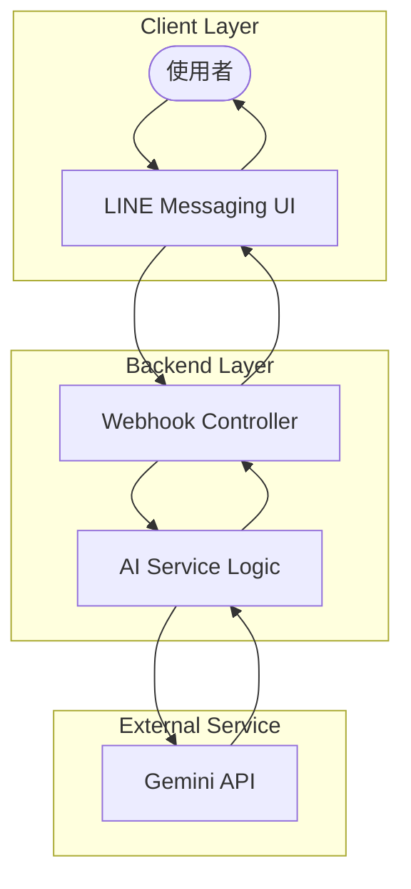

### Iteration 2

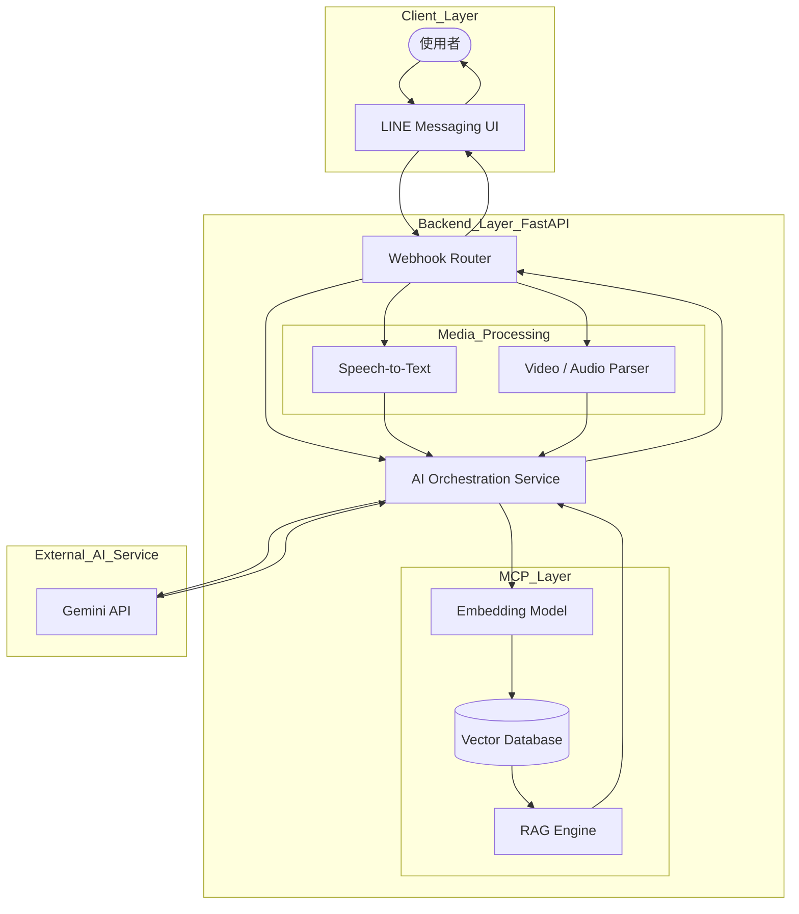

---

### Iteration 3

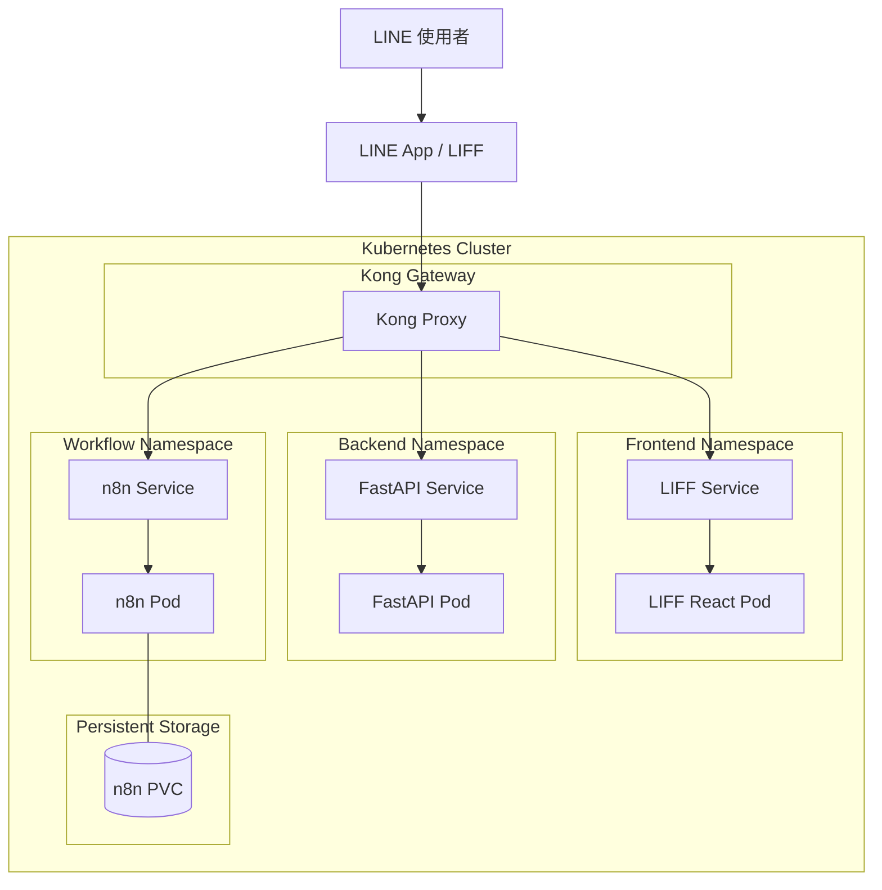

## 2. 介面需求與設計 (Interface Requirement and Design)

# fastAPI後端介面

## 使用者認證相關
| 介面名稱 | 介面提供者 | 介面使用者 | 連結方式 | 輸入資料 | 輸出資料 | 介面描述 |
| -------- | ---------- | ---------- | -------- | -------- | -------- | -------- |
| liffLogin | auth module | LIFF 登入頁 | POST `/api/auth/liff/login` | `id_token` | `access_token`, `token_type`, `expires_in`, `line_user_id` | 前端送出 LIFF `id_token`，後端驗證後簽發系統 JWT token |

## 個人資料相關
| 介面名稱 | 介面提供者 | 介面使用者 | 連結方式 | 輸入資料 | 輸出資料 | 介面描述 |
| -------- | ---------- | ---------- | -------- | -------- | -------- | -------- |
| getUserProfile | profile module | 個人資料頁 | GET `/api/profiles/me` |  Authorization Bearer token | 使用者個人健康資料（profile） | 取得指定使用者個人資料；僅允許查看自己的資料 |
| upsertUserProfile | profile module | 個人資料編輯頁 | PUT `/api/profiles/me/update` | body:`UserProfileData` + Authorization Bearer token | `{updated }` | 更新/寫入指定使用者個人健康資料；僅允許修改自己的資料 |

## 家庭功能相關
| 介面名稱 | 介面提供者 | 介面使用者 | 連結方式 | 輸入資料 | 輸出資料 | 介面描述 |
| -------- | ---------- | ---------- | -------- | -------- | -------- | -------- |
| get_my_tree | family_tree_service | 家族樹頁面 | GET `/api/family/me` | `Header: Authorization (Bearer Token)` | `family_tree` | 取得指定使用者家族樹；若不存在則初始化後回傳 |
| create_invite | family_tree_service | 家族樹頁面邀請按鈕 | POST `/api/family/invites` | `Header: Authorization (Bearer Token)` | `invite_token`, `expires_at` | 建立家族邀請連結供分享 |
| verify_invite | family_tree_service | 邀請連結 | GET `/api/family/invites/verify/{code}` | `code: str` | `inviter_display_name`, `expires_at` | 驗證邀請碼是否有效並回傳邀請人名稱與過期時間。 |
| accept_invite | family_tree_service | 接受邀請按鈕 | POST `/api/family/invites/accept` | `Header: Authorization (Bearer Token)`, `Body: AcceptInviteRequest (code: str)` | `status: ["joined", "already_member"]` | 將邀請人與被邀請人分別加入對方的家庭成員。 |
| set_relationship | family_tree_service | 設定關係按鈕 | POST `/api/family/relationship` | `Header: Authorization (Bearer Token)`, `Body: SetRelationshipRequest (code: str)` | `FamilyTree` | 設定該成員的的關係。 |

## 紀錄對話相關 

| 介面名稱 | 介面提供者 | 介面使用者 | 連結方式 | 輸入資料 | 輸出資料 | 介面描述 |
| -------- | ---------- | ---------- | -------- | -------- | -------- | -------- |
| getRawConsultations | consultation module | 諮詢紀錄頁 / 除錯查詢頁 | GET `/api/consultations/me/messages/raw` | Authorization Bearer token | `ConsultationViewResponse.messages` | 取得目前登入使用者 Redis 內尚未過期的原始對話紀錄 |
| getMemberRawConsultations | consultation module | LIFF 家庭頁 / 家人諮詢紀錄頁 | GET `/api/consultations/{userId}/messages/raw` | Authorization Bearer token, path 參數 `userId` | `ConsultationViewResponse.messages` | 取得指定家庭成員 Redis 內尚未過期的原始對話紀錄。請求者須為本人，或 `userId` 在請求者的家庭族譜內，否則回 403 |

## 摘要相關

| 介面名稱 | 介面提供者 | 介面使用者 | 連結方式 | 輸入資料 | 輸出資料 | 介面描述 |
| -------- | ---------- | ---------- | -------- | -------- | -------- | -------- |
| summarizeConsultations | consultation module | 諮詢紀錄頁 / 手動摘要流程 | POST `/api/consultations/me/summary/generate` | Authorization Bearer token, `target_date`, `force` | `ConsultationSummary` | 讀取 Redis 暫存對話，呼叫 Gemini 產生摘要，並寫入 MongoDB |
| getMySummaryHistory | consultation module | 摘要歷史頁 | GET `/api/consultations/me/allsummaries` | Authorization Bearer token | `ConsultationSummary[]` | 取得目前登入使用者所有 MongoDB 摘要紀錄，依日期由新到舊排序 |
| getMyLatestSummary | consultation module | 摘要歷史頁 | GET `/api/consultations/me/summary/latest` | Authorization Bearer token | `ConsultationSummary` | 取得目前登入使用者最新一筆摘要|
| getMySummaryDownloadToken | consultation module | 摘要下載流程 | GET `/api/consultations/me/summary/downloadtoken` | Authorization Bearer token | `downloadToken`, `expiresIn` | 產生短效下載 token，供前端下載摘要 JSON 使用 |
| downloadMySummaryHistory | consultation module | 摘要下載流程 | GET `/api/consultations/me/summary/download` | query: `downloadToken` | JSON 檔案 | 使用短效 downloadToken 下載目前使用者所有諮詢摘要紀錄 |
| getMemberSummaryHistory | consultation module | LIFF 家庭頁 / 家人諮詢紀錄頁 | GET `/api/consultations/{userId}/allsummaries` | Authorization Bearer token, path 參數 `userId` | `list[ConsultationSummary]` | 取得指定家庭成員在 MongoDB 的所有諮詢摘要，依日期由新到舊排序。請求者須為本人，或 `userId` 在請求者的家庭族譜內，否則回 403 |

## 系統與Webhook相關（補充）
| 介面名稱 | 介面提供者 | 介面使用者 | 連結方式 | 輸入資料 | 輸出資料 | 介面描述 |
| -------- | ---------- | ---------- | -------- | -------- | -------- | -------- |
| root | system module | 監控/測試 | GET `/` | 無 | `{ message }` | 檢查 API 啟動狀態 |
| healthCheck | system module | 監控/測試 | GET `/health` | 無 | `{ status }` | 健康檢查 |
| lineWebhookCallback | line module | LINE Platform | POST `/line/callback` | Header: `X-Line-Signature` + webhook body | `"OK"` | 接收 LINE webhook 事件並處理，異常時仍盡量回傳 200 OK 避免重試 |

## 家庭功能與照顧對象相關
| 介面名稱 | 介面提供者 | 介面使用者 | 連結方式 | 輸入資料 | 輸出資料 | 介面描述 |
| -------- | ---------- | ---------- | -------- | -------- | -------- | -------- |
| get_my_tree | family_tree_service | 家族樹頁面 | GET `/api/family/me` | `Header: Authorization (Bearer Token)` | `family_tree` | 取得指定使用者家族樹；若不存在則初始化後回傳 |
| create_invite | family_tree_service | 家族樹頁面邀請按鈕 | POST `/api/family/invites` | `Header: Authorization (Bearer Token)` | `invite_token`, `expires_at` | 建立家族邀請連結供分享 |
| verify_invite | family_tree_service | 邀請連結 | GET `/api/family/invites/verify/{code}` | `code: str` | `inviter_display_name`, `expires_at` | 驗證邀請碼是否有效並回傳邀請人名稱與過期時間。 |
| accept_invite | family_tree_service | 接受邀請按鈕 | POST `/api/family/invites/accept` | `Header: Authorization (Bearer Token)`, `Body: AcceptInviteRequest (code: str)` | `status: ["joined", "already_member"]` | 將邀請人與被邀請人分別加入對方的家庭成員。 |
| set_relationship | family_tree_service | 設定關係按鈕 | POST `/api/family/relationship` | `Header: Authorization (Bearer Token)`, `Body: SetRelationshipRequest` | `FamilyTree` | 設定該成員的關係。 |
| set_care_recipient | family_tree_service | 設定照顧對象按鈕 | POST `/api/family/care-recipient` | `Header: Authorization (Bearer Token)`, `Body: SetCareRecipientRequest` | `FamilyTree` | 設定家族樹內特定成員是否為照顧對象標籤 (`is_care_recipient`)。 |

## 用藥提醒管理相關 
| 介面名稱 | 介面提供者 | 介面使用者 | 連結方式 | 輸入資料 | 輸出資料 | 介面描述 |
| -------- | ---------- | ---------- | -------- | -------- | -------- | -------- |
| create_reminders | medication_service | 用藥設定頁 | POST `/api/medications/reminders` | `Header: Authorization`, `Body: CreateMedicationReminderRequest (user_id, slots, start_date, end_date)` | `List[MedicationReminder]` | 為自己或被照顧家屬勾選時段 (早/中/晚/睡前) 建立用藥提醒。 |
| get_reminders | medication_service | 用藥列表頁 | GET `/api/medications/reminders` | `Header: Authorization`, `Query: target_user_id?` | `List[MedicationReminder]` | 查詢自己或特定家庭成員的所有用藥提醒設定。 |
| update_reminder | medication_service | 用藥編輯頁 | PUT `/api/medications/reminders/{reminder_id}` | `Header: Authorization`, `Body: UpdateMedicationReminderRequest` | `MedicationReminder` | 修改指定用藥提醒的時間、起訖日期或開關狀態。 |
| delete_reminder | medication_service | 用藥編輯頁 | DELETE `/api/medications/reminders/{reminder_id}` | `Header: Authorization`, `Path: reminder_id` | `{"ok": true}` | 刪除指定的用藥提醒設定。 |
| confirm_medication | medication_service | LINE Flex Card 按鈕 | POST `/api/medications/confirm/{log_id}` | `Header: Authorization`, `Path: log_id` | `MedicationLog` | 用藥者確認已用藥，更新日誌狀態為 `taken` 並紀錄服藥時間。 |

## 掛號提醒相關
| 介面名稱 | 介面提供者 | 介面使用者 | 連結方式 | 輸入資料 | 輸出資料 | 介面描述 |
| -------- | ---------- | ---------- | -------- | -------- | -------- | -------- |
| list_reminders | appointment_service | 掛號提醒列表頁 | GET `/api/appointments/reminders` | `Header: Authorization (Bearer Token)`, `Query: target_user_id?: str, scope?: "upcoming" \| "past", limit?: int (1–50，預設 20), cursor?: str, include_past?: bool` | 帶 `scope`：`{ items: AppointmentReminderResponse[], next_cursor, total_count }`；不帶：`AppointmentReminderResponse[]` | 取得本人或家人的掛號提醒。`upcoming` 為未取消且當日未結束的門診，由早到晚、不分頁；`past` 為當日已結束或已取消的門診，由新到舊、以 cursor 分頁。查詢家人需具備 GENERAL 讀取權 |
| create_reminder | appointment_service | 新增掛號表單 | POST `/api/appointments/reminders` | `Header: Authorization (Bearer Token)`, `Body: CreateAppointmentReminderRequest (user_id, appointment_at, hospital_name, department, facility_id?, hospital_address?, hospital_phone?, doctor_name?, serial_number?, note?)` | `AppointmentReminderResponse` | 為本人或家人建立掛號提醒。`appointment_at` 須為帶時區的 ISO 8601；同一就診者同一時間只能有一筆未取消的掛號。為家人建立需具備 GENERAL 寫入權 |
| update_reminder | appointment_service | 編輯掛號表單 | PUT `/api/appointments/reminders/{reminder_id}` | `Header: Authorization (Bearer Token)`, `Path: reminder_id: str`, `Body: UpdateAppointmentReminderRequest（部分更新）` | `AppointmentReminderResponse` | 部分更新掛號提醒：未帶的欄位不動，帶 null 的欄位清空。修改門診時間會重置狀態並重新排定推播；已到診或已取消的掛號不可改時間 |
| delete_reminder | appointment_service | 刪除這筆紀錄按鈕 | DELETE `/api/appointments/reminders/{reminder_id}` | `Header: Authorization (Bearer Token)`, `Path: reminder_id: str` | `{ ok: bool }` | 刪除單筆掛號提醒，尚未發出的推播一併停止 |
| delete_past_reminders | appointment_service | 刪除全部歷史紀錄按鈕 | DELETE `/api/appointments/reminders` | `Header: Authorization (Bearer Token)`, `Query: scope: "past"（必填）, target_user_id?: str（僅可為本人）` | `{ deleted: int }` | 一次刪除本人所有過去（當日已結束或已取消）的掛號紀錄，即將到來的門診不受影響。僅限本人操作 |
| depart | appointment_service | 「我已出發」按鈕（LIFF / LINE 卡片） | POST `/api/appointments/reminders/{reminder_id}/depart` | `Header: Authorization (Bearer Token)`, `Path: reminder_id: str` | `AppointmentReminderResponse` | 回報已出發（scheduled → departed），僅限門診當天。本人或具 GENERAL 寫入權的家屬可代按，重複按冪等 |
| attend | appointment_service | 「我已到診」按鈕（LIFF / LINE 卡片） | POST `/api/appointments/reminders/{reminder_id}/attend` | `Header: Authorization (Bearer Token)`, `Path: reminder_id: str` | `AppointmentReminderResponse` | 回報已到診（scheduled／departed → attended），並停止該次門診所有後續推播。僅限門診當天，重複按冪等 |
| cancel | appointment_service | 取消這次門診按鈕 | POST `/api/appointments/reminders/{reminder_id}/cancel` | `Header: Authorization (Bearer Token)`, `Path: reminder_id: str` | `AppointmentReminderResponse` | 取消門診（scheduled／departed → cancelled）：保留紀錄、停止所有推播、不發通知。不限門診當天，重複按冪等 |

## 掛號提醒管理相關 
# vite前端介面

## 登入相關
| 介面名稱 | 介面提供者 | 介面使用者 | 連結方式 | 輸入資料 | 輸出資料 | 介面描述 | 錯誤處理 |
| -------- | ---------- | ---------- | -------- | -------- | -------- | -------- | -------- |
| LIFF 登入 | CARE 後端 | LIFF 前端 | POST `/api/auth/liff/login` | `Body: { id_token: str }`（LIFF ID Token），不需驗證 | `{ access_token, token_type, expires_in, line_user_id }` | 以 LIFF ID Token 換取後端存取憑證 | 非 2xx：拋出「LIFF 後端登入失敗：{status}」 |

## 個人資料相關
| 介面名稱 | 介面提供者 | 介面使用者 | 連結方式 | 輸入資料 | 輸出資料 | 介面描述 | 錯誤處理 |
| -------- | ---------- | ---------- | -------- | -------- | -------- | -------- | -------- |
| 更新個人健康資料 | CARE 後端 | LIFF 前端 | PUT `/api/profiles/me/update` | `Header: Authorization (Bearer Token，取自 CARE_AUTH_TOKEN)`, `Body: UpsertPersonalHealthPayload (name, gender, height, weight, age, chronic_history, major_illness_history, surgery_history, health_consultations)` | 後端回傳 JSON | 新增或更新本人的個人健康資料 | 無 token：拋出「缺少登入憑證，請先重新登入」；非 2xx：拋出「個人資料儲存失敗：{status} - {text?}」 |
| 取得個人健康資料 | CARE 後端 | LIFF 前端 | GET `/api/profiles/me/` | `Header: Authorization (Bearer Token，取自 CARE_AUTH_TOKEN)` | 後端回傳 JSON | 取得本人的個人健康資料 | 無 token：拋出「缺少登入憑證，請先重新登入」；非 2xx：拋出「取得個人資料失敗：{status} - {text?}」 |

## 家庭功能相關
| 介面名稱 | 介面提供者 | 介面使用者 | 連結方式 | 輸入資料 | 輸出資料 | 介面描述 | 錯誤處理 |
| -------- | ---------- | ---------- | -------- | -------- | -------- | -------- | -------- |
| 取得族譜 | CARE 後端 | LIFF 前端 | GET `/api/family-tree/me` | `Query: user_id: str`（目前前端未附帶 Bearer Token） | `GetFamilyTreeResponse` | 取得使用者的族譜 | 非 2xx：拋出「取得族譜失敗：{status}」 |
| 建立家庭邀請 | CARE 後端 | LIFF 前端 | POST `/api/family-tree/invite` | `Body: { inviter_id: str }`（目前前端未附帶 Bearer Token） | `SendInvitationResponse` | 建立邀請家人加入族譜的邀請 | 非 2xx：拋出「建立邀請失敗：{status}」 |

## 摘要相關
| 介面名稱 | 介面提供者 | 介面使用者 | 連結方式 | 輸入資料 | 輸出資料 | 介面描述 | 錯誤處理 |
| -------- | ---------- | ---------- | -------- | -------- | -------- | -------- | -------- |
| 取得所有諮詢摘要 | CARE 後端 | LIFF 前端 | GET `/api/consultations/me/allsummaries` | `Header: Authorization (Bearer Token，取自 CARE_AUTH_TOKEN)` | 後端回傳 JSON | 取得本人所有的諮詢摘要 | 無 token：拋出「缺少登入憑證，請先重新登入」；非 2xx：拋出「取得諮詢摘要清單失敗：${res.status}」 |
| 取得摘要下載 Token | CARE 後端 | LIFF 前端 | GET `/api/consultations/me/summary/downloadtoken` | `Header: Authorization (Bearer Token，取自 CARE_AUTH_TOKEN)` | JWT token | 取得下載諮詢摘要所需的 token | 無 token：拋出「缺少登入憑證，請先重新登入」；非 2xx：拋出「取得摘要下載token失敗：${res.status}」 |
| 下載諮詢摘要 | CARE 後端 | LIFF 前端 | GET `/api/consultations/me/summary/download` | `Header: Authorization (Bearer Token，取自 CARE_AUTH_TOKEN)`, `Query: downloadToken: str` | JWT token | 以下載 token 下載諮詢摘要 | 無 token：拋出「缺少登入憑證，請先重新登入」；非 2xx：拋出「取得摘要下載token失敗：${res.status}」 |
| 取得我的諮詢紀錄 | CARE 後端 | LIFF 前端 | GET `/api/consultations/me/messages/raw` | `Header: Authorization (Bearer Token，取自 CARE_AUTH_TOKEN)` | 後端回傳 JSON | 取得本人的原始對話訊息 | 無 token：拋出「缺少登入憑證，請先重新登入」；非 2xx：拋出「取得原始對話訊息失敗：${res.status}」 |
| 產生諮詢摘要 | CARE 後端 | LIFF 前端 | POST `/api/consultations/me/summary/generate` | `Header: Authorization (Bearer Token，取自 CARE_AUTH_TOKEN)` | 後端回傳 JSON | 產生本人的諮詢摘要 | 無 token：拋出「缺少登入憑證，請先重新登入」；422：日期格式不合法；429：AI 額度已達上限，請稍後再試；502：AI 服務異常；其他非 2xx：拋出「產生諮詢摘要失敗：${res.status}」 |
## 掛號提醒相關

| 介面名稱 | 介面提供者 | 介面使用者 | 連結方式 | 輸入資料 | 輸出資料 | 介面描述 | 錯誤處理 |
| -------- | ---------- | ---------- | -------- | -------- | -------- | -------- | -------- |
| 查詢掛號提醒清單 | CARE 後端 | LIFF 前端 | GET `/api/appointments/reminders` | `Query: scope（upcoming 或 past）, target_user_id?（查家人時才帶）`；scope=past 時另帶 `limit=20, cursor?（上一頁的 next_cursor）` | `{ items: AppointmentReminder[], next_cursor: str \| null, total_count: int }` | upcoming：沒有取消且當日還沒結束的門診，由早到晚、不分頁；past：當日已結束或已取消的門診，由新到舊、一頁 20 筆；total_count 是整個分區的筆數 | 共通處理；400：分頁位置無效；403：沒有讀取權；「載入更多」失敗只以提示告知，已載入的紀錄保留 |
| 新增掛號提醒 | CARE 後端 | LIFF 前端 | POST `/api/appointments/reminders` | `Body: { user_id, appointment_at, facility_id?, hospital_name, hospital_address?, hospital_phone?, department, doctor_name?, serial_number?, note? }` | `AppointmentReminder` | 為本人或家人建立一筆掛號提醒，後端排定門診前 1 小時、門診時間、門診後 30 分鐘三則推播 | 共通處理；400：時間已過、缺 offset、欄位過長；403：替家人建立但沒有寫入權；409：同一時間已有一筆未取消的掛號（前端重抓清單） |
| 修改掛號提醒 | CARE 後端 | LIFF 前端 | PUT `/api/appointments/reminders/{reminder_id}` | `Body: UpdateAppointmentRequest`（只帶有變動的欄位；沒帶＝不動、帶 null＝清空） | `AppointmentReminder` | 修改一筆掛號；改了門診時間會重新排定推播。已到診的前端只開放修改備註 | 共通處理；400：時間已過、欄位不合法；403；404：已被刪除；409：已到診或已取消的改時間、改到已被佔用的時間 |
| 刪除這筆紀錄 | CARE 後端 | LIFF 前端 | DELETE `/api/appointments/reminders/{reminder_id}` | 無 | `{ ok: true }` | 整筆刪除，無法復原 | 共通處理；403；404：已被刪除（前端重抓清單） |
| 刪除全部歷史紀錄 | CARE 後端 | LIFF 前端 | DELETE `/api/appointments/reminders?scope=past` | `Query: scope=past`（不帶 target_user_id，只刪本人的） | `{ deleted: int }` | 一次刪除本人所有「過去」的紀錄（當日已結束或已取消），即將到來的不受影響；只有本人可以操作 | 共通處理；400：scope 不是 past；403：帶了別人的 id（前端不會帶）；後端不是交易，失敗時可能刪到一半，前端一律重抓清單，重送也安全 |
| 回報已出發 | CARE 後端 | LIFF 前端 | POST `/api/appointments/reminders/{reminder_id}/depart` | 無 Body | `AppointmentReminder` | 本人或有寫入權的家屬代按，與 LINE 卡片上的按鈕是同一個後端方法；重複按回 200 並保留第一位回報者 | 共通處理；403：沒有寫入權；404；409：不是門診當天、當天已結束、已取消（前端重抓清單） |
| 回報已到診 | CARE 後端 | LIFF 前端 | POST `/api/appointments/reminders/{reminder_id}/attend` | 無 Body | `AppointmentReminder` | 回報到診後，這次門診還沒發的推播全部停止；重複按回 200 | 共通處理；403；404；409：不是門診當天、當天已結束、已取消（前端重抓清單） |
| 取消這次門診 | CARE 後端 | LIFF 前端 | POST `/api/appointments/reminders/{reminder_id}/cancel` | 無 Body | `AppointmentReminder`（status 為 cancelled、notify_at 為空陣列） | 保留紀錄、停止所有推播、不發任何通知；取消後移到「過去的門診」；重複按回 200 並保留第一位取消者 | 共通處理；403：沒有寫入權；404；409：已到診、當天已結束（前端重抓清單） |

## 醫療院所相關
| 介面名稱 | 介面提供者 | 介面使用者 | 連結方式 | 輸入資料 | 輸出資料 | 介面描述 | 錯誤處理 |
| -------- | ---------- | ---------- | -------- | -------- | -------- | -------- | -------- |
| 依 id 查詢院所 | CARE 後端 | LIFF 前端 | GET `/api/medical/facilities/{facility_id}` | `Header: Authorization (Bearer Token，取自 CARE_AUTH_TOKEN)` | `MedicalFacility`（`distance_meters` 一律 null） | 編輯掛號、再掛一次、點選常去的醫院時，依 facility_id 取回科別清單與門診時段 | 401：導向登入頁；503：拋出「醫療院所查詢暫時不可用，請稍後再試」；其他非 2xx：拋出「查詢院所失敗：{status}」。前端不重試，只當作這次查不到、不顯示門診時段 |

## 家庭功能相關（既有介面新增欄位）
| 介面名稱 | 介面提供者 | 介面使用者 | 連結方式 | 輸入資料 | 輸出資料 | 介面描述 | 錯誤處理 |
| -------- | ---------- | ---------- | -------- | -------- | -------- | -------- | -------- |
| 取得族譜（新增嚴格權限欄位） | CARE 後端 | LIFF 前端 | GET `/api/family/me` | `Header: Authorization (Bearer Token，取自 CARE_AUTH_TOKEN)` | `GetFamilyTreeResponse`；`family_members[]` 新增 `my_strict_permissions: { general, sensitive, private }`，形狀與 `my_permissions` 相同 | 純角色權限（含委任），不受影響模式影響。前端只用它判斷掛號的新增、修改、取消、刪除與回報按鈕要不要顯示；其他功能仍看 `my_permissions` | 沿用既有處理；欄位缺席時一律視為沒有權限（不顯示掛號寫入按鈕） |
 
    
# n8n workflow相關介面
## 多媒體處理
| 介面名稱 | 介面提供者 | 介面使用者 | 連結方式 | 輸入資料 | 輸出資料 | 介面描述 |
| -------- | ---------- | ---------- | -------- | -------- | -------- | -------- |
| multimediaProcessWebhook | n8n workflow | CARE Backend / Postman / 外部 client | POST `/webhook/multimedia-process` | multipart `file` | 文字內容或錯誤 JSON | n8n 對外入口，接收音訊、影片、圖片、文件，依副檔名分流處理 |
| geminiImageAnalyze | Google Gemini node | n8n workflow | n8n credential / Gemini API | binary `file`, OCR prompt | `content.parts[0].text` | 圖片 OCR，要求 Gemini 回傳 JSON 格式文字辨識結果 |
| n8nListWorkflows | n8n Admin API | 開發者 / Postman | GET `/api/v1/workflows` | API key / n8n auth | workflows list | 查詢 n8n workflows 清單 |
| n8nGetWorkflowDetails | n8n Admin API | 開發者 / Postman | GET `/api/v1/workflows/{workflow_id}` | `workflow_id`, API key / n8n auth | workflow detail | 查詢指定 workflow 詳細設定 |
| n8nListWorkflowExecutions | n8n Admin API | 開發者 / Postman | GET `/api/v1/workflows/{workflow_id}/executions` | `workflow_id`, API key / n8n auth | execution list | 查詢指定 workflow 的執行紀錄 |     
## ASR功能
| 介面名稱 | 介面提供者 | 介面使用者 | 連結方式 | 輸入資料 | 輸出資料 | 介面描述 |
| -------- | ---------- | ---------- | -------- | -------- | -------- | -------- |    
| asrTranscribe | local-asr | n8n `HTTP Request` node | POST `http://local-asr:8200/transcribe` | multipart `file`, optional `language`, `task` | `text`, `language`, `duration`, `segments`, `model`, `backend` | 音訊/影片檔轉文字；短音訊可走 Breeze，長音訊或指定時走 faster-whisper |
| asrHealth | local-asr | 開發者 / health check | GET `http://localhost:8200/health` | 無 | `ok`, `backend`, `model`, `long_audio_backend`, `long_audio_threshold_seconds` | 檢查 ASR 服務狀態與目前模型設定 |
## 文件解析
| 介面名稱 | 介面提供者 | 介面使用者 | 連結方式 | 輸入資料 | 輸出資料 | 介面描述 |
| -------- | ---------- | ---------- | -------- | -------- | -------- | -------- |
| parserParse | local-parser | n8n `HTTP Request` node | POST `http://local-parser:8100/parse` | multipart `file`, optional `include_metadata`, `source` | `filename`, `text`, `char_count`, optional `metadata` | 解析文件類檔案文字內容 |
| parserHealth | local-parser | 開發者 / health check | GET `http://localhost:8100/health` | 無 | `ok` | 檢查 Parser 服務是否存活 |
| parserSupportedTypes | local-parser | 開發者 / client | GET `http://localhost:8100/supported-types` | 無 | `extensions` | 查詢 Parser 支援的副檔名 |
   
    
    
## 3. 流程設計 (Process Design)
### 使用者流程

#### 登入流程
   

    
#### 醫院資源定位流程

#### 協助掛號流程

#### 多媒體資訊處理流程

#### 事實查核與RAG流程

#### 台語語音辨識與生成流程

#### MCP Server管理不同任務之流程
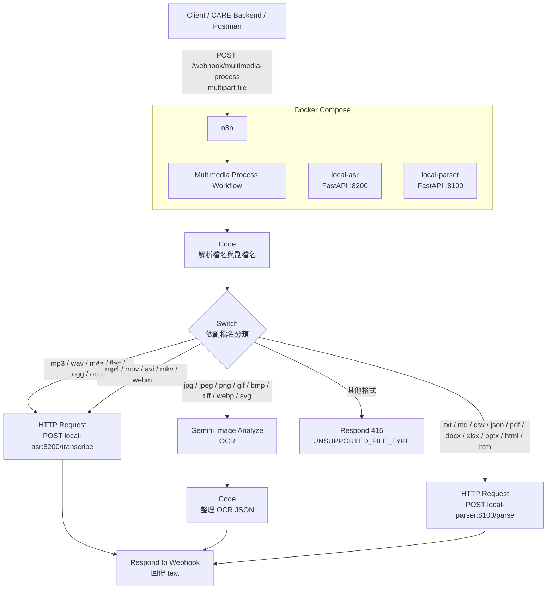
#### ASR 台語處理流程
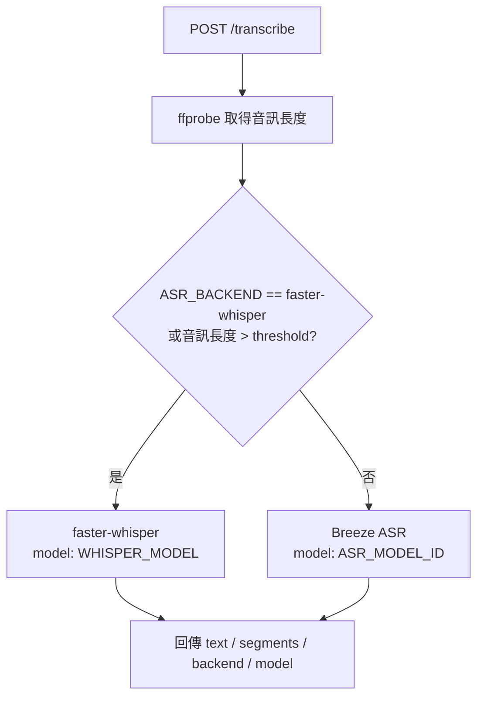
    
#### 使用者對話紀錄儲存流程:

#### 使用者摘要產生流程:

#### medical service主流程
    
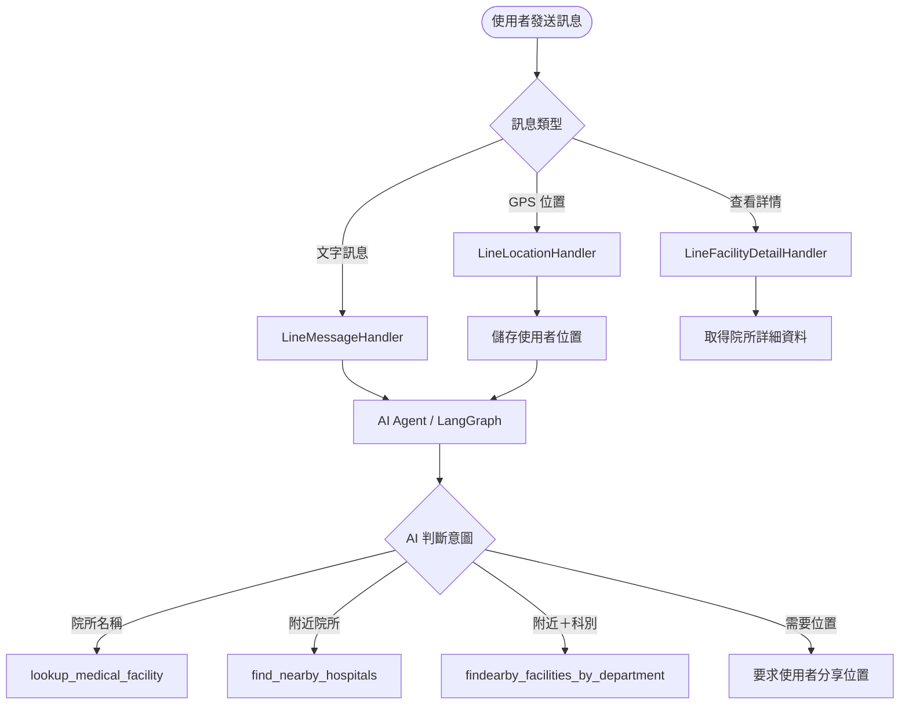
     
#### lookup_medical_facility流程 
    
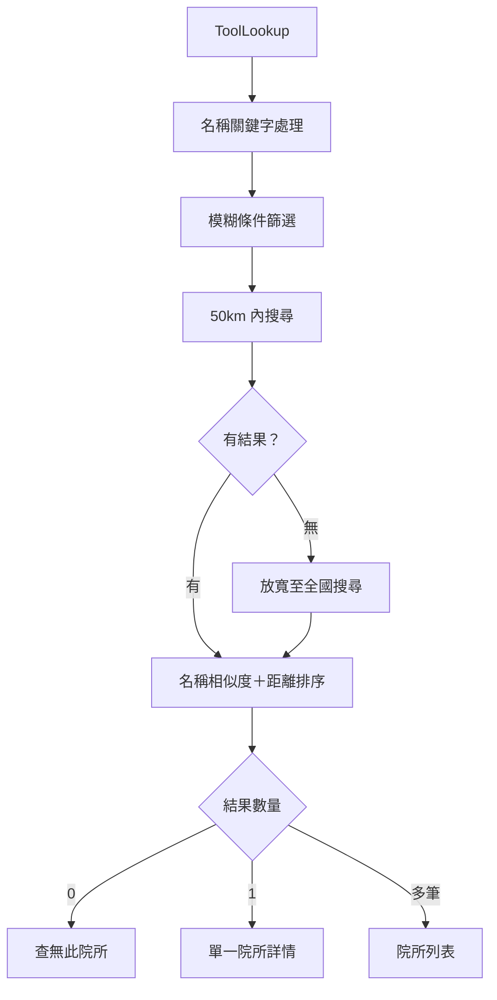
    
#### 醫療院所名稱搜尋(lookup_medical_facility中的"模糊條件篩選"節點)流程:
    
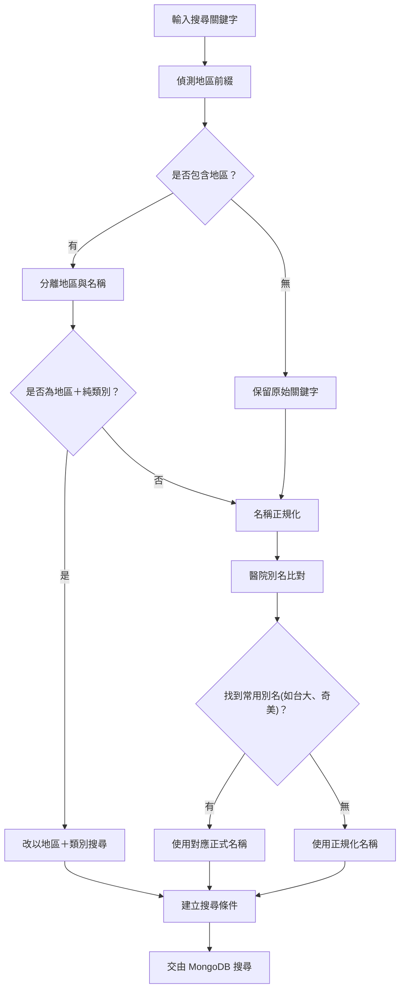
並針對常見院所(台大、奇美、馬偕醫院...)與離島地區僅有醫院、衛生所做特別的對照表，確保常見的大醫院不會因為簡稱而沒有被搜尋到、離島雖然較缺少醫療院所但仍可以搜尋到
    
#### find_nearby_hospitals流程
    
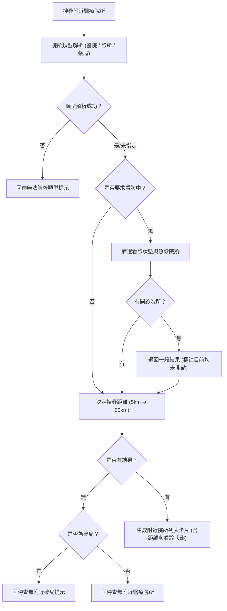
    
#### findearby_facilities_by_department流程
    
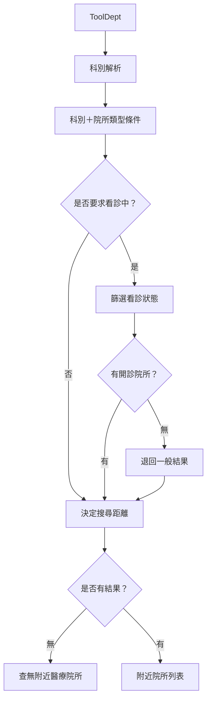
    
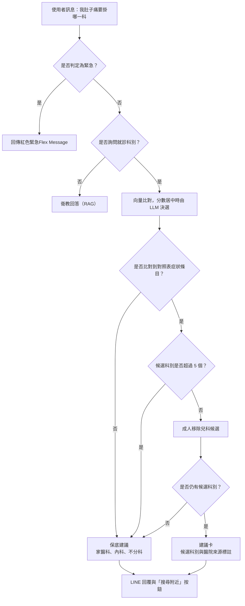
    

#### 家庭功能邀請者流程 (Sender Journey)
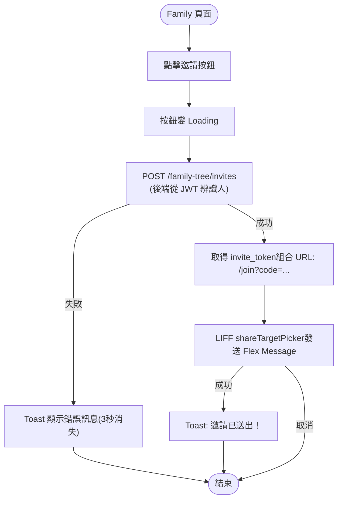

#### 家庭功能被邀請者流程 (Receiver Journey)
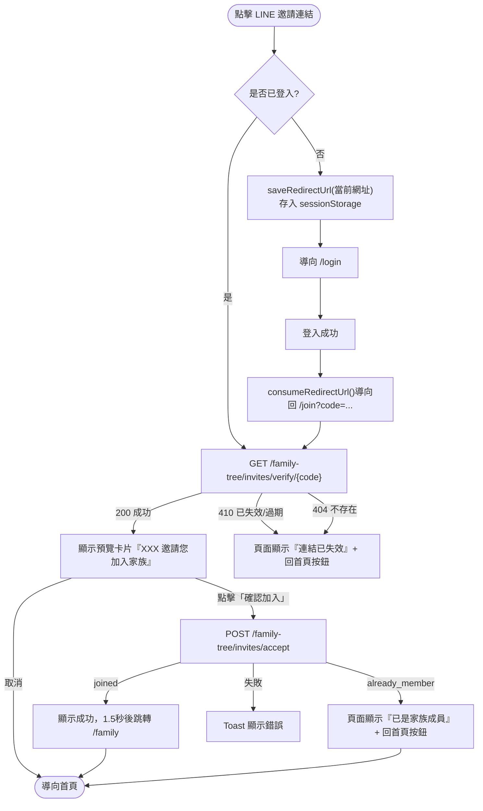
    
#### 用藥提醒與通報流程
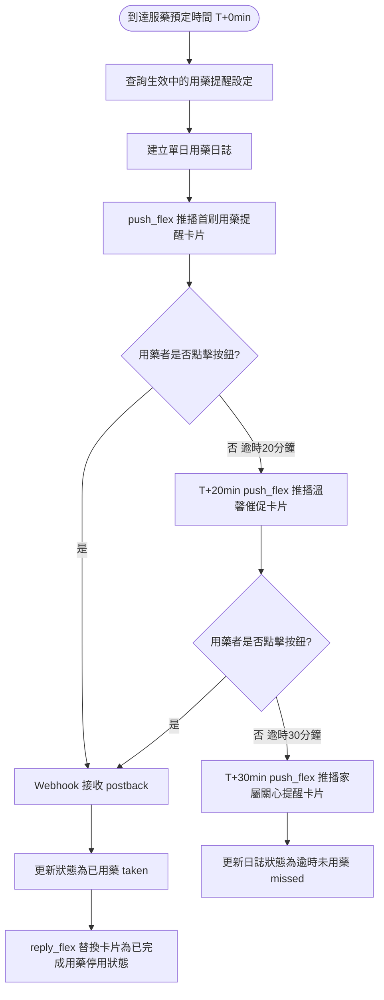
#### 掛號提醒流程
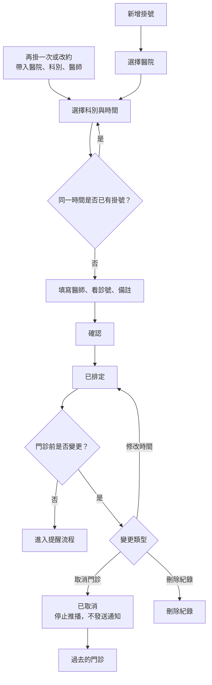
#### 掛號通報流程    
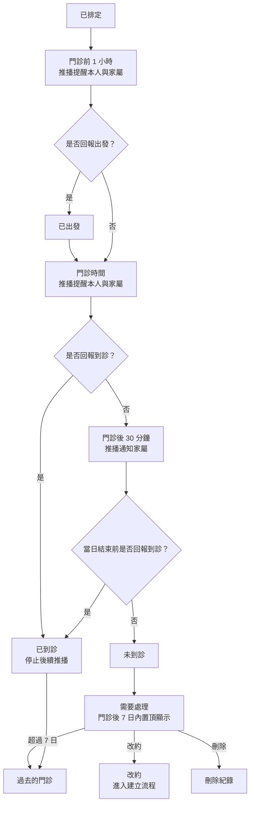
    
#### 危險、緊急情況警示流程圖    
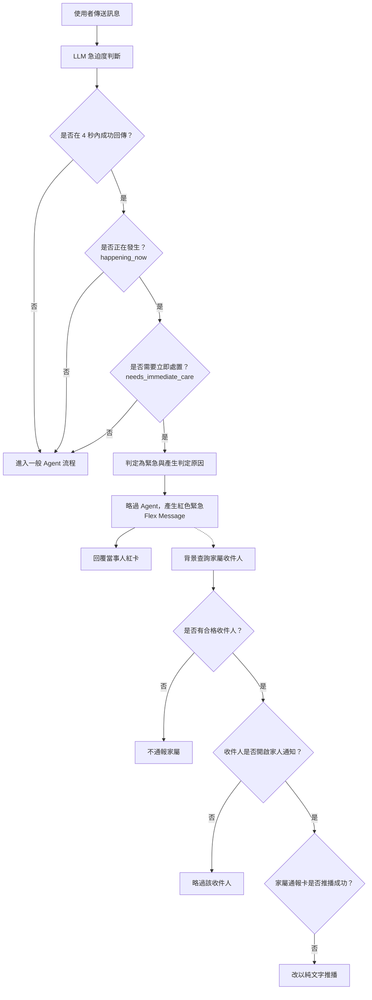
---
    
### 資料庫建置與更新流程
    
#### 醫療院所資料庫建置流程
    
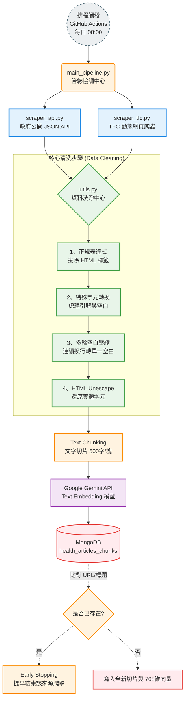
    
## 4. 使用者畫面設計 (User Interface Design)
### rich menu

### Flex Message設計
    
#### 分享位置並搜尋附近醫療院所

 
#### 搜尋到多筆醫療院所
列出至多3間院所的簡略資訊，包含院所名稱、地址、營業狀態、距離，並可點擊 "撥打電話"與"前往地圖"按鈕
    

#### 搜尋單一醫療院所
顯示詳細門診時間與看診科別，其中門診時間使用深黃色背景突顯當天的看診時段，並用診所常見的門診表格式，讓高齡長輩一目了然。診療科別使用兩種顏色交替顯示，讓長輩方便閱讀並舒緩眼睛疲勞。    

#### 日常健康紀錄與趨勢（Iteration 7 規劃）

* 提供血壓、血糖及體重等健康指標的新增與歷史紀錄查詢。
* 趨勢畫面可選擇指標與日期範圍，並以圖表搭配數值清單呈現。
* 輸入欄位應顯示單位、合理範圍與格式錯誤提示，避免誤植數值。

#### 用藥提醒與藥袋辨識

* 用藥提醒以 LINE Flex Message 顯示藥名、預定時間及「已用藥」按鈕。
* 藥袋掃描支援拍照與圖片上傳，辨識結果須先由使用者確認，再進行風險評估。
* 用藥風險與注意事項應使用清楚的警示層級，並顯示「資訊僅供參考，應諮詢醫師或藥師」。

#### 每日健康資訊與分享（Iteration 7 規劃）

* 健康資訊卡片應顯示標題、摘要、來源名稱、原始連結及分享按鈕。
* 分享功能支援 LINE 聯絡人與已授權家庭成員，送出前須由使用者確認分享對象。

### 全域使用者體驗與無障礙設計

* 多國語言支援範圍包含介面文字、自然語言理解、文字回覆、語音辨識及語音生成，不得僅翻譯最終回答。
* 高齡友善介面應提供可調整字體、足夠的文字與背景對比、明確按鈕標示及精簡的操作步驟。
* 主要功能應可透過文字或語音自然語言操作，複雜選單僅作為替代操作方式。
* 台語互動應維持輸入辨識、回答內容及語音輸出的語言一致性。
---

## 5. 資料設計 (Data Design)
### 5.1 檔案結構
* FastApi

* liff

### 5.2 資料結構與Schema
---
健康資訊Schema
| **欄位名稱 (Field)** | **型態 (Type)** | **說明 (Description)** | 
| ----- | ----- | ----- | 
| **`_id`** | `ObjectId` | MongoDB 自動生成的唯一識別碼，內含建立時間戳記，可用來反推最新資料。 | 
| **`source_name`** | `String` | 資料來源機構名稱（例：`"食藥署闢謠專區"`），方便未來提供 LLM 檢索時進行來源過濾。 | 
| **`url`** | `String / null` | 文章的原始網址。若來源未提供則為 `null`。未來在 LINE 回覆時可附上此連結以增加可信度。 | 
| **`original_title`** | `String` | 文章的完整原始標題。 | 
| **`chunk_content`** | `String` | 經過清洗與切片後的純文字內容。長度通常控制在 500 字以內，是 LLM 進行語意搜尋 (Semantic Search) 的核心依據。 | 
| **`chunk_index`** | `Integer` | 當前切片屬於原文章的第幾段（例如：`1`）。 | 
| **`total_chunks`** | `Integer` | 原文章總共被切成的段落數。若 `chunk_index == total_chunks` 代表為文章末段。 | 
| **`embedding`** | `Array[Float]` | 長度為 3072 的浮點數陣列。由 Gemini Embedding 模型轉換而成的向量特徵，用於向量資料庫比對。 | 
| **`uploaded_at`** | `Float` | 寫入 MongoDB 時的 Unix Timestamp（時間戳記），用於管理與追蹤資料更新進度。 |
    
醫療院所schema
| **欄位名稱 (Field)** | **型態 (Type)** | **說明 (Description)** |
| -------------------- | --------------- | ---------------------- |
| **`id`** | `String / null` | 院所唯一識別碼，作為primary key。 |
| **`name`** | `String` | 院所名稱。 |
| **`latitude`** | `Float` | 院所緯度座標。 |
| **`longitude`** | `Float` | 院所經度座標。 |
| **`address`** | `String` | 院所完整地址。 |
| **`phone`** | `String / null` | 院所聯絡電話。 |
| **`type`** | `String` | 院所類型，例如：`"醫院"`、`"診所"`、`"藥局"`。 |
| **`clinic_time`** | `Object / null` | 院所營業／門診時間。Key 為星期英文小寫（`monday ~ sunday`），Value 為 `ClinicDaySchedule`。 |
| **`clinic_time.<day>`** | `ClinicDaySchedule` | 單一天的營業／門診時間表。包含 `isClosed` 與 `slots`。 |
| **`ClinicDaySchedule.isClosed`** | `Boolean` | 當天是否公休。`true` 表示公休。 |
| **`ClinicDaySchedule.slots`** | `Array[ClinicTimeSlot]` | 當天的營業／門診時段清單，由一個或多個 `ClinicTimeSlot` 組成；公休時為空陣列。 |
| **`ClinicTimeSlot.open`** | `String` | 單一時段的開始時間，例如：`"08:00"`。 |
| **`ClinicTimeSlot.close`** | `String` | 單一時段的結束時間，例如：`"17:30"`。 |
| **`departments`** | `Array[String] / null` | 院所診療科別 |
| **`notes`** | `String / null` | 院所補充註記|
| **`distance_meters`** | `Float / null` | 院所距離使用者的直線距離（公尺），由 PostGIS 計算後填入。 |

家庭功能Schema
| 欄位名稱 (Field) | 資料型別 (Type) | 說明 (Description) | 範例值 (Example) |
| :--- | :--- | :--- | :--- |
| `_id` | ObjectId | 系統自動生成的唯一識別碼 | `ObjectId("6a0c2d68c8a4beb285bdba7f")` |
| `user_id` | String | 綁定的使用者 ID (如 LINE User ID) | `"U816f60cf1480bab4c9d30d46ce6474e4"` |
| `created_at` | Date | 資料建立的 UTC 時間 | `2026-05-19T09:29:12.126+00:00` |
| `family_members` | Array[Object] | 家庭成員的詳細資料陣列 | `[ { ... }, { ... } ]` |
| ↳ `[0]/[1]/[2]...` | Object | 成員的物件資料 (至多4個屬性) | {user_id:"Udb2c09a8f110ed32fc78ec9722ae1134 "relationship_type:null display_name:null picture_url:null}
| `updated_at` | Date | 資料最後更新的 UTC 時間 | `2026-07-29T13:43:02.460+00:00` |
***
    
## 6. 類別圖設計 (Class Diagram)
#### CARE-data
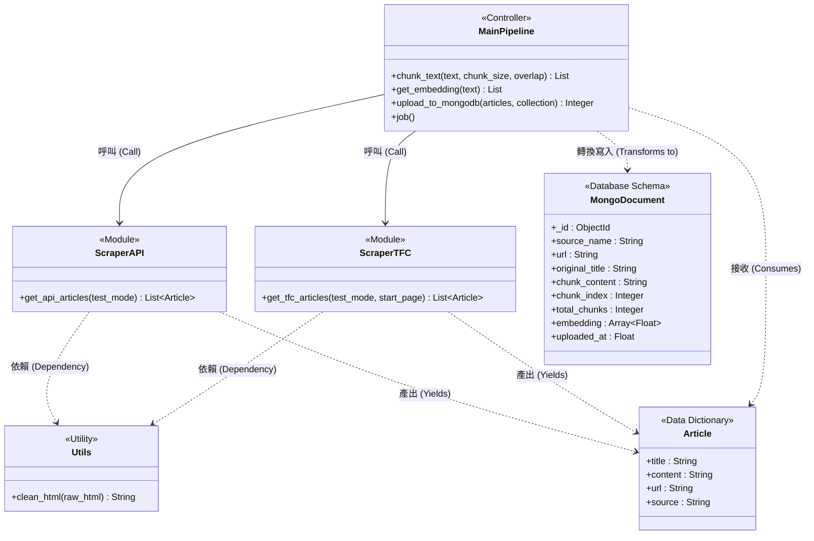
---

## 7. 實作方案 (Implementation Languages and Platforms)

### 1.前端: LIFF(vite+React+Typescript)
---
#### 登入
* 用戶到達的第一個頁面
* 直接呼叫liff.init()跳轉到line帳號登入
* 登入成功後自動跳轉到首頁並向後端發送POST/liff/login
* 登入失敗會跳轉回登入頁
---
#### 首頁
* 顯示大部分供使用者使用的功能
---
#### 組件
* Header
* Footer
---
#### 個人健康
* 透過liff取得user頭像和LINE暱稱
* 透過CARE資料庫取得健康資料
* 提供血壓、血糖及體重紀錄的新增、查詢與趨勢圖表
---
#### 個人諮詢紀錄
* 可選擇摘要與對話顯示
* 摘要會取得mongoDB中該user每一筆摘要，並提供下拉式選單可供瀏覽
* 儲存對話紀錄(JSON)，點擊按鈕後前往外部連結並下載
---
#### 設定頁面
* 調整個人偏好設定（語言、字體大小）
* 設定每日健康資訊的主題、推播時間與啟用狀態
---
#### 家庭介面
* 顯示有建立關係的成員及其健康狀態
* 掛號提醒
* 同一家庭群組的成員可以點擊成員卡片互相查看對話紀錄與摘要
* 健康資訊分享須依 GENERAL、SENSITIVE、PRIVATE 權限控制可見範圍
* 防走失定位須由家屬提出請求，並取得受照護者的明確同意；位置資料採限時授權

#### 用藥安全
* 上傳或拍攝藥袋圖片，顯示 OCR 原始文字及結構化藥品資訊
* 使用者確認辨識內容後，才進行用藥注意事項與風險評估
* 風險結果附上資料來源與就醫／諮詢藥師提醒，不作為診斷或處方依據
---
### 2.後端(FastApi)
---
#### 驗證
* 收到前端發送POST/liff/login後返回TOKEN
* 使用JWT驗證
---
#### 使用者
* ID使用LINE ID
* 取得、更新資料需要驗證
* 健康指標紀錄依使用者 ID 儲存，家庭成員代填或查詢時須驗證 SENSITIVE 權限
---
#### 家庭功能
* 建立關係
  * 邀請者建立連結並發送給被邀請者
  * 被邀請者點擊連結與邀請者建立關係

| 角色 | GENERAL | SENSITIVE | PRIVATE |
|---|---|---|---|
| `OWNER` | 讀 + 寫 | 讀 + 寫 | 讀 + 寫 |
| `GUARDIAN` | 讀 + 寫 | 讀 + 寫 | 讀 |
| `CAREGIVER` | 讀 + 寫 | 讀 | — |
| `MEMBER` | 讀 | — | — |
    
* 資訊定義
    
| 分類 | 資源 | 實際欄位 |
|---|---|---|
| `GENERAL` | 用藥提醒、藥品、身分欄位 | 吃藥時間、藥名、外觀、劑量、`name`、`picture_url` |
| `SENSITIVE` | 健康檔案、藥品適應症 | 年齡、性別、身高體重、慢性病、重大疾病史、手術史、`indication` |
| `PRIVATE` | 對話摘要、原始對話 | 與 LINE 機器人的健康諮詢內容 |
    
[技術文件](https://hackmd.io/@NTOU-CARE/S11OiCwdMl)   
    
---
#### 多媒體處理
* 音檔、影片檔(local-asr)
    * 目前使用 breeze asr 26 + faster_whisper 的 hybrid 模式
    * 30秒內使用 breeze asr 26，否則使用 faster_whisper
* 圖片
    * 目前使用Gemeni 2.5 faster
* 文件
    * 使用python完成
---
#### 對話紀錄
* 將對話紀錄存到redis，並建立一天的TTL
* redis端根據userId建立collection並儲存
* 不紀錄位置訊息
---
#### 產生摘要
* 使用scheduler搭配lifespan定時產生摘要
* 尋找當天的對話紀錄並傳給gemini產生摘要
* 摘要最多存20筆，新的摘要會將最舊的摘要擠掉
---
#### RAG
* 回覆內容應附上來源名稱與原始連結，供使用者追溯與查證
* 檢索結果不足或可信度未達門檻時，不生成推測性醫療回答，並明確告知資料不足
* 每日健康資訊僅可使用已納入可信知識庫且保留來源欄位的內容
---    
#### 台語
* 與 Taigi Ai Lab 合作，使用對方提供之 api key
---
### 3.資料庫
---
#### LIFF使用者資料
---    
#### 健康相關資料(vector database)
* 三大核心
    * ETL 模服務解耦：將即時 LINE Bot 與耗時的資料管線分開。
    * 雲端 Serverless 自動化：採用 GitHub Actions 每日定時爬蟲，零維護成本且保護實驗室 IP。
    * 智慧防護與增量更新：內建 Early Stopping 提早結束機制與 Rate-Limit Backoff 退避演算法，確保高穩定性。
---
#### 醫療院所資料
* 包含院所名稱、地址、電話、註記等等
* 目前將醫療院所包裝於flex message內
---
### 4. CI/CD
---
#### 測試
* 使用 Github action 做自動測試
    * 前端:playwright
    * 後端:pytest
    * CI:SonarQube Cloud
---
#### 部署
* 容器化部署
    * docker + Kubernetes k3s
* 反向代理
    * Traefik
* ArgoCD(待定)
---

    ## 8. 設計議題 (Design Issue)
AI模型的記憶問題

### 議題1:資料表schema:
- 議題內容：如何建立高效率、合理、符合正規化的資料表
- 可能解決方案1：建立多個表格，如media_file、session_cache資料表參照users、clinic_time參照medical_facilities
- 可能解決方案2：將參照的資料表與被參照的合在一個大表格
- 最後解決方案與理由：方案2，一次取得所有資料，效率較高，且在目前測試階段較方便閱讀、維護

### 議題2:Service架構:
之前討論那個event handler、orchestrator等等，誰可以來補充一下

### 議題3:醫療院所結果提供的連結
- 議題內容：要連結到google map還是該院所網址
- 可能解決方案1：
- 可能解決方案2：
- 最後解決方案與理由：

### 議題4:後端部署方式
- 議題內容：決定fast api後端、liff、n8n等等的部署方式，簡化每次開啟測試流程與提升服務的穩定、可靠性
- 可能解決方案1：使用實驗室的VM、系上伺服器
- 可能解決方案2：維持原狀，在本機測試
- 可能解決方案3：部署到雲端(render、aws等等)
- 最後解決方案與理由：方案1，跟學長姐連絡後，學長姐提供實驗室電腦做為後端，並使用ssh、tigerVNC遠程操作，省去目前階段不斷開啟眾多服務並修改webhook url的麻煩。
