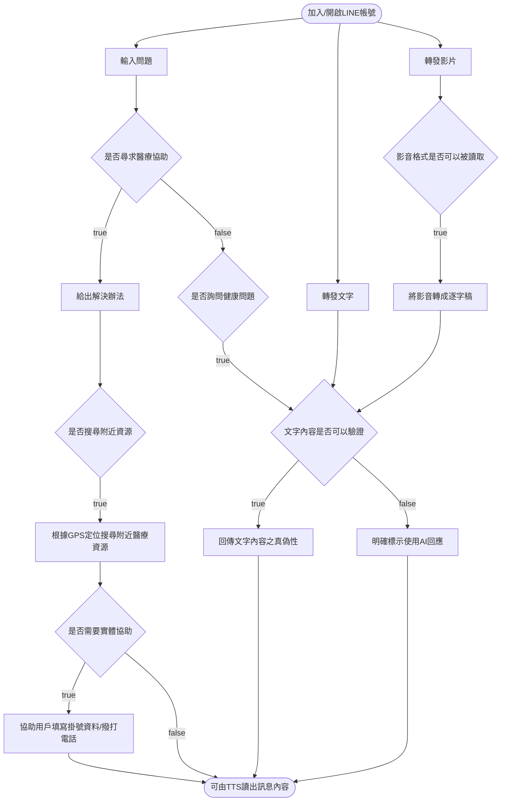
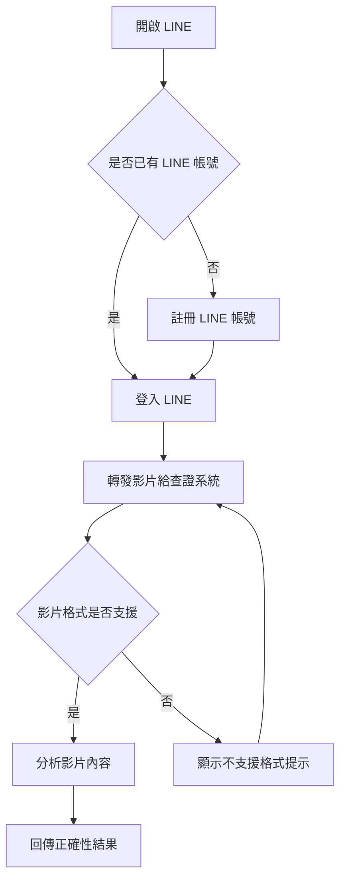
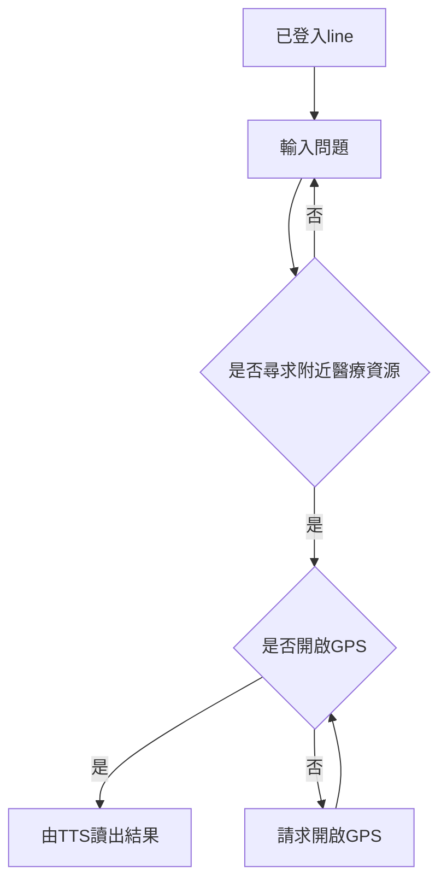

# CARE 軟體需求文件（SRD）

## 專案資訊
- **專案名稱**：LINE 醫療資源與健康資訊系統
- **撰寫日期**：2025/10/20
- **目前版次**：0.5（Iteration 7）
- **發展者**：游承諺 王洪賢

---

## 版次變更記錄

| 版次 | 變更項目 | 變更日期 |
|------|--------|---------|
| 0.1  | 初版 | 2025/10/20 |
| 0.2  | 使用者故事地圖+操作概念 | 2025/12/04 |
| 0.3  | 更新需求 | 2025/12/17 |
| 0.4  | 新增、拆分並詳述需求 | 2026/01/08 |
| 0.5  | 同步 Iteration 7 使用案例、日常健康、用藥安全、家庭權限、防走失定位及全域 UX 需求 | 2026/10/02 |

---

## 目錄
1. [接受準則 (Acceptance Criteria)](#section1)
2. [系統概述 (System Description)](#section2)
3. [操作概念 (Operational Concepts)](#section3)
4. [使用者故事地圖 (User Story Map)](#section4)
5. [使用者介面分析 (User Interface Analysis)](#section5)
6. [功能需求 (Functional Requirements)](#section6)
7. [非功能需求 (Non-functional Requirements)](#section7)
8. [需求追溯矩陣 (Traceability Matrix)](#section8)
9. [待決需求 (Open Requirements)](#section9)

---

## 接受準則 (Acceptance Criteria of this document)
- Clearly and properly stated（需求需清楚且適當的陳述）
- Complete（需求需完整）
- Consistent with each other（需求之間需維持一致性）
- Uniquely identified（每項需求有明確之識別）
- Appropriate to implement（需求需可被實作）
- Verifiable（需求需可被驗證）

---

## 系統概述 (System Description)
    
本系統為整合 LINE 聊天介面與 LIFF 操作介面的智慧健康資訊助理，結合人工智慧、可信健康資料、裝置能力與家庭照護權限，提供健康資訊諮詢、傳言查核、多媒體理解、日常健康紀錄、用藥安全、醫療資源搜尋及家庭安全照護服務。

系統以可追溯來源、資料不足時不臆測、敏感資料最小揭露及使用者明確確認為設計原則。AI 回應不取代醫師診斷、藥師諮詢或緊急服務；跨使用者操作均須依操作者、資料擁有者、資料分類、動作及權限生效模式重新判定。
    

---
## 操作概念 (Operational Concepts)

高中生小明收到爸媽傳來的健康資訊影片，想確認影片內容是否正確。於是他開啟 LINE，將影片轉發給系統。系統檢查影片格式，若格式不支援，會提示「不支援的格式，請選擇其他格式的檔案」，並要求重新上傳；若格式支援，系統則進行辨識並回傳影片正確性結果。
    
可能的例外:
使用者上傳了文字檔、pdf
 

    
65 歲的老王想查詢附近的醫療院所資訊，於是透過 LINE 向系統詢問：「幫我找附近的醫院診所，並用台語告訴我。」系統在接收到問題後，判斷這是查詢附近醫療資源的需求，接著使用 GPS 定位搜尋附近的診所與醫院，並以台語語音回覆結果，例如：「好，附近 1 公里有 XX 診所，1.5 公里有 XX 醫院⋯⋯」。老王很高興不用辛辛苦苦閱讀文字，就能用聽的獲得資訊。
  
可能的例外:
附近範圍沒有醫療院所
GPS訊號不穩定

    
## 使用者故事地圖 (User Story Map)
    
[user story map](https://miro.com/app/board/uXjVJg5UEcc=/?share_link_id=509572146952)
    

| 需求編號  | 使用者角色 | 使用者故事 |
| -------- | -------- | -------- |
| US-1    | 一般使用者     | 身為一位使用者，我希望只要加入 LINE 帳號就能開始對話， 這樣我不需要學習新的 App 或複雜設定。|
| US-2    | 一般使用者     | 身為需要幫助的使用者，我希望在看醫生前能得到初步建議， 但不被誤導為正式診斷。     |
| US-3    | 一般使用者     | 身為需要就醫的使用者，我希望系統能直接幫我找附近診所或醫院， 不用自己查地圖。      |
| US-4    | 一般使用者     | 身為需要就醫的使用者，我希望系統能告訴我線上掛號資訊和網址。  |
| US-5    | 一般使用者     |  身為一般使用者，我想問健康相關問題， 並知道答案是不是可靠。  |
| US-6    | 一般使用者     | 身為使用者，我希望知道我看到的健康資訊是真的還是只是 AI 推測。    |
| US-7    | 一般使用者     | 身為使用者，我希望轉傳影片後， 系統能幫我判斷內容是否可信。     |
| US-8    | 高齡長者     | 身為長輩，我希望系統直接用台語念給我聽， 而不是只顯示文字。    |
| US-9    | 高齡長者 |身為長輩，我希望統列出附近5間診所後,能直接點選按鈕撥打對應電話,而不用自己抄電話號碼再手動撥打。|   
| US-10   | 照護者     | 身為家人，我希望能看到家中長輩的健康狀態， 並在需要時幫忙處理。     |
| US-11   | 外籍照護者     | 身為移工，我希望能使用熟悉的語言，以較準確得知資訊。     |

    

---

## 使用者介面分析 (User Interface Analysis)
LINE message 以訊息回應使用者
LIFF api 完成其他功能

---

## 功能需求 (Functional Requirements)

除另有註明外，下列需求中的「系統應」均為驗收時必須成立的行為。跨使用者資料權限以 [家庭成員權限分級（family-rbac）技術文件](<./家庭成員權限分級（family-rbac）技術文件.md>) 為判定依據；使用案例流程以 [Iteration 7 使用案例](<./Iteration%207使用案例(Use%20Case).md>) 為追溯依據。

### 6.1 AI 智慧對話與可信資訊

| 需求編號 | 功能名稱 | 可驗證需求 |
| --- | --- | --- |
| FR-1 | LINE／LIFF 互動入口 | 使用者應可由 LINE 對話及系統提供的 LIFF 頁面進入服務；系統應識別使用者並維持同一話題所需的對話上下文。 |
| FR-2 | 意圖理解與分流 | 系統應辨識一般健康諮詢、醫療協助、傳言查核、醫療資源、健康紀錄、用藥及家庭照護等意圖；意圖或操作對象不明時，應先要求補充，不得直接執行寫入或跨使用者操作。 |
| FR-2.1 | 健康與醫療資訊問答 | 系統應提供一般性健康、醫療與衛教資訊；內容不得宣稱為診斷、處方或取代專業醫療意見。 |
| FR-2.2 | 多輪對話 | 使用者追問同一主題時，系統應沿用仍適用的上下文；上下文不足或互相矛盾時應要求確認。 |
| FR-2.3 | 對話風險警示 | 系統辨識到高風險情境時，應向本人顯示風險提示及適當求助管道；無法判斷時應清楚說明限制。 |
| FR-2.4 | 高風險用藥通知 | `high_risk_drug_alert` 在 enforced 模式應通知 GUARDIAN、CAREGIVER，在 shadow 模式應依既有族譜成員政策通知；通知只得包含姓名、藥名與風險類型，且通知資格不得推定為 PRIVATE 對話或完整風險報告的讀取權。 |
| FR-3 | 可信資料檢索 | 回答需外部事實依據時，系統應優先檢索已核可的可信資料來源，並提供可追溯的來源名稱或連結。 |
| FR-3.1 | 健康傳言查核 | 系統應辨識待查核內容中的具體主張，逐項呈現查核結果、理由、來源及必要的更正說明。 |
| FR-3.2 | 不確定性處理 | 資料不足、來源矛盾、主張不可驗證或僅部分可驗證時，系統應標明限制，不得編造來源或強制判定真偽。 |
| FR-3.3 | AI 內容標示 | 無法由來源直接支持而由生成模型補充的內容，應明確標示為 AI 生成或推論內容。 |
| FR-3.4 | 對話紀錄與摘要 | 系統應依資料保存及存取規則建立本人對話紀錄與摘要；跨使用者讀取應依 FR-13.3 的 PRIVATE 權限處理。 |

### 6.2 多媒體理解與語音互動

| 需求編號 | 功能名稱 | 可驗證需求 |
| --- | --- | --- |
| FR-4 | 多媒體輸入 | 系統應接受支援格式的圖片、音訊、影片、PDF 與 DOCX，依類型執行 OCR、語音轉錄或文件文字擷取。 |
| FR-4.1 | 格式與品質檢查 | 格式不支援、檔案損毀、內容模糊或擷取不完整時，系統應指出問題並要求重傳或補充，不得虛構未擷取內容。 |
| FR-4.2 | 影片處理範圍 | 影片分析應以實際擷取的語音或文字為依據；未處理的畫面不得作為結論依據。 |
| FR-4.3 | 擷取內容銜接 | 擷取結果應可銜接資訊諮詢、傳言查核或自然語言功能操作，並保留原始輸入與擷取結果之關聯。 |
| FR-5 | 語音輸入 | 系統應將支援語言的語音訊息轉為可供意圖辨識的文字，並支援國語及台語互動；辨識不清時應請使用者重錄或改用文字。 |
| FR-5.1 | 語音回覆 | 使用者啟用語音回覆時，系統應將可輸出的文字回答轉為語音；語音生成失敗時仍應保留文字回答。 |
| FR-5.2 | 語音偏好 | 本人應可設定是否啟用語音回覆、語速及音色；家屬代填健康檔案不得修改此設定。 |

### 6.3 日常健康與主動照護

| 需求編號 | 功能名稱 | 可驗證需求 |
| --- | --- | --- |
| FR-6 | 新增健康量測 | 本人應可新增血壓、血糖量測；系統應保存指標、數值、單位與量測時間，並在自然語言輸入後先顯示待確認內容，確認前不得寫入。 |
| FR-6.1 | 量測資料驗證 | 必要欄位缺漏、單位不明或數值格式無效時，系統應要求補充；使用者取消或儲存失敗時不得新增紀錄。 |
| FR-6.2 | 健康紀錄查詢 | 本人應可依指標及期間查詢血壓、血糖歷史，結果應顯示量測時間、數值及單位，並區分查無資料與服務失敗。 |
| FR-6.3 | 量測權限 | 血壓與血糖時間序列應分類為 SENSITIVE；本人可新增、查詢、刪除，GUARDIAN 可代填與刪除，GUARDIAN、CAREGIVER 可查詢，MEMBER 不可存取；此新能力在 shadow 模式亦不得放寬。 |
| FR-6.4 | 健康趨勢 | 系統應依所選指標及期間，以時間順序呈現可比較的量測值；紀錄不足、單位不可比或資料缺漏時應標示限制，不得補造趨勢。 |
| FR-6.5 | 體重紀錄狀態 | 體重時間序列紀錄、查詢及趨勢屬 Iteration 7 需求，但其獨立資料模型、API 與跨使用者權限尚待 OR-01 定案；不得以健康檔案中的單一 `weight` 欄位宣稱已完成時間序列功能。 |
| FR-7 | 設定用藥提醒 | 本人或對實際用藥者具 GENERAL WRITE 的 GUARDIAN、CAREGIVER／有效受委任者應可建立、修改、停用及刪除用藥提醒；每次變更均應重新檢核權限，MEMBER 不得寫入。 |
| FR-7.1 | 提醒內容確認 | 建立提醒前，系統應讓使用者確認實際用藥者、藥品及服藥時間；資訊不足時不得啟用提醒。 |
| FR-7.2 | 定時提醒 | 到達生效提醒時間時，系統應依最新設定通知用藥者；傳送成功不得直接標示為已閱讀或已服藥。 |
| FR-7.3 | 逾時家屬通知 | `medication_missed` 在 enforced 模式應通知 GUARDIAN、CAREGIVER，在 shadow 模式應依既有族譜成員政策通知；本人可關閉用藥提醒，家屬可各自關閉家庭通知。 |
| FR-8 | 每日健康資訊 | 系統應於每日 09:00（Asia/Taipei）向啟用訂閱的使用者發送最多一則具來源的健康或衛教資訊；無合適內容時不得編造，失敗時不得標示為已送達。 |
| FR-8.1 | 衛教資訊分享 | 使用者應可在確認接收對象後分享一般健康或衛教內容及其來源連結；取消時不得傳送，且分享內容不得自動夾帶個人健康資料。 |

### 6.4 醫療資源與用藥安全

| 需求編號 | 功能名稱 | 可驗證需求 |
| --- | --- | --- |
| FR-9 | 附近醫療資源搜尋 | 系統應先說明定位用途並取得本人裝置授權，再依目前位置及查詢條件提供附近醫院、診所或其他醫療資源；拒絕或無法定位時應提供明確提示。 |
| FR-9.1 | 院所名稱搜尋 | 使用者輸入醫療院所名稱時，系統應回覆可取得的院所資料，並區分查無資料與查詢失敗。 |
| FR-9.2 | 醫療機構資訊 | 系統應顯示可取得的院所名稱、地址、電話、門診資訊及資料來源；缺漏欄位應標示未提供。 |
| FR-9.3 | 快速撥號 | 院所有有效電話時，系統應將電話交由裝置撥號功能處理；不得將開啟撥號介面宣稱為已接通。 |
| FR-9.4 | 掛號導引 | 院所有掛號連結時，系統應提供外部入口並帶入正確院所；掛號結果由外部服務決定，系統不得在未取得結果時宣稱掛號成功。 |
| FR-10 | 藥袋辨識 | 系統應從使用者拍攝或上傳的藥袋圖片擷取 OCR 原文及藥名、劑量、用法等結構化資訊，並在使用者核對或修正後才提交。 |
| FR-10.1 | 辨識失敗處理 | 圖片模糊、文字不完整或藥名有歧義時，系統應要求重拍或補充；未確認藥品前不得產生確定的用藥風險結論。 |
| FR-10.2 | 藥袋草稿權限 | 藥袋草稿只能由建立者讀取且具有期限；將草稿提交至目標用藥者資料時須具 GENERAL WRITE，且 shadow 模式不得放寬。 |
| FR-10.3 | 用藥資訊說明 | 系統應依已確認藥品提供有可信來源的用途、用法、注意事項及易懂說明；查無資料或藥品不明時應說明無法判斷。 |
| FR-10.4 | 藥物風險警示 | 資料支持風險時，系統應顯示風險類型、依據及諮詢醫師或藥師的建議；未出現警示不得解讀為藥品安全。 |
| FR-10.5 | 用藥安全邊界 | 系統不得自行調整處方或保證個人化交互作用安全；原始圖片、OCR 全文及完整風險報告的跨使用者分類依 OR-02 定案。 |

### 6.5 家庭連結與安全照護

| 需求編號 | 功能名稱 | 可驗證需求 |
| --- | --- | --- |
| FR-11 | 建立家庭連結 | 本人應可邀請他人加入自己的照護圈並指定 GUARDIAN、CAREGIVER 或 MEMBER；有效受委任者代為邀請時只可指定 CAREGIVER 或 MEMBER。 |
| FR-11.1 | 邀請與關係建立 | 系統應保存邀請所屬資料擁有者及角色，受邀者接受後依保存角色建立關係；不得邀請自己、指派 OWNER、由受邀者改寫角色或以反向關係自動賦權。 |
| FR-11.2 | 家庭成員管理 | 系統應顯示本人照護圈成員、雙向角色、實際權限及角色設定狀態，並支援撤銷邀請、雙向移除成員、設定或清除親屬稱謂與照顧對象標籤。 |
| FR-11.3 | 成員移除 | 移除成員時，系統應同步撤銷雙方相關委任並留下稽核紀錄；移除後的資料存取須重新判定。 |
| FR-12 | 角色管理 | 本人可為照護圈內其他成員指定 GUARDIAN、CAREGIVER 或 MEMBER；有效受委任者只可指定 CAREGIVER 或 MEMBER。一般 GUARDIAN 身分本身不具角色管理資格。 |
| FR-12.1 | 角色變更限制 | 系統不得將 OWNER 指派給他人、修改本人 OWNER 身分或跨資料擁有者套用角色／委任；變更應記錄操作者、變更前後角色及委任狀態。 |
| FR-12.2 | 委任撤銷 | OWNER 應可檢視及撤銷本人既有有效委任；受委任者不得代查或代撤銷。撤銷後應留下稽核紀錄並重新依原角色解析權限。 |
| FR-13 | 資料分類與存取 | 跨使用者存取應以「操作者、資料擁有者、資料分類、動作及生效模式」判斷；前端未取得 `my_permissions` 時應視為無權，後端仍須逐次檢核。 |
| FR-13.1 | GENERAL 權限 | enforced 模式下，GUARDIAN、CAREGIVER 可讀寫 GENERAL，MEMBER 只可讀；實際委任及個別資源規則優先。 |
| FR-13.2 | SENSITIVE 權限 | enforced 模式下，GUARDIAN 可讀寫 SENSITIVE，CAREGIVER 只可讀，MEMBER 不可存取。CAREGIVER 不得代填健康檔案或其他 SENSITIVE 資料。 |
| FR-13.3 | PRIVATE 權限 | enforced 模式下，家庭成員僅 GUARDIAN 可讀指定資料擁有者的 PRIVATE 對話原文與摘要；CAREGIVER、MEMBER 不可讀取。 |
| FR-13.4 | 欄位遮蔽與失敗關閉 | 同一回應包含不同分類時，系統應逐欄遮蔽；未登記的新資源或欄位在跨使用者情境應 fail-closed，不得由相似資料推定權限。 |
| FR-14 | 代填健康檔案 | 對目標資料擁有者具 SENSITIVE WRITE 的 GUARDIAN／有效受委任者可代填允許欄位；CAREGIVER、MEMBER 及族譜外成員不得代填，shadow 模式亦不得放寬。 |
| FR-14.1 | 代填欄位限制 | 代填僅能部分更新年齡、性別、身高體重、慢性病或病史等允許欄位；姓名、照片、角色、`settings`、`line_id` 等禁止欄位應被排除並回報，未提交欄位不得清空。 |
| FR-15 | 主動分享個人健康資訊 | 系統應僅允許資料本人選擇明確資料範圍、接收者、有效期限及是否允許匯出／轉傳，並在確認後建立可撤回的分享授權；撤回或到期後不得再由該授權取得資料。 |
| FR-15.1 | 分享與既有權限區隔 | 既有家庭讀取權、通知收件資格及主動分享授權應分別判定；不得因可讀資料而自動取得轉傳、匯出或建立分享連結的權限。 |
| FR-15.2 | 分享功能狀態 | FR-15 為 Iteration 7 正式需求；其資料模型、接收方式、撤回後已下載內容的控制及預設期限仍依 OR-03 定案。在 OR-03 完成前，系統不得宣稱個人健康資料主動分享已可用。 |
| FR-16 | 防走失事件啟動 | 防走失求救應由本人 LINE 對話觸發；本人須在 LIFF 明確授權裝置定位後，系統才可建立事件及接收位置。 |
| FR-16.1 | 定位更新與軌跡 | 事件有效期間內，裝置應每 20 秒嘗試上傳位置，系統應提供事件軌跡；位置超過 3 分鐘未更新時應標示為過期，不得呈現為即時位置。 |
| FR-16.2 | 定位查看權限 | 只有符合 `elder_lost` 通知政策的成員可查看事件位置：enforced 模式為 GUARDIAN、CAREGIVER，shadow 模式為既有族譜成員；一般健康資料讀取權不得推定為定位權。 |
| FR-16.3 | 事件通知與協作 | 系統應通知合格收件人，允許家屬回報「正在前往」，並允許授權流程結束事件；通知失敗時不得宣稱已通知。 |
| FR-16.4 | 事件期限與刪除 | 防走失事件應於啟動後 2 小時自動結束；事件位置資料應於事件結束後 24 小時清除，不得作為長期定位歷史保存。 |
| FR-16.5 | 定位失敗處理 | 使用者拒絕瀏覽器定位、裝置無法定位或上傳失敗時，系統應顯示可辨識的狀態及安全建議，不得顯示虛構位置。 |

### 6.6 全域使用者體驗

| 需求編號 | 功能名稱 | 可驗證需求 |
| --- | --- | --- |
| FR-17 | 多語言處理鏈 | 系統的介面、文字／語音輸入理解、可信資料檢索、回答生成、畫面顯示及語音輸出，應依各功能公布的支援語言一致處理；未支援階段應明確說明，不得只以末端翻譯宣稱全流程支援。 |
| FR-17.1 | 支援語言清單 | 系統應在設定介面顯示目前實際支援的語言及各語言可用範圍；既有目標包含國語、台語及英、日、菲、泰、越南、印尼語，但驗收應以介面公布且實際可用的能力為準。 |
| FR-18 | 字級設定 | 本人應可在 CARE 可控制的畫面調整字級；放大後文字、欄位與必要按鈕不得被裁切、重疊或無法操作。 |
| FR-18.1 | 偏好保存與同步 | 語言、字級、語音回覆、語速及音色應同時保存於伺服器與本機；本人登入其他裝置後應以伺服器設定同步，家屬不得代改。 |
| FR-18.2 | 高齡友善流程 | 系統應減少不必要步驟及複雜選單，並在寫入、分享、權限變更及高風險操作保留明確確認。 |
| FR-19 | 自然語言操作 | 使用者應可用文字或語音表達各模組操作需求；系統應辨識意圖、對象及必要參數，再銜接對應功能需求。 |
| FR-19.1 | 操作確認與權限 | 自然語言操作涉及寫入、分享、定位或權限變更時，系統應先顯示待執行內容並依目標資源重新檢核權限；未確認或無權時不得執行。 |
| FR-19.2 | 不支援操作 | 目標功能尚未提供自然語言操作或執行失敗時，系統應如實說明並提供既有入口，不得宣稱操作成功。 |

## 非功能需求 (Non-functional Requirements)

| 編號 | 類型 | 可驗證需求 |
| --- | --- | --- |
| NFR-1 | AI 透明性 | AI 生成、來源支持、推論及無法驗證內容應以使用者可辨識的方式區分；引用不得連結至不存在或未使用的來源。 |
| NFR-2 | 隱私與最小蒐集 | 定位、健康、用藥及對話資料只得為已告知目的蒐集與處理，回應及通知只揭露完成目的所需的最少欄位。 |
| NFR-3 | 授權安全 | 後端不得只依前端顯示狀態授權；每次跨使用者讀寫均須依實際資料擁有者重新檢核，未登記能力採 fail-closed。 |
| NFR-4 | 傳輸與儲存安全 | SENSITIVE、PRIVATE、定位與驗證憑證在傳輸及儲存時應使用業界通行的保護機制；日誌不得記錄不必要的完整敏感內容。 |
| NFR-5 | 稽核性 | 角色變更、委任撤銷、跨使用者寫入、分享授權與防走失事件應記錄操作者、目標、時間、動作及結果，且稽核紀錄不得由一般使用者任意修改。 |
| NFR-6 | 可靠性 | 外部資料、AI、通知、定位或掛號服務失敗時，系統應保留可理解的失敗狀態，不得將請求送出視為結果成功。 |
| NFR-7 | 資料正確性 | 單位不可比、來源過期、擷取不完整或關聯對象不明時，系統不得合併、推算或寫入為已確認資料。 |
| NFR-8 | 可用性與無障礙 | 核心流程應同時提供清楚文字提示；不得以顏色作為唯一狀態訊號，字級放大後仍須可閱讀與操作。 |
| NFR-9 | 效能回饋 | 無法立即完成的 AI、多媒體、搜尋或定位處理應顯示處理中狀態；逾時後應提供重試或替代方式，不得讓使用者無限等待。 |
| NFR-10 | 可維護性 | AI、可信檢索、多媒體、健康量測、用藥、醫療資源、家庭 RBAC、通知及定位模組應維持清楚介面與責任邊界。 |
| NFR-11 | 可測試性 | 每項功能需求應至少具有成功、資料不足／格式錯誤、權限不足及外部服務失敗等適用測試；時間規則應使用可控制的系統時鐘驗證。 |
| NFR-12 | 使用者回報 | LINE 或 LIFF 應提供可找到的問題回報入口，並讓使用者取得已送出或失敗的明確結果；回報不得自動夾帶非必要健康資料。 |

## 需求追溯矩陣 (Traceability Matrix)

| 使用案例 | 對應需求 |
| --- | --- |
| UC-01 資訊諮詢與延續對話 | FR-1～FR-3、FR-3.4 |
| UC-02 接收對話風險警示 | FR-2.3～FR-2.4 |
| UC-03 查核健康傳言與闢謠 | FR-3～FR-3.3、FR-4.3 |
| UC-04 使用語音對話 | FR-5～FR-5.2、FR-17 |
| UC-05 理解上傳內容 | FR-4～FR-4.3 |
| UC-06 新增日常健康紀錄 | FR-6～FR-6.5、FR-19～FR-19.2 |
| UC-07 查詢健康紀錄 | FR-6.2～FR-6.5 |
| UC-08 查看健康變化趨勢 | FR-6.4～FR-6.5 |
| UC-09 設定用藥提醒 | FR-7～FR-7.1 |
| UC-10 接收用藥提醒 | FR-7.2～FR-7.3 |
| UC-11 接收每日健康資訊 | FR-8 |
| UC-12 分享健康衛教資訊 | FR-8.1 |
| UC-13 搜尋附近醫療資源 | FR-9 |
| UC-14 查看醫療機構資訊 | FR-9.1～FR-9.2 |
| UC-15 撥打醫療機構電話 | FR-9.3 |
| UC-16 前往醫療機構掛號服務 | FR-9.4 |
| UC-17 辨識藥袋資訊 | FR-10～FR-10.2 |
| UC-18 查詢用藥資訊與風險 | FR-10.3～FR-10.5、FR-2.4 |
| UC-19 建立家庭帳號連結 | FR-11～FR-11.1 |
| UC-20 管理家庭成員 | FR-11.2～FR-11.3、FR-13 |
| UC-21 設定家庭角色與存取權限 | FR-12～FR-13.4 |
| UC-22 分享個人健康資訊 | FR-15～FR-15.2 |
| UC-23 查看家人照護資訊 | FR-13～FR-13.4 |
| UC-24 查詢受照護家人位置 | FR-16～FR-16.5 |
| UC-25 代填家人健康檔案 | FR-13.2、FR-14～FR-14.1 |
| UC-26 檢視與撤銷既有委任 | FR-12.2 |
| UC-27 設定使用語言 | FR-17～FR-17.1、FR-18.1 |
| UC-28 調整字體大小 | FR-18～FR-18.2 |
| UC-29 以自然語言操作功能 | FR-19～FR-19.2 |

## 待決需求 (Open Requirements)

下列項目仍是需求基線的一部分，但尚未具備足以宣告完成的產品決策或資源分類。實作、測試與其他文件不得自行推定未列出的權限或流程。

| 編號 | 待決事項 | 完成條件 | 影響需求 |
| --- | --- | --- | --- |
| OR-01 | 體重時間序列與趨勢 | 定義資料模型、單位、本人增刪查、家屬代填／讀取權限及趨勢呈現驗收條件。 | FR-6.4～FR-6.5 |
| OR-02 | 藥袋與風險資料分類 | 為原始藥袋圖片、OCR 全文、掃描草稿讀取及完整風險報告定義 GENERAL／SENSITIVE／PRIVATE 分類、保存期限與跨使用者動作。 | FR-10.2、FR-10.5 |
| OR-03 | 個人健康資料主動分享 | 定義可分享資料、接收者資格、傳遞方式、預設／上限期限、撤回效果、匯出與轉傳控制及稽核方式。 | FR-15～FR-15.2 |
| OR-04 | 個人化藥物交互作用 | 確認是否納入範圍；若納入，需定義所需個資、資料來源、風險等級、免責提示及專業覆核。 | FR-10.4～FR-10.5 |
| OR-05 | 新委任建立核可 | 定義新委任的申請、核可、期限與前端入口；在完成前維持建立閘門關閉，只提供既有委任檢視與撤銷。 | FR-12.2 |
